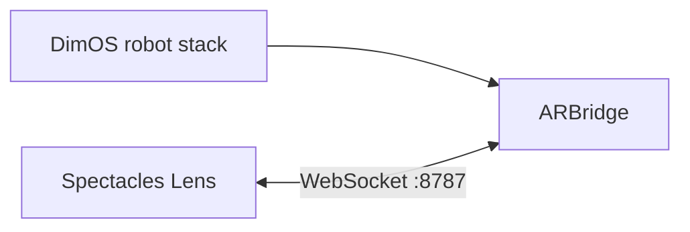
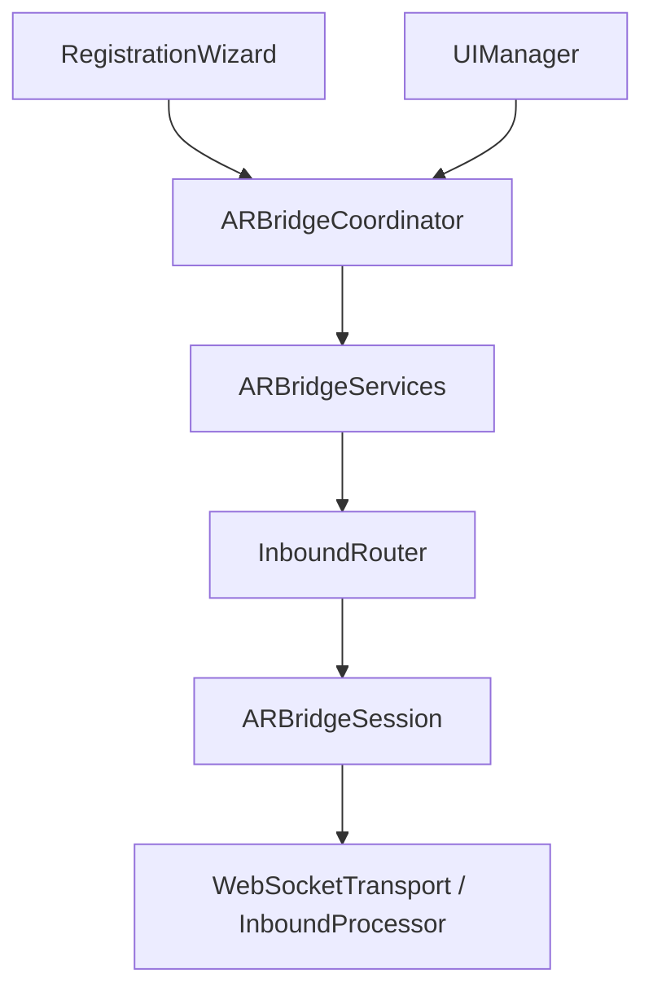
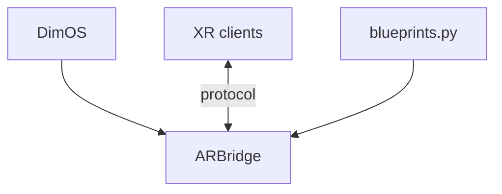

# Spectacles AR + Dimensional OS

> **Lens Studio:** open [`lens-studio/spectacles-dimensional-os.esproj`](lens-studio/spectacles-dimensional-os.esproj), not the repo root.

Visualize and control **DimOS robot stacks** from **Snap Spectacles**.
[`dimos-ar/`](dimos-ar/) is a WebSocket based bridge between [Dimensional OS](https://github.com/dimensionalOS/dimos) for low-level robot control and orchestration and a Spectacles Lens for spatial UI/UX.

<p align="center">
  
</p>

This is **not a fork of DimOS**. It is a separate package that depends on DimOS and composes into blueprints via `autoconnect`. The Spectacles client lives in [`lens-studio/`](lens-studio/), while the Python side stays platform-agnostic so future XR clients can implement the same protocol without changing `dimos/ar/`.


At a glance:
- [`lens-studio/`](lens-studio/) contains the Spectacles Lens Studio project, setup flow, HUD, navigation interaction, and world-anchored visuals.
- [`dimos-ar/`](dimos-ar/) contains the DimOS XR bridge package, `ARBridge`, the adapter module, and tests.
- [`dimos-ar/PROTOCOL.md`](dimos-ar/PROTOCOL.md) is the cross-platform contract between the bridge and every XR client.



## Core concepts / Overview

- `dimos-ar` is a **DimOS extension**, not a platform-specific fork.
- The shared API is the JSON WebSocket protocol in [`dimos-ar/PROTOCOL.md`](dimos-ar/PROTOCOL.md).
- The robot lives in an **odom** frame, while AR clients live in a **world** frame, so setup must solve a shared transform before runtime visuals are trustworthy.
- The bridge is single-active-robot per process and uses adapter-declared capabilities.

<details>
<summary>Quick start</summary>

1. Install and test the Python side:

   ```bash
   cd /path/to/spectacles-dimensional-os
   ./scripts/setup.sh
   ```

2. Start the XR bridge:

   ```bash
   cd /path/to/spectacles-dimensional-os
   ./scripts/start.sh
   ```

3. Open [`lens-studio/spectacles-dimensional-os.esproj`](lens-studio/spectacles-dimensional-os.esproj) in Lens Studio and push to device.

4. In the Lens, go through **Connect -> Register -> Complete**.

</details>

<details>
<summary>Frame registration</summary>

The bridge solves `T_world_odom` so AR content stays registered to the robot. Two registration flows are supported:

- **AprilTag + baseline** (`registration_command{command:"start",mode:"april_odom_baseline"}`) — the robot drives a 3-leg baseline move while the Spectacles user looks at the robot-mounted AprilTag; the bridge stops between legs to collect stable observations, then auto-commits. Requires `registration_april_odom_baseline`.
- **Manual pose** (`registration_command{command:"start",mode:"manual_pose"}`) — user places the robot marker in AR; client streams `registration_pose` and sends `registration_command{command:"commit"}`. No camera frames are consumed; always available when `registration_manual_pose` is advertised.

After commit, the same robot-mounted tag continues to drive runtime drift correction from Spectacles frames: a full solve updates yaw and translation once enough baseline exists, falling back to a translation-only correction when the robot is stationary. Runtime corrections only surface to the Lens as a "Refined Tracking" notification once they cross a small deadband (≥ 5 cm translation or ≥ 1° yaw); smaller continuous refinements stay silent.

Registration requires a **printed robot-mounted tag** for the AprilTag baseline flow:

```bash
cd /path/to/spectacles-dimensional-os/dimos-ar
python scripts/generate_marker.py
```

Print `apriltag_robot_a4.pdf` or `apriltag_robot_letter.pdf` from `dimos-ar/assets/` at **actual size** (no "fit to page") and verify the outer edge measures 70 mm with a ruler before mounting on the robot.

</details>

<details>
<summary>Protocol and platform boundary</summary>

The Mac is always the WebSocket **server** and AR devices are **clients**. The bridge sends `hello` and a `runtime_snapshot` on connect, then streams messages such as `bridge_status`, `pose`, binary LiDAR, `path`, `nav_status`, and `registration_status`. Clients send messages such as `registration_command`, `goal`, `cancel_goal`, and `emergency_stop`.

If the protocol changes, update these together in the same change:
- [`dimos-ar/dimos/ar/network/protocol.py`](dimos-ar/dimos/ar/network/protocol.py)
- [`dimos-ar/PROTOCOL.md`](dimos-ar/PROTOCOL.md)
- [`lens-studio/Assets/Scripts/ARBridge/Network/Protocol.ts`](lens-studio/Assets/Scripts/ARBridge/Network/Protocol.ts)

</details>

## Lens Studio Project

The Lens side is organized around three scene-entry scripts plus one wiring hub:

- [`ARBridgeServices.ts`](lens-studio/Assets/Scripts/App/ARBridgeServices.ts) owns scene `@input`s and plain runtime service instances (`AppStateStore`, `InboundRouter`, `RegistrationClient`, `RobotPresenter`, `NavigationPlacement`, …).
- [`ARBridgeCoordinator.ts`](lens-studio/Assets/Scripts/App/ARBridgeCoordinator.ts) is the orchestration hub for phase/mode lifecycle; it delegates to `ARBridgeServices`.
- [`RegistrationWizard.ts`](lens-studio/Assets/Scripts/App/Registration/RegistrationWizard.ts) owns the connect-and-register flow and hands off to runtime. Check Lens Studio Logger output and `./scripts/start.sh` bridge logs when registration fails.
- [`UIManager.ts`](lens-studio/Assets/Scripts/App/UI/UIManager.ts) mirrors app state and bridge status into the authored HUD; it does not own the runtime lifecycle.

[`ARBridgeSession`](lens-studio/Assets/Scripts/ARBridge/Network/ARBridgeSession.ts) owns WebSocket transport and the hello handshake; [`InboundProcessor`](lens-studio/Assets/Scripts/ARBridge/Network/InboundProcessor.ts) parses inbound frames into typed signals. [`InboundRouter`](lens-studio/Assets/Scripts/ARBridge/Session/InboundRouter.ts) fans those signals out to domain `*Client` classes (`StatusClient`, `TelemetryClient`, `NavigationClient`, `RegistrationClient`) and app presenters (`RobotPresenter`, `NavigationPlacement`). `RegistrationFlow` owns registration-step UI state; `RegistrationClient` is the single owner of the bridge registration session. `DeviceCameraStream` is a singleton wrapper around the Spectacles colour camera shared by registration and runtime capture. Visuals live under `App/Robot/`, `App/Lidar/`, and `App/Navigation/`.



<details>
<summary>Lens setup and runtime responsibilities</summary>

`RegistrationWizard` builds the wizard view, starts autoconnect, owns the 3-step state machine inline, and finishes by calling `ARBridgeCoordinator.enterRuntime()`. Registration-step state is delegated to `RegistrationFlow`; the bridge registration session is owned exclusively by `RegistrationClient`, which re-arms on every `hello` so reconnects cannot leave the session stranded.

`ARBridgeCoordinator` starts in registration phase, disconnects the bridge when re-entering registration, and switches to runtime by enabling visuals, preserving manual registration state when needed, and syncing navigation and robot interaction state. Shared app state (including bridge-link status used by setup and runtime UI) lives in `AppStateStore` / `AppState`. During runtime, `InboundRouter` fans inbound bridge messages into:
- `TelemetryClient` + `RobotPresenter` for pose, drift correction, LiDAR presentation, and `RobotMarker` / `RobotUiView` controls
- `NavigationClient` + `NavigationPlacement` for goal placement, path display, and nav status

`UIManager` subscribes to app state and updates the authored HUD. Restarting registration goes back through `RegistrationWizard`, while bridge status, operating mode changes, and the coarse `disconnected` / `connectedNoRobot` / `connected` link state still come from `ARBridgeCoordinator`.

</details>

<details>
<summary>Scene setup pointers</summary>

- Open the project from [`lens-studio/spectacles-dimensional-os.esproj`](lens-studio/spectacles-dimensional-os.esproj).
- Wire cross-tree references on [`ARBridgeServices`](lens-studio/Assets/Scripts/App/ARBridgeServices.ts) (`bridgeSession`, `frameCaptureController`, `robotMarker`, `pointCloudRenderer`, `navigationMarkerPrefab`, `assistClearanceDiscPrefab`). Point `ARBridgeCoordinator` at `ARBridgeServices`; point `RegistrationWizard` and `UIManager` at `ARBridgeCoordinator`. On `UIManager`, also wire `mainUIFrame` and `registrationWizard`. See [`CONTRIBUTING.md`](CONTRIBUTING.md) for the full scene-wiring and architecture rules.
- The main feature folders are:

  ```text
  lens-studio/Assets/Scripts/
  ├── App/                  (ARBridgeServices, ARBridgeCoordinator, AppState, AppStateStore)
  │   ├── Registration/     (RegistrationWizard, RegistrationWizardView, RegistrationFlow, RegistrationPreview)
  │   ├── Navigation/       (NavigationPlacement, NavigationPresenter, NavigationBridgeHandler, …)
  │   ├── Robot/            (RobotPresenter, RobotMarker, RobotUiView, RobotRuntimeModel)
  │   ├── Lidar/            (PointCloudRenderer, LidarPresenter)
  │   ├── UI/               (UIManager, MainMenuView, UILogger, kit/UIKit)
  │   └── Utilities/        (AnimationUtilities, Utilities)
  └── ARBridge/             (platform-agnostic bridge layer)
      ├── Network/          (ARBridgeSession, WebSocketTransport, InboundProcessor, Protocol)
      ├── Session/          (InboundRouter)
      ├── Registration/     (RegistrationClient, ManualRegistrationAlignment)
      ├── Navigation/       (NavigationClient, NavigationModel)
      ├── Telemetry/        (TelemetryClient)
      ├── Status/           (StatusClient)
      └── Camera/           (FrameCaptureController, DeviceCameraStream, FrameCapturePolicy)
  ```

- `ShowLiDAR` controls the height/debug layer, while the red obstacle layer still comes from live bridge lidar when connected. The Lens can also request a bridge-side LiDAR transmit mode (`off` / `obstacles` / `full`) via `set_lidar_mode` to cut payload when only obstacle proximity matters.

</details>

## Dimensional OS Blueprint (`dimos-ar`)

[`dimos-ar/`](dimos-ar/) contains the Python side: `ARBridge`, `ARRobotAdapterModule`, the protocol definition, and the tests. The monorepo entrypoint is [`dimos-ar/dimos/ar/blueprints.py`](dimos-ar/dimos/ar/blueprints.py), which wraps native DimOS stack composition for the currently selected robot runtime.

`ARBridge` itself ([`dimos-ar/dimos/ar/bridge/module.py`](dimos-ar/dimos/ar/bridge/module.py)) subclasses `dimos.core.module.Module` and stays thin: it declares the DimOS `In[...]` streams, builds its collaborators, and fans handler calls out to them. The actual logic lives in single-owner collaborators under `dimos-ar/dimos/ar/`: `registration/` (setup wizard — `RegistrationSession`, baseline collector), `world_frame/` (`WorldFrameState`, `WorldFrameRefiner`), `tag_tracking/` (robot-mounted AprilTag detect + solve), `navigation/` (`NavigateGoalHandler`, `PreviewGoalHandler`), `bridge/` (`TelemetryPublisher`, `StatusService`, `OdomBuffer`, …), and adapters for Go2/G1.



<details>
<summary>Runtime support and capabilities</summary>

Supported runtimes (selected interactively by `./scripts/start.sh`):

- `ar-go2` — Unitree Go2 stack (full navigation and AprilTag registration when the onboard modules are available; capability states may negotiate reduced features on lighter stacks).
- `ar-g1` — Unitree G1 nav-onboard stack (requires the Unitree DDS Python package set in the DimOS `.venv` for onboard navigation).

Direct `dimos run ar-go2` / `dimos run ar-g1` work once these blueprints are registered upstream in DimOS; until then, use `./scripts/start.sh`.

On the Lens side, runtime behavior is negotiated from the bridge handshake:
- `AppState` projects robot/runtime metadata from the bridge and carries the coarse bridge-link state used by the setup and runtime UI.
- offline development stays permissive until a bridge connects and completes the handshake.
- unavailable controls stay visible and switch into disabled explanatory UI states with labels explaining why.

</details>

<details>
<summary>Start the blueprint</summary>

The monorepo provides `scripts/start.sh` as a convenience wrapper around native DimOS composition:

```bash
cd /path/to/spectacles-dimensional-os
./scripts/start.sh
```

`./scripts/start.sh` always prompts for the target robot stack, then runs the bridge against the selected composition. The equivalent native commands are:

```bash
dimos run ar-go2
dimos run ar-g1
```

Use `./scripts/start.sh` if the blueprints are not yet registered in your DimOS install.

If DimOS lives somewhere unusual, set `DIMOS_PYTHON` explicitly:

```bash
DIMOS_PYTHON=/path/to/dimos/.venv/bin/python3 ./scripts/start.sh
```

</details>

<details>
<summary>Manual setup and tests</summary>

**Python** (`dimos-ar/`) — install from the DimOS Python environment:

```bash
cd /path/to/spectacles-dimensional-os/dimos-ar
/path/to/dimos/.venv/bin/python3 -m pip install -e ".[dev]"
/path/to/dimos/.venv/bin/python3 -m pytest
/path/to/dimos/.venv/bin/python3 -m ruff check .
/path/to/dimos/.venv/bin/python3 -m mypy dimos/ar
```

**Lens TypeScript** (`lens-studio/Tests/`) — pure-logic unit tests for `Protocol.ts`, `AppState`, `InboundRouter`, `RegistrationClient`, `RegistrationFlow`, `NavigationModel`, `RobotRuntimeModel`, `FrameCapturePolicy`, and related utilities (runs in Node/Vitest, not inside Lens Studio):

```bash
cd /path/to/spectacles-dimensional-os/lens-studio/Tests
npm install   # first time only
npm test
```

Do not put `*.test.ts` under `lens-studio/Assets/` — the Lens compiler globs all `Assets/**/*.ts`.

**Reproduce CI locally** — GitHub Actions runs both jobs in [`.github/workflows/ci.yml`](.github/workflows/ci.yml). From the repo root:

```bash
chmod +x scripts/run-ci.sh   # first time only
./scripts/run-ci.sh
```

That script mirrors CI exactly: `dimos-ar` installs the same pinned deps as the workflow (into a throwaway venv at `/tmp/spectacles-dimensional-os-ci-venv`), then runs `ruff check .`, `mypy dimos/ar`, and `pytest -m "not integration"`; `lens-studio-tests` runs `npm ci && npm test`. Override the interpreter with `CI_PYTHON=/path/to/python3.12 ./scripts/run-ci.sh` if needed.

To run the jobs manually instead:

```bash
# dimos-ar (use a fresh Python 3.12 venv on macOS/Homebrew — PEP 668 blocks system pip)
cd dimos-ar
python3.12 -m venv /tmp/spectacles-dimensional-os-ci-venv
source /tmp/spectacles-dimensional-os-ci-venv/bin/activate
python -m pip install --upgrade pip
pip install websockets pytest pytest-asyncio ruff mypy numpy opencv-python-headless Pillow scipy dimos
pip install -e . --no-deps
ruff check .
mypy dimos/ar
pytest -m "not integration"

# lens-studio-tests
cd ../lens-studio/Tests
npm ci
npm test
```

On every push and pull request, CI runs these two jobs in parallel. Changes that touch shared protocol or pure Lens logic should pass both before merge.

If you want to run `ar-g1`, make sure the same DimOS `.venv`
also has the DDS SDK package installed:

```bash
/path/to/dimos/.venv/bin/pip3 install "unitree-sdk2py-dimos>=1.0.2"
```

Optional live protocol check while the blueprint is already running:

```bash
cd /path/to/spectacles-dimensional-os/dimos-ar
/path/to/dimos/.venv/bin/python3 -m pytest dimos/ar/network/test_ws_integration.py -m integration
```

Python tests are colocated with their modules under `dimos-ar/dimos/ar/`. See [`dimos-ar/README.md`](dimos-ar/README.md) for the unit vs integration test split.

</details>

<details>
<summary>Transport, ports, and discovery</summary>

- XR bridge WebSocket listens on **8787**; avoid binding port **8765** on the same machine while Foxglove is running.
- `scripts/start.sh` chooses the stack interactively at launch, between `ar-go2` and `ar-g1`.
- `ar-g1` always composes on top of the Unitree G1 nav-onboard blueprint; navigation requires the Unitree DDS Python package set in the DimOS `.venv`, while manual registration stays available regardless.

</details>

<details>
<summary>Extension points</summary>

- Tune lidar and rate limits via `ARBridgeConfig` in [`dimos-ar/dimos/ar/bridge/module.py`](dimos-ar/dimos/ar/bridge/module.py).
- Add or change messages by updating the Python protocol, the protocol spec, and the Lens protocol modules together.
- The protocol now also carries `set_lidar_mode` (client-selected `off` / `obstacles` / `full` LiDAR transmission) and `world_frame_correction` (runtime drift-correction telemetry, deadbanded so only meaningful jumps reach the client); see [`dimos-ar/PROTOCOL.md`](dimos-ar/PROTOCOL.md) for the full schema.
- Keep `dimos-ar/dimos/ar/` platform-agnostic. Spectacles-specific code stays in [`lens-studio/`](lens-studio/); other XR clients should live in their own client folder or repo.

</details>

Contributions, ideas, and bug reports are welcome. If you are changing behavior that crosses the bridge boundary, also check [`CONTRIBUTING.md`](CONTRIBUTING.md) before opening a PR.

## License

MIT License — see [LICENSE](LICENSE).
