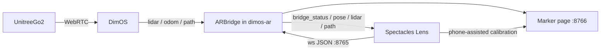
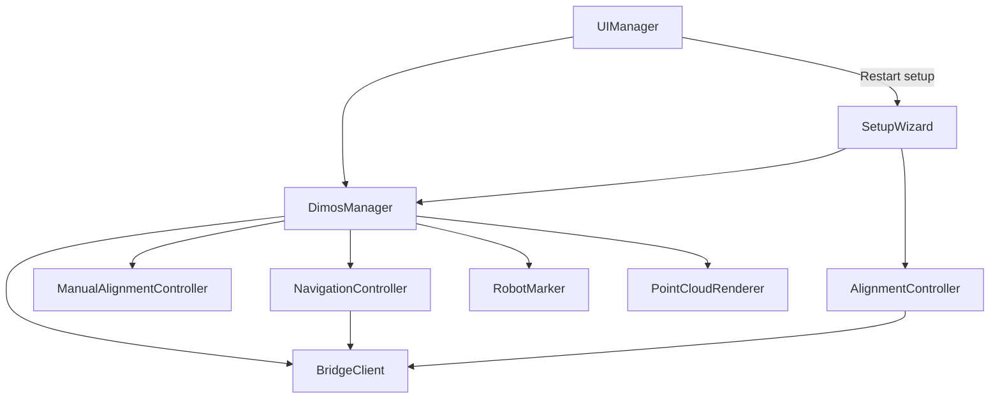
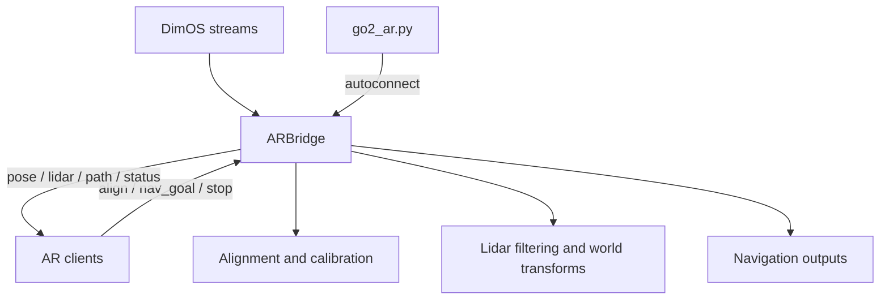

# Spectacles AR + Dimensional OS

> **Lens Studio:** open [`lens-studio/spectacles-dimensional-os.esproj`](lens-studio/spectacles-dimensional-os.esproj), not the repo root.

Visualize and control a **Unitree Go2** from **Snap Spectacles**. 
[`dimos-ar/`](dimos-ar/) is a WebSocket based bridge between [Dimensional OS](https://github.com/dimensionalOS/dimos) for low-level robot control and orchestration and a Spectacles Lens for spatial UI/UX.

<p align="center">
  
</p>

This is **not a fork of DimOS**. It is a separate package that depends on DimOS and composes into blueprints via `autoconnect`. The Spectacles client lives in [`lens-studio/`](lens-studio/), while the Python side stays platform-agnostic so future AR clients can implement the same protocol without changing `dimos_ar/`.


At a glance:
- [`lens-studio/`](lens-studio/) contains the Spectacles Lens Studio project, setup flow, HUD, navigation interaction, and world-anchored visuals.
- [`dimos-ar/`](dimos-ar/) contains the DimOS extension, `ARBridge` module, Go2 blueprint, marker page, and tests.
- [`dimos-ar/PROTOCOL.md`](dimos-ar/PROTOCOL.md) is the cross-platform contract between the bridge and every AR client.



## Core concepts / Overview

- `dimos-ar` is a **DimOS extension**, not a platform-specific fork.
- The shared API is the JSON WebSocket protocol in [`dimos-ar/PROTOCOL.md`](dimos-ar/PROTOCOL.md).
- The robot lives in an **odom** frame, while AR clients live in a **world** frame, so setup must solve a shared transform before runtime visuals are trustworthy.
- The same bridge supports **live** hardware and **replay** workflows.

<details>
<summary>Quick start</summary>

1. Install and test the Python side:

   ```bash
   cd /path/to/spectacles-dimensional-os/dimos-ar
   ./setup.sh
   ```

2. Start the Go2 AR blueprint:

   ```bash
   cd /path/to/spectacles-dimensional-os/dimos-ar
   ./start.sh
   ```

3. Open [`lens-studio/spectacles-dimensional-os.esproj`](lens-studio/spectacles-dimensional-os.esproj) in Lens Studio, follow [`lens-studio/docs/SCENE_SETUP.md`](lens-studio/docs/SCENE_SETUP.md), and push to device.

4. In the Lens, go through **Connect -> Calibrate -> Complete**.

</details>

<details>
<summary>Frame alignment</summary>

The bridge solves `T_world_odom` so AR content stays registered to the robot. During calibration, the Lens sends `align_start` and `align_marker` while the headset tracks the marker, and the bridge combines that with AprilTag detection from the robot camera. When both sides see the same marker within the configured time tolerance, the bridge produces an alignment candidate and commits a gravity-leveled transform so the AR floor stays flat.

The default marker contract is a **60 mm x 120 mm** tracked image with a **60 mm x 60 mm** AprilTag centered inside. The shared marker definition lives in `dimos-ar/dimos_ar/marker_contract.py`, and marker assets can be regenerated with:

```bash
cd /path/to/spectacles-dimensional-os/dimos-ar
python scripts/generate_marker.py --sync-lens
```

</details>

<details>
<summary>Protocol and platform boundary</summary>

The Mac is always the WebSocket **server** and AR devices are **clients**. The bridge sends `hello` and `bridge_status` on connect, then streams messages such as `pose`, `lidar`, `path`, `nav_status`, and `align_status`. Clients send messages such as `align_*`, `nav_goal`, `cancel_goal`, and `emergency_stop`.

If the protocol changes, update these together in the same change:
- [`dimos-ar/dimos_ar/protocol.py`](dimos-ar/dimos_ar/protocol.py)
- [`dimos-ar/PROTOCOL.md`](dimos-ar/PROTOCOL.md)
- [`lens-studio/Assets/Scripts/Network/ProtocolTypes.ts`](lens-studio/Assets/Scripts/Network/ProtocolTypes.ts)
- [`lens-studio/Assets/Scripts/Network/Protocol.ts`](lens-studio/Assets/Scripts/Network/Protocol.ts)
- [`lens-studio/Assets/Scripts/Network/ProtocolParser.ts`](lens-studio/Assets/Scripts/Network/ProtocolParser.ts)

</details>

## Lens Studio Project

The Lens side is organized around three scene-entry scripts:

- [`SetupWizard.ts`](lens-studio/Assets/Scripts/Setup/SetupWizard.ts) owns the connect-and-calibrate flow and hands off to runtime.
- [`DimosManager.ts`](lens-studio/Assets/Scripts/DimosManager.ts) is the orchestration hub for bridge I/O, app state, robot marker state, LiDAR/path rendering, navigation placement, and manual-alignment fallback.
- [`UIManager.ts`](lens-studio/Assets/Scripts/UI/UIManager.ts) mirrors app state and bridge status into the authored HUD; it does not own the runtime lifecycle.

`BridgeClient` is the transport layer, `AlignmentController` handles marker alignment, `ManualAlignmentController` handles local placement fallback, `NavigationController` manages goal placement and navigation state, and the visuals live under [`Assets/Scripts/Visuals/`](lens-studio/Assets/Scripts/Visuals/).



<details>
<summary>Lens setup and runtime responsibilities</summary>

`SetupWizard` creates the wizard view and its helper controllers, starts autoconnect, watches bridge status, and finishes by calling `DimosManager.enterRuntime()`. It does not talk to `BridgeClient` directly; connection checks flow through `WizardConnectionController` and `DimosManager`.

`DimosManager` starts in setup mode, disconnects the bridge when re-entering setup, and switches to runtime by enabling visuals, preserving manual alignment state when needed, and syncing navigation and robot interaction state. During runtime it fans bridge events into:
- `PointCloudRenderer` for lidar visualization
- `RobotMarker` for robot pose and local controls
- `NavigationController` and `PathRenderer` for goal placement and path display
- `UIManager` and `RobotMenuController` for status presentation

`UIManager` subscribes to app state and updates the authored HUD. Restarting setup goes back through `SetupWizard`, while bridge status and operating mode changes still come from `DimosManager`.

</details>

<details>
<summary>Scene setup pointers</summary>

- Open the project from [`lens-studio/spectacles-dimensional-os.esproj`](lens-studio/spectacles-dimensional-os.esproj).
- Follow [`lens-studio/docs/SCENE_SETUP.md`](lens-studio/docs/SCENE_SETUP.md) for scene wiring, authored object names, and `@input` references.
- The main feature folders are:

  ```text
  lens-studio/Assets/Scripts/
  ├── DimosManager.ts
  ├── Setup/
  ├── UI/
  ├── Alignment/
  ├── Navigation/
  ├── Network/
  └── Visuals/
  ```

- `ShowLiDAR` controls the height/debug layer, while the red obstacle layer still comes from live bridge lidar when connected.

</details>

## Dimensional OS Blueprint (`dimos-ar`)

[`dimos-ar/`](dimos-ar/) contains the Python side: the `ARBridge` DimOS module, the Go2 AR blueprint, the marker page server, the protocol definition, and the tests. The main entrypoint is [`dimos-ar/blueprints/go2_ar.py`](dimos-ar/blueprints/go2_ar.py), which composes the `unitree_go2` blueprint with `ARBridge.blueprint(...)` through `autoconnect`.

`ARBridge` subclasses `dimos.core.module.Module`, subscribes to typed DimOS streams such as `lidar`, `odom`, `color_image`, `camera_info`, `path`, `goal_reached`, and `navigation_state`, and exposes typed outputs for navigation interaction. Its WebSocket server runs on a daemon thread so stream handlers stay non-blocking.



<details>
<summary>Start the blueprint</summary>

AR development uses the blueprint script, not `dimos --replay run unitree-go2` alone, because the stock CLI does not include `ARBridge`.

```bash
cd /path/to/spectacles-dimensional-os/dimos-ar
./start.sh
./start.sh --replay
./start.sh --local
```

- `./start.sh` discovers a Go2 on the LAN or falls back to replay.
- `./start.sh --replay` forces replay mode.
- `./start.sh --local` binds WebSocket to `127.0.0.1` instead of `0.0.0.0`.

If DimOS lives somewhere unusual, set `DIMOS_PYTHON` explicitly:

```bash
DIMOS_PYTHON=/path/to/dimos/.venv/bin/python3 ./start.sh --replay
```

</details>

<details>
<summary>Manual setup and tests</summary>

Install from the DimOS Python environment:

```bash
cd /path/to/spectacles-dimensional-os/dimos-ar
/path/to/dimos/.venv/bin/python3 -m pip install -e ".[dev]"
pytest
```

Optional live protocol check while the blueprint is already running:

```bash
cd /path/to/spectacles-dimensional-os/dimos-ar
pytest tests/test_ws_integration.py -m integration
```

See [`dimos-ar/tests/README.md`](dimos-ar/tests/README.md) for the unit vs integration test split.

</details>

<details>
<summary>Transport, ports, and discovery</summary>

- ARBridge WebSocket listens on **8765**.
- The marker page is served separately on **8766** by default and its QR code is printed when the blueprint starts.
- There is no configured robot IP in the Lens flow; startup uses DimOS LAN discovery unless replay is forced.
- `ROBOT_SERIAL` pins a specific robot when multiple Go2s are visible.
- `FORCE_REPLAY=1` skips discovery and uses replay immediately.
- Do not run DimOS Foxglove on the same machine at the same time as ARBridge, because both can bind port **8765**.
- Replay lidar may take **15-40 seconds** to start on the first boot; that delay is expected.

</details>

<details>
<summary>Extension points</summary>

- Tune lidar and rate limits in [`dimos-ar/dimos_ar/bridge_module.py`](dimos-ar/dimos_ar/bridge_module.py) via `ARBridgeConfig`.
- Add or change messages by updating the Python protocol, the protocol spec, and the Lens protocol modules together.
- Keep `dimos-ar/dimos_ar/` platform-agnostic. Spectacles-specific code stays in [`lens-studio/`](lens-studio/); other AR clients should live in their own client folder or repo.

</details>

Contributions, ideas, and bug reports are welcome. If you are changing behavior that crosses the bridge boundary, also check [`CONTRIBUTING.md`](CONTRIBUTING.md) before opening a PR.

## License

MIT License — see [LICENSE](LICENSE).
