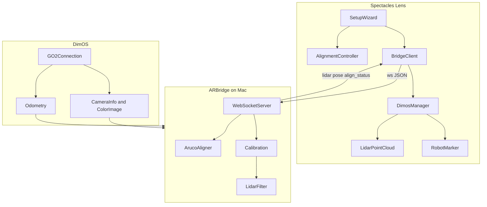
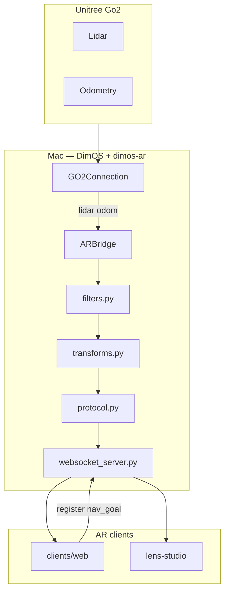

# spectacles-unitree — AR for DimOS + Unitree Go2

> **Lens Studio:** open [`lens-studio/spectacles-unitree.esproj`](lens-studio/spectacles-unitree.esproj) — not the repo root. See [CONTRIBUTING.md](CONTRIBUTING.md).

Visualize your **Unitree Go2** in **augmented reality**: live lidar and robot pose in the AR world frame, with floor-pin navigation on the roadmap. The Mac runs [DimOS](https://github.com/dimensionalOS/dimos); the Python side is a **DimOS extension** ([`dimos-ar/`](dimos-ar/)) that exposes a documented WebSocket API any AR client can speak.

First targets: **Snap Spectacles** (Lens Studio) and a **phone/web** debug viewer. Neither is hardcoded in the Python side — platform-specific clients live outside `dimos_ar/` (`dimos-ar/clients/web/`; Spectacles in [`lens-studio/`](lens-studio/)).

## Repository layout

```text
spectacles-unitree/          # this repo (README, git, shared assets)
├── assets/                  # README gifs, demo media
├── dimos-ar/                # Python AR bridge, blueprints, web client, protocol docs
└── lens-studio/             # Spectacles Lens Studio project (spectacles-unitree.esproj)
```

> This is **not a fork of DimOS**. It is a separate package that depends on DimOS and composes into DimOS blueprints via `autoconnect`.

This repo is a starting point for developers who want to work at the intersection of **spatial computing**, **mobile robotics**, and **DimOS**. The layout and documentation style are inspired by [spectacles-reachy-mini](https://github.com/V4C38/spectacles-reachy-mini) (Spectacles Lens + robot-side WebSocket), adapted here for quadruped navigation.

*Demo video and GIFs: add under [`assets/`](assets/) when ready — see [`assets/README.md`](assets/README.md).*

## This repo contains

- **AR bridge (Python)** — [`dimos-ar/dimos_ar/`](dimos-ar/dimos_ar/) `ARBridge` DimOS module: filter lidar, transform frames, serve WebSocket
- **Blueprints** — [`dimos-ar/blueprints/`](dimos-ar/blueprints/) compose DimOS robot stacks with `ARBridge`
- **Protocol spec** — [`dimos-ar/docs/PROTOCOL.md`](dimos-ar/docs/PROTOCOL.md) JSON WebSocket contract (the real cross-platform API)
- **Web debug client** — [`dimos-ar/clients/web/`](dimos-ar/clients/web/) Vite + Three.js viewer for replay testing (no glasses required)
- **Tests** — [`dimos-ar/tests/`](dimos-ar/tests/) unit tests + optional live WebSocket integration check
- **Spectacles client** — [`lens-studio/`](lens-studio/) Lens Studio project (early stage)
- **Design docs** — [`dimos-ar/docs/`](dimos-ar/docs/) architecture, project brief, protocol, Lens development guide

## Setup

**Prerequisites**

- macOS dev machine (8GB-class MacBook Air is the reference target; CPU only, no CUDA)
- Python 3.12+
- [DimOS](https://github.com/dimensionalOS/dimos) installed in a venv (`pip install "dimos[base,unitree]"` or `pip install -e ".[unitree]"` from this repo after DimOS is available)
- Node.js 18+ (for the web debug client only)

*Note: With no Go2 on the LAN, the blueprint starts in **replay mode** automatically (WebSocket still works for testing).*

1. **Install dimos-ar into your DimOS venv**

   ```bash
   /path/to/dimos/.venv/bin/python3 -m pip install -e /path/to/spectacles-unitree/dimos-ar
   ```

2. **Start the AR blueprint**

   AR development uses the blueprint script — **not** the stock `dimos --replay run unitree-go2` CLI alone (that runs DimOS without `ARBridge`).

   **Quick start (from this repo):**

   ```bash
   cd /path/to/spectacles-unitree/dimos-ar
   ./start.sh              # discover Go2, or replay; WebSocket on 0.0.0.0:8765 (Spectacles-ready)
   ./start.sh --replay     # replay only (no robot)
   ./start.sh --local      # WebSocket localhost-only (same-machine web client)
   ```

   The script auto-picks `../dimos/.venv/bin/python3` when present, or set `DIMOS_PYTHON` explicitly.

   **Equivalent manual command:**

   ```bash
   /path/to/dimos/.venv/bin/python3 /path/to/spectacles-unitree/dimos-ar/blueprints/go2_ar_basic.py
   ```

   On startup the blueprint **searches the LAN for Go2 robots** (DimOS UDP discovery). There is **no robot IP configuration** — only an optional serial:

   ```text
   Searching for robots...
   Found 1 robot (B42D...) — connecting.
   ```

   If several robots are on the network, an interactive picker runs in the terminal (arrow keys). Pin a robot with `ROBOT_SERIAL` in the environment or `.env` to skip the menu.

   **Offline / CI (no discovery, replay only):**

   ```bash
   FORCE_REPLAY=1 CI=1 /path/to/dimos/.venv/bin/python3 \
     /path/to/spectacles-unitree/dimos-ar/blueprints/go2_ar_basic.py
   ```

   Wait for:

   ```text
   AR WebSocket server listening host=0.0.0.0 port=8765
   ```

   Replay lidar often starts **15–40 seconds** after the process boots — that delay is normal.

3. **Open the web debug viewer**

   ```bash
   cd dimos-ar/clients/web
   npm install
   npm run dev
   ```

   Open the URL Vite prints (typically `http://localhost:5173`). Click **Connect**, then **Dev Register** to apply identity calibration for replay (no physical ArUco marker required).

   For headless protocol checks (with the blueprint still running in another terminal):

   ```bash
   cd /path/to/spectacles-unitree/dimos-ar
   pytest tests/test_ws_integration.py -m integration
   ```

   See [`dimos-ar/tests/README.md`](dimos-ar/tests/README.md) for unit vs integration test details.

4. **Spectacles Lens (hardware)**

   - On the phone, scan the **QR code** from `./start.sh` (marker page at true size) — see [Frame alignment](#frame-alignment-apriltag-marker).
   - Open [`lens-studio/spectacles-unitree.esproj`](lens-studio/spectacles-unitree.esproj) in Lens Studio; follow [`lens-studio/docs/SCENE_SETUP.md`](lens-studio/docs/SCENE_SETUP.md).
   - Push to device — the setup wizard opens automatically: **Connect → Calibrate → Complete**.

## Core concepts

### The bridge is a DimOS module

`ARBridge` subclasses `dimos.core.module.Module`. It declares typed `In[]` / `Out[]` streams and is wired into a blueprint with `autoconnect` — the same pattern as other DimOS modules.

DimOS connects to the Go2 over **WebRTC** (no ROS2 on this path). This package subscribes to DimOS streams and re-broadcasts them to AR clients over WebSocket.

- **Inputs (M1):** `lidar`, `odom`, `color_image`, `camera_info` from `ARGO2Connection` — wired automatically via `handle_*` when `super().start()` runs
- **Outputs (M2+):** `clicked_point` to `ReplanningAStarPlanner`
- **Side channel:** a WebSocket server on a daemon thread (the RPC worker never blocks)

### Platform-agnostic protocol

All DimOS-side code speaks a single JSON WebSocket protocol ([`dimos-ar/docs/PROTOCOL.md`](dimos-ar/docs/PROTOCOL.md)). Any client that implements it works: Spectacles, a phone browser, a future Quest app.

- Name things generically: `ARBridge`, not `SpectaclesBridge`
- Treat the protocol schema as a versioned API (`protocol_version` in `hello`)
- Inbound messages with an unknown `robot_id` are rejected

### Frame alignment (AprilTag marker)

The robot lives in an **odom** frame; AR devices live in a **world** frame.

**M1 hardware flow (phone-first — no printing required):**

1. Run `./start.sh` and **scan the QR code** on your phone (opens the composite marker page at **60 mm × 120 mm**, with the inner AprilTag still **60 mm × 60 mm**). Max brightness, disable auto-lock.
2. Run the Spectacles setup wizard (**Connect → Calibrate → Complete**).
3. During **Calibrate**, hold the phone so both the Go2 camera and your Spectacles can see the marker simultaneously.

The Lens sends `align_start` / `align_marker` while Image Tracking sees the marker; the bridge runs OpenCV AprilTag detection on the Go2 camera and computes `T_world_odom` when both sides detect the marker within **500 ms**. After that, lidar and pose stream in **world** coordinates.

**Marker size configuration.** Default: AprilTag 36h11 with a **60 mm** square inner tag inside a **60 mm × 120 mm** composite tracked image. The shared contract lives in `dimos-ar/dimos_ar/marker_contract.py`. The marker web page is rendered from that contract, and `python scripts/generate_marker.py --sync-lens` updates the Lens marker asset height to match automatically (see [`dimos-ar/docs/MARKER_ASSETS.md`](dimos-ar/docs/MARKER_ASSETS.md)).

The web client’s **Dev Register** button still uses the legacy `register` message (identity at origin) for replay without a physical marker.

### DimOS visualization vs this repo

DimOS ships its own Mac-side tools (Rerun native/web on port **7779**, optional Foxglove on **8765**). Those are for **debugging DimOS blueprints** in robot/odom frame.

| Tool | Use for |
|------|---------|
| DimOS Rerun / WebsocketVis | Nav, costmaps, teleop, odom-frame lidar |
| **`dimos-ar/clients/web`** | AR protocol, world-frame lidar, `register` flow |

They are complementary. Do **not** enable `viewer=foxglove` on the same machine as ARBridge — both bind port **8765**.

## Architecture overview



```text
Unitree Go2 Air
    |  WebRTC (DimOS GO2Connection — no jailbreak)
MacBook (DimOS + dimos-ar)
    |  WebSocket JSON  ws://host:8765
AR client (Spectacles Lens / phone web app)
```



Detailed information about the individual components is provided in the next sections.

### ARBridge (Python)

Central module: [`dimos-ar/dimos_ar/bridge_module.py`](dimos-ar/dimos_ar/bridge_module.py).

| File | Responsibility |
|------|----------------|
| [`bridge_module.py`](dimos-ar/dimos_ar/bridge_module.py) | DimOS module lifecycle, stream handlers |
| [`websocket_server.py`](dimos-ar/dimos_ar/websocket_server.py) | Daemon-thread `websockets` server |
| [`protocol.py`](dimos-ar/dimos_ar/protocol.py) | JSON encode/decode (keep in sync with PROTOCOL.md) |
| [`filters.py`](dimos-ar/dimos_ar/filters.py) | Range/height filter, subsample, rate limit (~1–3k points) |
| [`transforms.py`](dimos-ar/dimos_ar/transforms.py) | `T_world_odom` calibration and inverse transforms |

**Threading (critical):** `super().start()` auto-binds `handle_lidar` / `handle_odom` on the module asyncio loop. Handlers schedule WebSocket sends via `asyncio.run_coroutine_threadsafe`. The WebSocket server runs on its own daemon thread; `start()` waits until the socket is listening.

**Configuration (`ARBridgeConfig`):**

| Field | Default | Purpose |
|-------|---------|---------|
| `port` | 8765 | WebSocket listen port |
| `robot_id` | `"go2"` | Protocol robot identifier |
| `max_message_bytes` | 1048576 | Max inbound WebSocket frame size |
| `max_range_m` | 3.0 | Lidar horizontal range filter |
| `min_height_m` / `max_height_m` | 0.1 / 1.5 | Height band filter |
| `target_points` | 2500 | Lidar subsample target |
| `lidar_max_hz` / `pose_max_hz` | 10 / 20 | Outbound rate limits |
| `marker_length_m` | 0.060 | AprilTag square edge (60 mm) |
| `align_timestamp_tolerance_s` | 0.5 | Max time gap between dual detections |

### Web debug client

[`dimos-ar/clients/web/`](dimos-ar/clients/web/) — Vite + Three.js reference implementation of the AR protocol.

1. Connect to `ws://127.0.0.1:8765` (or your Mac’s LAN IP when testing from a phone)
2. Server sends `hello` with capabilities; stats panel shows connection state
3. Click **Dev Register** to send identity calibration (replay without a printed marker)
4. Live point cloud and robot pose render in world frame; Hz counters update in the HUD

See [`dimos-ar/clients/web/README.md`](dimos-ar/clients/web/README.md) for two-terminal setup details.

### Spectacles client (`lens-studio/`)

The Lens Studio project lives in [`lens-studio/`](lens-studio/) (`lens-studio/spectacles-unitree.esproj`), not under `dimos-ar/clients/`. It implements world-anchored lidar rendering, ArUco registration in-scene, and (M2+) floor-pin navigation using the same WebSocket protocol as the web client.

See [`dimos-ar/docs/LENS_DEVELOPMENT.md`](dimos-ar/docs/LENS_DEVELOPMENT.md) for Lens architecture (Agent Center patterns), dev workflow, and Lens Studio MCP setup for Cursor.

## WebSocket on port 8765

The Mac is the **server**; AR devices are **clients**. All messages are JSON text frames.

**Handshake (server → client on connect, M1)**

```json
{"type":"hello","protocol_version":1,"robots":["go2"],"capabilities":["lidar","odom","align"]}
{"type":"bridge_status","mode":"replay","robot_model":"unitree_go2","robot_connected":true,...}
```

`bridge_status` tells clients whether the bridge is on **live** hardware or **replay**,
which `robot_model` is active (`unitree_go2` today; `unitree_g1` when that blueprint
exists), and whether streams are flowing. Clients can send `get_status` to refresh.

**Outbound (server → client, M1)**

| Message | Purpose |
|---------|---------|
| `lidar` | Filtered point cloud in **world** frame (~1–3k points) |
| `pose` | Robot pose in **world** frame |
| `registered` | Ack after `register` |

**Inbound (client → server, M1)**

| Message | Purpose |
|---------|---------|
| `register` | ArUco marker pose in world frame → compute calibration |

**Inbound (M2+, not yet wired in `go2_ar_basic`)**

| Message | Purpose |
|---------|---------|
| `nav_goal` | Floor waypoint in world frame → planner |
| `cancel_goal` | Cancel active navigation |

Full schema: [`dimos-ar/docs/PROTOCOL.md`](dimos-ar/docs/PROTOCOL.md).

## Blueprints

| Blueprint | Composition | Milestone |
|-----------|-------------|-----------|
| [`go2_ar_basic.py`](dimos-ar/blueprints/go2_ar_basic.py) | LAN discovery + `ARGO2Connection` + `ARBridge` | M1 — lidar + odom |
| `go2_ar_nav.py` (planned) | `unitree_go2` + `ARBridge` | M2 — navigation + path |

## Customization

Here are things you can change without leaving the supported architecture:

- **Tune lidar for your network:** edit `ARBridgeConfig` in [`bridge_module.py`](dimos-ar/dimos_ar/bridge_module.py) — `max_range_m`, `target_points`, `lidar_max_hz`
- **Pin a specific Go2 on a busy LAN:** set `ROBOT_SERIAL` before starting the blueprint (must match the hardware serial from discovery)
- **Add a protocol message:** update [`dimos_ar/protocol.py`](dimos-ar/dimos_ar/protocol.py) and [`dimos-ar/docs/PROTOCOL.md`](dimos-ar/docs/PROTOCOL.md) together, then mirror types in [`dimos-ar/clients/web/src/protocol.ts`](dimos-ar/clients/web/src/protocol.ts) and `lens-studio/Assets/Scripts/Network/Protocol.ts`
- **Add a new AR platform:** implement [`dimos-ar/docs/PROTOCOL.md`](dimos-ar/docs/PROTOCOL.md) in your client; keep platform code out of `dimos_ar/` (web in `dimos-ar/clients/web/`; Spectacles in `lens-studio/`; other platforms in their own folder or repo)

**Extend the bridge (M2+)**

1. Add stream declarations on `ARBridge` (`path`, `goal_reached`, `clicked_point`)
2. Switch blueprint to `go2_ar_nav` composing `unitree_go2` (includes planner)
3. Wire `on_nav_goal` / `on_cancel_goal` on `ARWebSocketServer`; use `inverse_transform_point` from [`transforms.py`](dimos-ar/dimos_ar/transforms.py)

## Milestones

| # | Goal | Status |
|---|------|--------|
| **M1** | Lidar visualization in AR with ArUco registration | In progress — bridge + web client |
| **M2** | Waypoint navigation: pin on floor, path in AR, robot follows | Planned |
| **M3** | Open-vocabulary object detection pins | Planned |
| **M4** | Voice commands via DimOS agent | Planned |
| **M5+** | Semantic queries, spatial map in AR, multi-robot | Planned |

Build strictly in order. See [`dimos-ar/docs/PROJECT_BRIEF.md`](dimos-ar/docs/PROJECT_BRIEF.md).

## Ports

| Service | Port |
|---------|------|
| **ARBridge WebSocket** | **8765** |
| DimOS WebsocketVis (nav dashboard) | 7779 |
| Vite dev server (`dimos-ar/clients/web`) | 5173 |

## Robot discovery

The blueprint never uses a configured robot IP. At startup it probes the LAN (DimOS `landiscovery`, ~2 seconds), then:

| Result | Behavior |
|--------|----------|
| No Go2 found | **Replay mode** — recorded lidar/odom, WebSocket on port 8765 |
| One Go2 | Connect automatically; `robot_id` in protocol = hardware serial |
| Multiple Go2s | Interactive terminal picker (or `ROBOT_SERIAL` to skip) |

If the live connection goes stale, `ARGO2Connection` re-discovers by **serial** and reconnects WebRTC to the robot’s current IP.

| Environment variable | Purpose |
|---------------------|---------|
| `ROBOT_SERIAL` | Connect to this serial (required in CI when multiple robots are on LAN) |
| `FORCE_REPLAY=1` | Skip discovery; replay only |
| `DISCOVER_TIMEOUT` | Discovery wait in seconds (default `2.0`) |
| `CI=1` | Non-interactive: no picker; single robot auto-connects |

## Additional notes

### Development tips

- Use `pip install -e ".[dev]"` from `dimos-ar/` for pytest, ruff, and mypy
- Run unit tests: `cd dimos-ar && pytest` (integration tests excluded by default)
- Run live WebSocket check: `cd dimos-ar && pytest tests/test_ws_integration.py -m integration` while the blueprint is running
- Use `CI=1` when running blueprints to skip interactive system configurators
- Use `FORCE_REPLAY=1` for offline dev without LAN discovery; use `ROBOT_SERIAL` when multiple Go2s are on the network (CI / non-interactive)
- For robot-only debugging without the AR protocol, use DimOS directly: `dimos --replay run unitree-go2` with Rerun ([visualization docs](https://github.com/dimensionalOS/dimos/blob/main/docs/usage/visualization.md))
- If you bind `listen_host` to a non-localhost address for phone/Spectacles testing, remember the WebSocket has **no authentication** — use only on trusted networks

### Known issues

- Replay lidar may take **15–40 seconds** after blueprint boot before the first points arrive
- Port **8765** conflicts with DimOS **Foxglove** viewer — do not run both on the same machine
- WebSocket has no auth (intended for local dev; see `listen_host` warning above)
- Spectacles Lens (`lens-studio/`) is early stage — see `dimos-ar/docs/LENS_DEVELOPMENT.md`

### Documentation map

| Doc | Contents |
|-----|----------|
| [`dimos-ar/docs/PROJECT_BRIEF.md`](dimos-ar/docs/PROJECT_BRIEF.md) | Goals, milestones, constraints |
| [`dimos-ar/docs/ARCHITECTURE.md`](dimos-ar/docs/ARCHITECTURE.md) | Package layout, threading, data flow |
| [`dimos-ar/docs/PROTOCOL.md`](dimos-ar/docs/PROTOCOL.md) | WebSocket message schema |
| [`dimos-ar/docs/LENS_DEVELOPMENT.md`](dimos-ar/docs/LENS_DEVELOPMENT.md) | Spectacles Lens Studio guide, MCP, UI patterns |
| [`dimos-ar/docs/MARKER_ASSETS.md`](dimos-ar/docs/MARKER_ASSETS.md) | AprilTag generation and Lens sync |
| [`lens-studio/docs/SCENE_SETUP.md`](lens-studio/docs/SCENE_SETUP.md) | Lens scene wiring checklist |
| [`CONTRIBUTING.md`](CONTRIBUTING.md) | Monorepo layout, protocol sync, dev workflow |

Contributions, ideas, and bug reports are welcome. Feel free to open an issue or pull request.

## License

MIT License — see [LICENSE](LICENSE).
