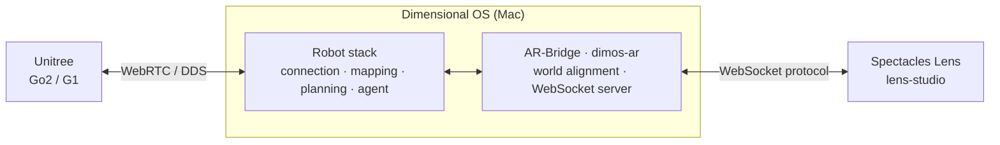

<h1 align="center">Spectacles AR for Robotics and Physical AI</h1>

<p align="center">
  <a href="https://github.com/V4C38/spectacles-dimensional-os"></a>
  <a href="LICENSE"></a>
  <a href="https://github.com/V4C38/spectacles-dimensional-os/stargazers"></a>
  <a href="https://github.com/V4C38/spectacles-dimensional-os/network/members"></a>
  <a href="https://github.com/V4C38/spectacles-dimensional-os/graphs/contributors"></a>
</p>

<p align="center">
  
  
</p>

<p>
  This project explores the use of <b>Augmented Reality as an interface for robotics and physical AI</b> in the context of navigation tasks and sensor data visualization. The AR glasses used are the 2024 <b>Snap Spectacles</b> 2024 developer kit. A <b>Unitree Go2 quadruped or G1 humanoid</b> is controlled via <a href="https://github.com/dimensionalOS/dimos">Dimensional OS</a> which handles navigation and path planning. A custom Websocket extension for DimOS is used as a bridge between the Spectacles Lens (App) and physical stack.
</p>

<p align="center">
  <a href="#setup">Setup</a> •
  <a href="#systems-design">Systems Design</a> •
  <a href="#ar-interactions">AR Interactions</a> •
  <a href="#pose-drift">Pose Drift</a>
</p>


<a id="prerequisites"></a>

### Supported Hardware

<table align="center">
  <tr>
    <th>Quadruped</th>
    <th>Humanoid</th>
  </tr>
  <tr>
    <td>🟩 Unitree Go2 pro/air<br><sub>Fully supported &amp; tested - primary development target</sub></td>
    <td>🟧 Unitree G1<br><sub>Supported, not tested - looking for collaborators</sub></td>
  </tr>
</table>


<a id="setup"></a>

### Setup

You need a Mac, Spectacles and the robot on the same WiFi. Nothing else needs an internet connection, except Agent Mode, which calls the OpenAI API from the Mac.

<a id="vialauncher"></a>
<details>
<summary><strong>Via launcher</strong></summary>

The launcher is a small web app that runs on your Mac and handles everything outside the Lens. It checks what is already installed, installs Dimensional OS and the bridge for you, finds the robot on your network, keeps your OpenAI key, generates and configures the AprilTag, and starts or stops the bridge with one button. A live log next to it shows what the robot stack is doing, so you can see problems without reading terminal output.

This is the recommended path. Once it is open you do not need the terminal again.

Double-click [`launcher/Start Launcher.command`](launcher/Start%20Launcher.command) in Finder, or run:

```bash
cd /path/to/spectacles-dimensional-os
./launcher/scripts/start-launcher.sh
```

Your browser opens at `http://127.0.0.1:8790`. Leave the terminal window it started from open, closing it stops the launcher.

**First run:** open **Dependencies**, choose whether to reuse a Dimensional OS install you already have or download a fresh one, then press **Install**. This takes a while.

**Every run:** pick **Unitree Go2** or **Unitree G1**, press **Start**, and wait for the log. The value shown as **Bridge IP** is the address you type into the Lens. If no robot answers on the network, the bridge starts with a simulated robot instead.

macOS asks for your admin password the first time you start after a reboot. Dimensional OS needs a local network route and larger socket buffers for its internal messaging.

</details>

<a id="manual-install"></a>
<details>
<summary><strong>Via manual install</strong></summary>

The launcher runs two scripts, and you can run them yourself.

[`launcher/scripts/setup.sh`](launcher/scripts/setup.sh) locates a Dimensional OS install or clones one into `../dimos`, then installs this repo's `dimos-ar` package into that same Python environment and runs its tests. Add `--stack g1` if you need the G1 navigation stack, which requires Dimensional OS from source.

```bash
./launcher/scripts/setup.sh
```

[`launcher/scripts/start.sh`](launcher/scripts/start.sh) applies the macOS network settings, asks which robot stack to run, looks for the robot on the network, and boots the bridge on port **8787**. The log prints the address to enter on Spectacles. Set `OPENAI_API_KEY` beforehand if you want Agent Mode, and `ROBOT_IP` to skip discovery.

```bash
./launcher/scripts/start.sh
```

To skip the scripts entirely, install [Dimensional OS](https://github.com/dimensionalOS/dimos) yourself, add the bridge to the same environment, and start a blueprint directly:

```bash
cd /path/to/spectacles-dimensional-os/dimos-ar
/path/to/dimos/.venv/bin/python3 -m pip install -e ".[dev]"

sudo ../launcher/scripts/configure-system.sh --apply

export ROBOT_IP=<robot-lan-ip>   # or "fake" for a simulated robot
/path/to/dimos/.venv/bin/python3 -c "
import sys
sys.path.insert(0, '.')
from dimos.core.coordination.module_coordinator import ModuleCoordinator
from dimos.ar.blueprints import ar_go2
ModuleCoordinator.build(ar_go2).loop()
"
```

Use `ar_g1` instead of `ar_go2` for the humanoid.

</details>

<details>
<summary><strong>AprilTag setup</strong></summary>

The Lens finds the robot by looking at a printed AprilTag on it. The launcher generates the tag for you, so you only need to print and stick it on. Open **Config**, click the tag image to get a printable PDF, and print it at **100% scale** with no page scaling.

<table>
  <tr>
    <th width="50%">Unitree Go2</th>
    <th width="50%">Unitree G1</th>
  </tr>
  <tr>
    <td valign="top">
      
    </td>
    <td valign="top">
      
    </td>
  </tr>
  <tr>
    <td valign="top">
      One tag, ID 0, printed at <b>70 mm</b>.<br><br>
      It lies flat on top of the body, 18 cm ahead of the robot center and 6 cm up, tilted slightly backwards so you can read it while standing next to the robot.
    </td>
    <td valign="top">
      Two tags, ID 0 and ID 1, printed at <b>70 mm</b>.<br><br>
      ID 0 goes upright on the chest panel, 17.8 cm above the pelvis; ID 1 goes upright on the back panel, 23.7 cm up. Both are centered left to right. Two tags let the Lens see the robot from either side. The torso shell is curved, so a larger tag would not seat flat.
    </td>
  </tr>
</table>

If you want to mount a tag somewhere else, change its ID, size and offsets in the launcher under **Config**. Adding a second tag that is visible from the start will significantly improve the initial yaw calibration.

Prefer editing code? The same defaults live in [`go2.py`](dimos-ar/dimos/ar/robot_profile/go2.py) and [`g1.py`](dimos-ar/dimos/ar/robot_profile/g1.py).

</details>

#### Register inside Spectacles Lens

Open [`lens-studio/spectacles-dimensional-os.esproj`](lens-studio/spectacles-dimensional-os.esproj) in Lens Studio and send the Lens to your Spectacles. The Registration Wizard walks you through connecting and locating the robot. Enter the bridge IP from the launcher when asked.

<p align="center">
  
</p>

Leave the robot standing still and walk around it while looking at the tag. Registration finishes on its own once it has gathered sufficient tag sightings. Keep viewing distance about 0.5 - 1.5 meters.
Alternatively, switch to **Manual Placement**, where you drag a marker onto the robot by hand - this doesn`t require printing and mounting the tag but yields much lower accuracy and will not support runtime drift correction.

Alignment is rough at first and gets better as the robot moves and more tag sightings are integrated into the world frame calibration.

<a id="systems-design"></a>

## Systems Design

**Dimensional OS** runs the robot. It owns the connection to the Go2 or G1, builds a map out of the LiDAR, plans routes through that map and handles the navigation. In Agent Mode it also runs the language model behind your voice commands. 

**The DimOS AR-Bridge** is the main addition of this repo. It streams the robot's position, route and LiDAR over a WebSocket and takes navigation goals and other commands back. It is responsible for aligning both glasses and robot coordinate systems via the mounted april tag.

The bridge is designed to be device agnostic. Clients implement [`PROTOCOL.md`](dimos-ar/PROTOCOL.md) as the communication protocol for all messages.

**The Spectacles Lens** is the reference client. It renders the robot and its route, reads hand gestures, sends camera images the bridge requires for april tag based frame alignment and handles speech.



<details>
<summary><strong>Architecture overview</strong></summary>

**DimOS AR-Bridge**

`ARBridge` is the module Dimensional OS loads. It builds everything below and receives the robot's sensor streams.

| Class | Role |
|-------|------|
| `Go2RobotProfileModule` / `G1RobotProfileModule` | Everything specific to one robot: its name, size, what it can do, and where the tags are mounted. Adding a new robot mostly means adding a profile. |
| `ARWebSocketServer` | The socket clients connect to. `BridgeSender` queues what goes out so nothing blocks the robot stack. |
| `RegistrationSession` | Runs setup, either scanning the tag or taking a manually placed pose, until the two worlds are locked together. |
| `RobotAprilTagTracker` | Finds tags in the camera images the client sends and works out where the robot is from them. |
| `WorldFrameState` | The committed link between the AR world and the robot's own coordinates. Everything that converts between the two reads it. |
| `WorldFrameRefiner` | Watches later tag sightings and nudges that link back into place as the robot drifts. |
| `NavigateGoalHandler` | Takes a goal from the client, hands it to the planner, and reports progress or failure back. |
| `TelemetryPublisher` | Sends robot position and LiDAR out to the client. |
| `BridgeSafetyCoordinator` | Emergency stops, and stopping the robot if a client vanishes mid-goal. |
| `AgentRelay` | Voice commands in, agent replies and status out. |

**Spectacles Lens**

`ARBridgeCoordinator` is the entry point. It moves the app from registration into runtime and connects the pieces below.

| Class | Role |
|-------|------|
| `ARBridgeSession` | The connection itself, including the handshake that tells the Lens which robot it is talking to. |
| `InboundRouter` | Hands each incoming message to whoever cares about it. |
| `AppState` | One observable store for the current mode, the robot's state and the connection. The UI reacts to it rather than to messages. |
| `RegistrationWizard` | The setup steps you walk through, backed by `RegistrationFlow` for the actual logic. |
| `NavigationController` | Marker placement, the path line, and sending goals to the bridge. |
| `RobotPresenter` | The robot marker, its menu, and keeping it on the real robot as pose updates arrive. |
| `LidarPresenter` | Turns incoming points into the obstacle and full point cloud views. |
| `UIManager` | The wrist menu and the debug console, via `WristMenuController` and `MainMenuView`. |
| `AgentSpeechController` | Wake word, speech session, and passing transcripts to the bridge. |
| `FrameCaptureController` | Captures camera stills and sends them over when the bridge asks for them. |

</details>

<a id="ar-interactions"></a>

## AR Interactions

Hold your left palm up to open the wrist menu. That is where you switch between Manual and Agent Mode, restart registration, show the debug console, and hit the emergency stop.

The LiDAR button in the wrist menu cycles three states: off, obstacles only, and the full point cloud around the robot.

<a id="manual-mode"></a>

### Manual Mode


The NavigationMarker is initially attached to the robot and allows the user to drag it at any time. The direction you drag sets the heading it should face when it arrives, as inidicated by the arrow. The robot will continuously move towards the marker.
The yellow path line shown is the real navigation path the planner sends back, rendered in world space. 


<a id="agent-mode"></a>

### Agent Mode

Say **"Robot"** to wake it, then tell it what to do. Speech to text runs on the Spectacles and the transcript goes to a GPT-4o agent on the Mac, which picks from the tools below. The session closes after 30 seconds of silence. Say **"stop"** and the robot stops immediately.

Anything the agent starts looks and behaves exactly like a manually placed navigation goal. You can grab the marker and take over at any point which will override the goal set by the agent immediately.

The agent does not talk back. It replies in a few words on the robot and in the debug console. It will assume reasonable defaults when user commands are unspecific.

| Tool | What it does |
|------|--------------|
| `relative_move` | Walk or turn by an amount relative to where the robot is now |
| `navigate_to_user` | Come to you, using the position of your headset |
| `get_user_pose` | Find out where you are standing and which way you face |
| `cancel_navigation` | Emergency-stop the robot and clear the current goal |
| `place_marker` | Leave a marker floating in the room |
| `draw_line` | Draw a line between two points in the room |
| `clear_annotation` | Remove a marker or line it drew earlier |

Agent Mode needs `OPENAI_API_KEY` set in the launcher and and internet connection on the Mac.

<a id="pose-drift"></a>

## Pose Drift

The RobotMarker you see in AR drifts directly proportional to travelled distance. The amount of drift varies but is aprox. 25cm at a total travel distance of 5m. 

The cause is inconsistent odometry data from the robot itself. In simple terms, the robot estimates it´s current world pose by adding up how far it has moved, and on Unitree hardware those numbers are not consistent, so small errors accumulate over time and distance. 

The bridge corrects for this whenever it gets a valid camera frameat the AprilTag. It compares where the tag really is against where the robot reports to be and corrects the alignment to match the observation. Between those corrections the error grows again.

Practically: expect it to be off after a long run, look at the robot to force the correction.

<details>
<summary><h3>Development &amp; Troubleshooting</h3></summary>

Run the full CI suite before opening a PR. It covers both sides and mirrors what GitHub Actions runs.

```bash
./launcher/scripts/run-ci.sh
```

Python tests on their own, using the Dimensional OS environment:

```bash
cd dimos-ar
/path/to/dimos/.venv/bin/python3 -m pytest
```

Lens tests on their own. These are plain TypeScript and do not need Lens Studio:

```bash
cd lens-studio/Tests
npm test
```

### Troubleshooting

| Symptom | Things to try |
|---------|----------------|
| Lens cannot connect | Check that Spectacles and the Mac are on the same WiFi and that you typed the Bridge IP from the launcher, not `127.0.0.1`. |
| AprilTag not detected | Get closer, improve the lighting, keep walking around the robot, and check that the tag printed at full size. |
| Drift after registration | Expected, see [Pose Drift](#pose-drift). Look at the tag while the robot stands still so the bridge can correct itself. |
| Navigation unavailable | The bridge log reports which capabilities the robot advertised. G1 navigation needs the Unitree DDS packages in the DimOS environment. |
| Agent does not respond | Check that `OPENAI_API_KEY` is set in the launcher and that the Mac has internet. |
| Wake word ignored | Turn on the debug console and watch line 7 to see what was transcribed, and check that you are in Agent Mode. |
| Robot does not move | Registration has to be finished and the robot connected. The agent reply on line 8 turns red or yellow when something failed. |

</details>

## Contributing

Contributions, ideas and bug reports are welcome. If you are changing something that crosses between the bridge and the Lens, read [`CONTRIBUTING.md`](CONTRIBUTING.md) first, especially the rules on keeping the protocol in sync.

## License

MIT License, see [LICENSE](LICENSE).
