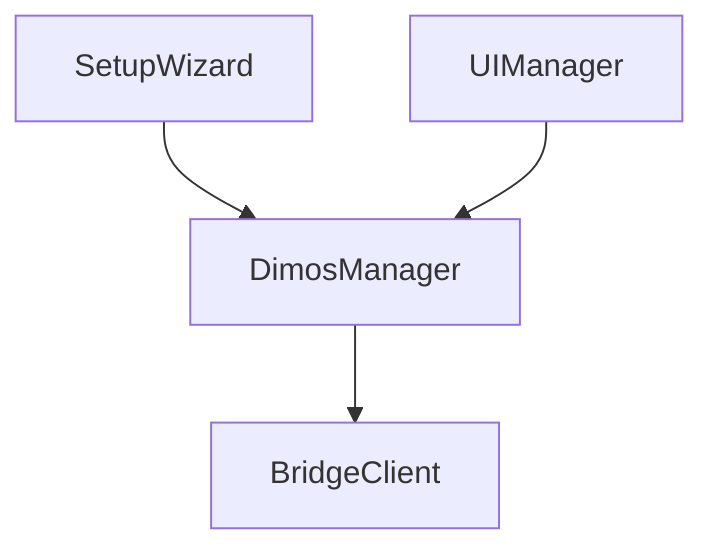

# Spectacles AR + Dimensional OS

> **Lens Studio:** open [`lens-studio/spectacles-dimensional-os.esproj`](lens-studio/spectacles-dimensional-os.esproj), not the repo root.

Visualize and control **DimOS robot stacks** from **Snap Spectacles**.
[`dimos-xr/`](dimos-xr/) is a WebSocket based bridge between [Dimensional OS](https://github.com/dimensionalOS/dimos) for low-level robot control and orchestration and a Spectacles Lens for spatial UI/UX.

<p align="center">
  
</p>

This is **not a fork of DimOS**. It is a separate package that depends on DimOS and composes into blueprints via `autoconnect`. The Spectacles client lives in [`lens-studio/`](lens-studio/), while the Python side stays platform-agnostic so future XR clients can implement the same protocol without changing `dimos_xr/`.


At a glance:
- [`lens-studio/`](lens-studio/) contains the Spectacles Lens Studio project, setup flow, HUD, navigation interaction, and world-anchored visuals.
- [`dimos-xr/`](dimos-xr/) contains the DimOS XR bridge package, `XRBridge`, the adapter module, and tests.
- [`dimos-xr/PROTOCOL.md`](dimos-xr/PROTOCOL.md) is the cross-platform contract between the bridge and every XR client.


## Core concepts / Overview

- `dimos-xr` is a **DimOS extension**, not a platform-specific fork.
- The shared API is the JSON WebSocket protocol in [`dimos-xr/PROTOCOL.md`](dimos-xr/PROTOCOL.md).
- The robot lives in an **odom** frame, while AR clients live in a **world** frame, so setup must solve a shared transform before runtime visuals are trustworthy.
- The bridge is single-active-robot per process and uses adapter-declared capabilities.

<details>
<summary>Quick start</summary>

1. Install and test the Python side:

   ```bash
   cd /path/to/spectacles-dimensional-os
   ./setup.sh
   ```

2. Start the XR bridge:

   ```bash
   cd /path/to/spectacles-dimensional-os
   ./start.sh
   ```

3. Open [`lens-studio/spectacles-dimensional-os.esproj`](lens-studio/spectacles-dimensional-os.esproj) in Lens Studio and push to device.

4. In the Lens, go through **Connect -> Calibrate -> Complete**.

</details>

<details>
<summary>Frame alignment</summary>

The bridge solves `T_world_odom` so AR content stays registered to the robot. Two calibration flows are supported:

- **Assisted tag** (`align_start{method:"tag", assist:true}`) — the robot drives itself through a 3-leg baseline move (out → back → return) while the Spectacles user looks at the **robot-mounted** AprilTag; the bridge stops the robot between legs to collect stable observations, then runs PnP and auto-commits a gravity-leveled transform once enough baseline has accumulated. Requires the active robot to advertise `align_assist`.
- **Manual pose** — the user drags the robot marker to its real-world position in the Lens and commits directly. No camera frames are consumed, and it's always available regardless of hardware capabilities.

After commit, the same robot-mounted tag continues to drive runtime drift correction from Spectacles frames: a full solve updates yaw and translation once enough baseline exists, falling back to a translation-only correction when the robot is stationary. Runtime corrections only surface to the Lens as a "Refined Tracking" notification once they cross a small deadband (≥ 5 cm translation or ≥ 1° yaw); smaller continuous refinements stay silent.

Calibration requires a **printed robot-mounted tag**: a plain **70 mm × 70 mm** AprilTag 36h11 sticker (56 mm black square). Generate assets with:

```bash
cd /path/to/spectacles-dimensional-os/dimos-xr
python scripts/generate_marker.py
```

Print `apriltag_robot_a4.pdf` or `apriltag_robot_letter.pdf` from `dimos-xr/assets/` at **actual size** (no "fit to page") and verify the outer edge measures 70 mm with a ruler before mounting on the robot.

</details>

<details>
<summary>Protocol and platform boundary</summary>

The Mac is always the WebSocket **server** and AR devices are **clients**. The bridge sends `hello` and `bridge_status` on connect, then streams messages such as `pose`, `lidar`, `path`, `nav_status`, and `align_status`. Clients send messages such as `align_*`, `nav_goal`, `cancel_goal`, and `emergency_stop`.

If the protocol changes, update these together in the same change:
- [`dimos-xr/dimos_xr/network/protocol.py`](dimos-xr/dimos_xr/network/protocol.py)
- [`dimos-xr/PROTOCOL.md`](dimos-xr/PROTOCOL.md)
- [`lens-studio/Assets/Scripts/Bridge/Protocol.ts`](lens-studio/Assets/Scripts/Bridge/Protocol.ts)

</details>

## Lens Studio Project

The Lens side is organized around three scene-entry scripts:

- [`SetupWizard.ts`](lens-studio/Assets/Scripts/Setup/SetupWizard.ts) owns the connect-and-calibrate flow and hands off to runtime. Check Lens Studio Logger output and `./start.sh` bridge logs when calibrate fails.
- [`DimosManager.ts`](lens-studio/Assets/Scripts/Core/DimosManager.ts) is the orchestration hub for bridge I/O, shared app state, robot marker state, LiDAR/path rendering, navigation placement, and manual-alignment fallback.
- [`UIManager.ts`](lens-studio/Assets/Scripts/UI/UIManager.ts) mirrors app state and bridge status into the authored HUD; it does not own the runtime lifecycle.

`BridgeClient` is the transport layer, `SetupCalibrationFlow` owns calibrate-step state for both tag and manual modes, `AlignmentSession` is the single owner of the bridge alignment session (tag + manual), `CameraStream` is a singleton wrapper around the Spectacles colour camera shared by setup and runtime capture, `NavigationController` manages goal placement and navigation state, and the visuals live under `robot/`, `lidar/`, and `navigation/`.



<details>
<summary>Lens setup and runtime responsibilities</summary>

`SetupWizard` builds the wizard view, starts autoconnect, owns the 3-step state machine inline, and finishes by calling `DimosManager.enterRuntime()`. Calibrate-step state (both tag and manual modes) is delegated to `SetupCalibrationFlow`; the bridge alignment session is owned exclusively by `AlignmentSession`, which re-arms on every `hello` so reconnects cannot leave the session stranded.

`DimosManager` starts in setup mode, disconnects the bridge when re-entering setup, and switches to runtime by enabling visuals, preserving manual alignment state when needed, and syncing navigation and robot interaction state. It also owns the shared `AppState`, including bridge-link status used by setup and runtime UI. During runtime it fans bridge events into:
- `PointCloudRenderer` for lidar visualization
- `RobotMarker` for robot pose and local controls
- `NavigationController` for goal placement and path display
- `UIManager` for status presentation

`UIManager` subscribes to app state and updates the authored HUD. Restarting setup goes back through `SetupWizard`, while bridge status, operating mode changes, and the coarse `disconnected` / `connectedNoRobot` / `connected` link state still come from `DimosManager`.

</details>

<details>
<summary>Scene setup pointers</summary>

- Open the project from [`lens-studio/spectacles-dimensional-os.esproj`](lens-studio/spectacles-dimensional-os.esproj).
- Scene wiring, authored object names, and `@input` references are documented inline in the script files via comments at lookup sites.
- The main feature folders are:

  ```text
  lens-studio/Assets/Scripts/
  ├── Core/        (DimosManager, AppState, SignalEmitter, MathUtils, UILogger)
  ├── Bridge/      (BridgeClient, Protocol — types + parser + builders)
  ├── Camera/      (CameraStream — shared colour camera singleton)
  ├── Setup/       (SetupWizard, SetupWizardView, SetupCalibrationFlow, SetupAlignmentPreview)
  ├── UI/          (UIManager, MainMenuView, BridgeStatusPresentation, kit/UIKit, kit/UIAnimations)
  ├── Alignment/   (AlignmentSession, ManualPoseCorrection, FrameCaptureController)
  ├── Navigation/  (NavigationController, PlacementController, PathRenderer, NavigationMarkerView, SurfacePlacementStabilizer, HeadingRotation)
  ├── Robot/       (RobotMarker, RobotMarkerView, RobotRuntimeModel)
  └── Lidar/       (PointCloudRenderer, MockLidarPoints)
  ```

- `ShowLiDAR` controls the height/debug layer, while the red obstacle layer still comes from live bridge lidar when connected. The Lens can also request a bridge-side LiDAR transmit mode (`off` / `obstacles` / `full`) via `set_lidar_mode` to cut payload when only obstacle proximity matters.

</details>

## Dimensional OS Blueprint (`dimos-xr`)

[`dimos-xr/`](dimos-xr/) contains the Python side: `XRBridge`, `XRRobotAdapterModule`, the protocol definition, and the tests. The monorepo entrypoint is [`dimos-xr/dimos_xr/blueprints.py`](dimos-xr/dimos_xr/blueprints.py), which wraps native DimOS stack composition for the currently selected robot runtime.

`XRBridge` itself ([`dimos-xr/dimos_xr/bridge/module.py`](dimos-xr/dimos_xr/bridge/module.py)) subclasses `dimos.core.module.Module` and stays thin: it declares the DimOS `In[...]` streams, builds its collaborators, and fans handler calls out to them. The actual logic lives in single-owner collaborators under `dimos-xr/dimos_xr/bridge/`: `AlignmentController` (calibration sessions, camera-frame processing, runtime drift correction), `NavController` (goal placement, path execution, e-stop), `TelemetryPublisher` (pose/lidar streaming and the bridge-side LiDAR transmit mode), `OdomBuffer` (latest-odom cache), `StatusService` (`bridge_status` broadcasting), `PreviewService` (side-effect-free path preview), and `BridgeSender` (the shared outbound-message sink). The adapter module absorbs robot-specific streams and control surfaces for Go2 and G1 while keeping the bridge core platform-agnostic.


<details>
<summary>Runtime support and capabilities</summary>

Supported runtimes (selected interactively by `./start.sh`):

- `xr-go2` — Unitree Go2 stack (full navigation and marker alignment when the onboard modules are available; capability states may negotiate reduced features on lighter stacks).
- `xr-g1` — Unitree G1 nav-onboard stack (requires the Unitree DDS Python package set in the DimOS `.venv` for onboard navigation).

Direct `dimos run xr-go2` / `dimos run xr-g1` work once these blueprints are registered upstream in DimOS; until then, use `./start.sh`.

On the Lens side, runtime behavior is negotiated from the bridge handshake:
- `AppState` projects robot/runtime metadata from the bridge and carries the coarse bridge-link state used by the setup and runtime UI.
- offline development stays permissive until a bridge connects and completes the handshake.
- unavailable controls stay visible and switch into disabled explanatory UI states with labels explaining why.

</details>

<details>
<summary>Start the blueprint</summary>

The monorepo provides `start.sh` as a convenience wrapper around native DimOS composition:

```bash
cd /path/to/spectacles-dimensional-os
./start.sh
```

`./start.sh` always prompts for the target robot stack, then runs the bridge against the selected composition. The equivalent native commands are:

```bash
dimos run xr-go2
dimos run xr-g1
```

Use `./start.sh` if the blueprints are not yet registered in your DimOS install.

If DimOS lives somewhere unusual, set `DIMOS_PYTHON` explicitly:

```bash
DIMOS_PYTHON=/path/to/dimos/.venv/bin/python3 ./start.sh
```

</details>

<details>
<summary>Manual setup and tests</summary>

Install from the DimOS Python environment:

```bash
cd /path/to/spectacles-dimensional-os/dimos-xr
/path/to/dimos/.venv/bin/python3 -m pip install -e ".[dev]"
/path/to/dimos/.venv/bin/python3 -m pytest
/path/to/dimos/.venv/bin/python3 -m ruff check .
/path/to/dimos/.venv/bin/python3 -m mypy dimos_xr
```

If you want to run `xr-g1`, make sure the same DimOS `.venv`
also has the DDS SDK package installed:

```bash
/path/to/dimos/.venv/bin/pip3 install "unitree-sdk2py-dimos>=1.0.2"
```

Optional live protocol check while the blueprint is already running:

```bash
cd /path/to/spectacles-dimensional-os/dimos-xr
/path/to/dimos/.venv/bin/python3 -m pytest dimos_xr/network/test_ws_integration.py -m integration
```

Tests are colocated with their modules under `dimos-xr/dimos_xr/`. See [`dimos-xr/README.md`](dimos-xr/README.md) for the unit vs integration test split.

</details>

<details>
<summary>Transport, ports, and discovery</summary>

- XR bridge WebSocket listens on **8787**; avoid binding port **8765** on the same machine while Foxglove is running.
- `start.sh` chooses the stack interactively at launch, between `xr-go2` and `xr-g1`.
- `xr-g1` always composes on top of the Unitree G1 nav-onboard blueprint; navigation requires the Unitree DDS Python package set in the DimOS `.venv`, while manual alignment stays available regardless.

</details>

<details>
<summary>Extension points</summary>

- Tune lidar and rate limits via `XRBridgeConfig` in [`dimos-xr/dimos_xr/bridge/module.py`](dimos-xr/dimos_xr/bridge/module.py).
- Add or change messages by updating the Python protocol, the protocol spec, and the Lens protocol modules together.
- The protocol now also carries `set_lidar_mode` (client-selected `off` / `obstacles` / `full` LiDAR transmission) and `pose_correction` (runtime drift-correction telemetry, deadbanded so only meaningful jumps reach the client); see [`dimos-xr/PROTOCOL.md`](dimos-xr/PROTOCOL.md) for the full schema.
- Keep `dimos-xr/dimos_xr/` platform-agnostic. Spectacles-specific code stays in [`lens-studio/`](lens-studio/); other XR clients should live in their own client folder or repo.

</details>

Contributions, ideas, and bug reports are welcome. If you are changing behavior that crosses the bridge boundary, also check [`CONTRIBUTING.md`](CONTRIBUTING.md) before opening a PR.

## License

MIT License — see [LICENSE](LICENSE).
