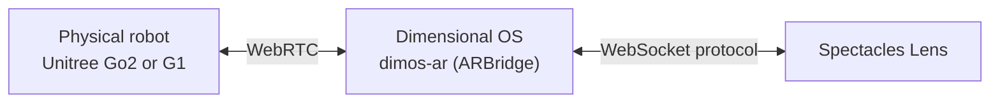
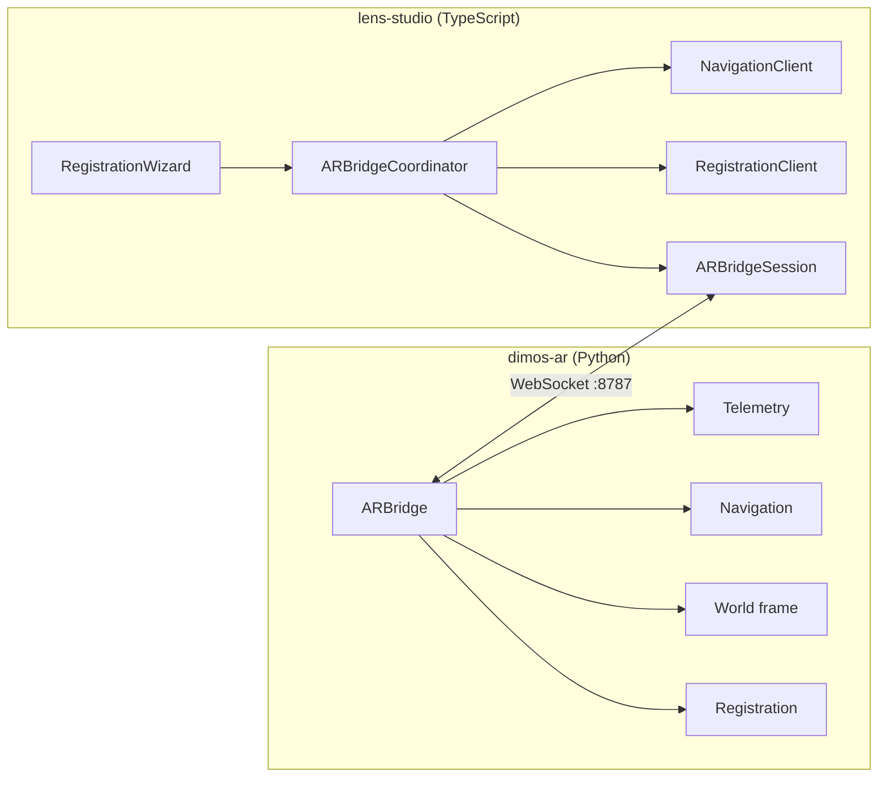

<h1 align="center">Spectacles AR for Robotics and Physical AI</h1>

<p align="center">
  Control and visualize robots from <b>Snap Spectacles</b> (currently 2024 dev-kit) using a Websocket bridge for
  <a href="https://github.com/dimensionalOS/dimos">Dimensional OS</a>. Dimensional OS (DimOS) is an open-source robot operating system that runs the physical robot stack. <br>
  Two modes are available in the spatial interface: manually drag a move-to target, or send voice commands to an llm based agent.
</p>

<p align="center">
  <a href="#setup">Setup</a> •
  <a href="#system-overview">System Overview</a> •
  <a href="#manual-mode">Manual Mode</a> •
  <a href="#agent-mode">Agent Mode</a> 
</p>


<a id="prerequisites"></a>

### Supported Hardware

<table>
  <tr>
    <th>Quadruped</th>
    <th>Humanoid</th>
  </tr>
  <tr>
    <td>🟩 Unitree Go2 pro/air<br><sub>Fully supported &amp; tested - primary development target</sub></td>
    <td>🟧 Unitree G1<br><sub>Supported, not tested - looking for collaborators</sub></td>
  </tr>
</table>


<a id="setup"></a>

<details>
<summary><h3>Setup</h3></summary>

### Supported Operating Systems

<table>
  <tr>
    <th>macOS</th>
    <th>Linux</th>
    <th>Windows</th>
  </tr>
  <tr>
    <td>🟩 supported</td>
    <td>🟧 not tested, generally supported</td>
    <td>🟥 not supported</td>
  </tr>
</table>

### Installation

Install [Dimensional OS](https://github.com/dimensionalOS/dimos) manually ([Installation](https://github.com/dimensionalOS/dimos#installation)), or use [`scripts/setup.sh`](scripts/setup.sh), which sets up all required dependencies for Dimensional OS and the WebSocket bridge (`dimos-ar`).

```bash
cd /path/to/spectacles-dimensional-os
./scripts/setup.sh
```

### Quickstart

Ensure Spectacles, Mac, and the robot are on the same WiFi. An internet connection is not required for basic operation. Agentic mode requires an internet connection for the OpenAI API.

### Robot

If you want to use registration via a robot-mounted AprilTag (recommended), print [`dimos-ar/assets/apriltag_robot_a4.pdf`](dimos-ar/assets/apriltag_robot_a4.pdf) (EU paper) or [`dimos-ar/assets/apriltag_robot_letter.pdf`](dimos-ar/assets/apriltag_robot_letter.pdf) (US paper).

The default size is **7×7 cm** for Go2 and **10×10 cm** for G1. Multiple tags can be mounted (front & back on G1, etc.); this improves tracking and yaw alignment.

Printable tag assets live in [`dimos-ar/assets/`](dimos-ar/assets/)

Tag count, printed size, and each mount’s position/rotation in the robot frame are configured per robot profile in:

| Robot | Profile file | What to edit |
|-------|--------------|--------------|
| Go2 | [`dimos-ar/dimos/ar/robot_profile/go2.py`](dimos-ar/dimos/ar/robot_profile/go2.py) | `GO2_DEFAULT_TAG_MOUNTS` - list of `TagMount(tag_id, size_m, position, orientation)` |
| G1 | [`dimos-ar/dimos/ar/robot_profile/g1.py`](dimos-ar/dimos/ar/robot_profile/g1.py) | `G1_DEFAULT_TAG_MOUNTS` - same shape |

Each `TagMount` entry defines:

- **`tag_id`** - AprilTag 36h11 ID (default `0`; add `tag_id=1`, etc. for extra mounts)
- **`size_m`** - black detection square edge length in metres (default `0.056` for a 70 mm printed tag)
- **`position`** - `(x, y, z)` of the tag centre in the robot `base_link` frame (metres)
- **`orientation`** - quaternion `(x, y, z, w)` of the tag on the robot

The handshake advertises `tag_total_size_m` (outer printed edge, default **0.070 m**) via `TAG_TOTAL_SIZE_M` in [`dimos-ar/dimos/ar/tag_tracking/solve.py`](dimos-ar/dimos/ar/tag_tracking/solve.py). Regenerate PDFs after changing size:

```bash
cd dimos-ar
python scripts/generate_marker.py
```

Print at **100% scale** (no “fit to page”) and verify the outer edge with a ruler before mounting.

The default location for the Go2 is shown below:

<p align="center">
  
</p>

### macOS

Use [`scripts/start.sh`](scripts/start.sh) for an interactive setup that runs all required steps automatically. Select the robot type (Go2 / G1) and wait until the bridge prints:

```text
Bridge ready - ws://0.0.0.0:8787
Spectacles: enter <your-mac-lan-ip> in the lens
```

The LAN IP in the second line is the address to enter on Spectacles during setup.

```bash
cd /path/to/spectacles-dimensional-os
./scripts/start.sh
```

### Spectacles

Launch the lens **spectacles-dimensional-os**: open the Lens Studio project and upload the Lens to your Specs.

Follow the Registration Wizard step-by-step. You will need to enter the IP of the machine running the WebSocket bridge. The IP is shown in the bridge log for convenience.


If the tag is not detected, move closer. Depending on the lighting, the detection range is approx. **1.5 meters / 5 foot**. It is best to move around during the tag scanning step.

Initial alignment / calibration will be imperfect - it improves significantly as the robot moves around.

</details>

## System overview

DimOS owns the robot stack (connection, odometry, navigation, LiDAR, motion). `dimos-ar` runs as a DimOS module (`ARBridge`) and exposes a JSON WebSocket API on port **8787**. The Spectacles Lens is a client: it connects, completes registration to solve the shared **world ↔ odom** transform, then drives and visualizes the robot in AR.



<details>
<summary><h3>Bridge and Lens structure</h3></summary>

[`PROTOCOL.md`](dimos-ar/PROTOCOL.md) is the shared contract between both sides - same message types, field names, and lifecycle vocabulary on Python and TypeScript. Everything else implements against it.



</details>

<details>
<summary><h3>Protocol</h3></summary>

[`dimos-ar/PROTOCOL.md`](dimos-ar/PROTOCOL.md) is the cross-platform contract (currently **v16**). The Mac is always the WebSocket **server**; AR devices are **clients**. Most messages are JSON; camera stills and LiDAR use binary frames.

**Handshake (bridge → Lens)**

| Message | Key fields |
|---------|------------|
| `hello` | `protocol_version`, `robot` (`robot_id`, `display_name`, `body_bounds_m`, `footprint_m`, `tag_tracking_profile`), `capabilities` |
| `runtime_snapshot` | `bridge`, `nav.state`, optional `path` |

**Live telemetry (bridge → Lens)**

| Message | Key fields |
|---------|------------|
| `bridge_status` | `robot_connected`, `world_frame_committed`, `world_frame_method`, `reconnecting` |
| `registration_status` | `mode`, `state`, `message`, `progress`, `tag_visible`, `preview_pose` |
| `pose` | `position`, `orientation`, optional `speed_mps`, `velocity_mps`, `yaw_rate_rad_s` |
| `path` | `waypoints` |
| `nav_status` | `state` (`idle` \| `navIntent` \| `navigating` \| `resolved`), optional `outcome`, `retryable` |
| `world_frame_correction` | `trans_delta_m`, `yaw_delta_deg`, `alignment_confidence` |
| `capture_policy` | `max_capture_distance_m`, `min_capture_distance_m`, `max_capture_speed_mps`, `static_speed_mps`, `min_observations` |
| `camera_frame_ack` | `seq`, `capturing_budgeted_complete` |
| `lidar_f16` | binary float16 point cloud |

**Client commands (Lens → bridge)**

| Message | Key fields |
|---------|------------|
| `registration_command` | `command` (`start` \| `stop` \| `commit`), `mode` (`april_tag` \| `manual_pose`) when starting |
| `registration_pose` | `position`, `orientation` (manual placement) |
| `camera_info` / `camera_frame` | intrinsics + JPEG with camera pose metadata |
| `nav_goal` | `position`, optional `orientation` |
| `cancel_nav_goal` | - |
| `set_lidar_mode` | `mode` (`off` \| `obstacles` \| `full`) |
| `joystick_command` | `vx`, `vy`, `wz` stick deflection in [-1, 1] |
| `emergency_stop` | - |
| `ping` / `pong` | clock sync for frame timestamps |

When the protocol changes, update these together in one change:

- [`dimos-ar/dimos/ar/network/protocol.py`](dimos-ar/dimos/ar/network/protocol.py)
- [`dimos-ar/PROTOCOL.md`](dimos-ar/PROTOCOL.md)
- [`lens-studio/Assets/Scripts/ARBridge/Network/Protocol.ts`](lens-studio/Assets/Scripts/ARBridge/Network/Protocol.ts)

</details>

## DimOS AR WebSocket bridge

This is **not a fork of DimOS**. It is a separate package that depends on DimOS and composes into blueprints via `autoconnect`. The Python bridge stays platform-agnostic under [`dimos-ar/`](dimos-ar/).

> **Note:** Once the bridge protocol and setup are stable enough, a PR into [Dimensional OS](https://github.com/dimensionalOS/dimos) upstream is planned. That would resolve the current monorepo structure and leave only a clean Lens Studio / Spectacles client, which is easier to set up for AR developers.

<a id="manual-mode"></a>

<details>
<summary><h3>Manual Mode</h3></summary>


After registration, **Manual Mode** anchors a spatial controller in front of the robot. Tilt and rotate your hand (or pinch-drag the navigation marker) to aim the direction arrow; the Lens streams world-frame `nav_goal` messages to the bridge, DimOS plans a path, and the robot walks in that direction. Live `pose` updates keep the AR robot marker aligned with the physical machine; optional LiDAR layers show obstacles and height bands around the robot.

Toggle Manual Mode from the runtime wrist menu. While navigating, the yellow direction disc animates toward the commanded heading; release or cancel to stop. The bridge can also accept direct `joystick_command` stick input on the wire for teleop-style control.

</details>

<a id="agent-mode"></a>

<details>
<summary><h3>Agent Mode</h3></summary>

> **Note:** Agent mode is currently under development. Check out the branch [`development/agentic`](../../tree/development/agentic) for the latest updates.

In Agent Mode, voice commands on Spectacles are routed to a DimOS agent (OpenAI API on the Mac). The agent reasons over robot state and skills - e.g. “go to the kitchen” - instead of the user placing goals by hand. This requires an internet connection for the LLM API.

</details>

<details>
<summary><h3>Development &amp; Troubleshooting</h3></summary>

Reproduce CI locally before opening a PR:

```bash
./scripts/run-ci.sh
```

**Python tests** (from the DimOS `.venv`):

```bash
cd dimos-ar
/path/to/dimos/.venv/bin/python3 -m pytest
```

**Lens TypeScript tests** (Vitest, no Lens Studio required):

```bash
cd lens-studio/Tests
npm test
```

## Troubleshooting

| Symptom | Things to try |
|---------|----------------|
| Lens cannot connect | Confirm Spectacles and Mac share WiFi; use the LAN IP from the `Bridge ready` banner, not `127.0.0.1`. |
| AprilTag not detected | Move within ~1.5 m; improve lighting; walk around the robot during scan; verify print scale (70 mm outer edge for default Go2 tag). |
| Drift after registration | Normal at first - refinement improves as the robot moves and stops; watch for “Refined Tracking” after larger corrections. |
| Navigation unavailable | Check `hello.capabilities.nav` in bridge logs; G1 navigation needs the Unitree DDS Python packages in the DimOS `.venv`. |

</details>

## Contributing

Contributions, ideas, and bug reports are welcome. If you are changing behavior that crosses the bridge boundary, read [`CONTRIBUTING.md`](CONTRIBUTING.md) first - especially protocol sync rules and scene-wiring constraints.

## License

MIT License - see [LICENSE](LICENSE).
