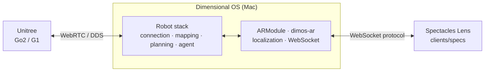
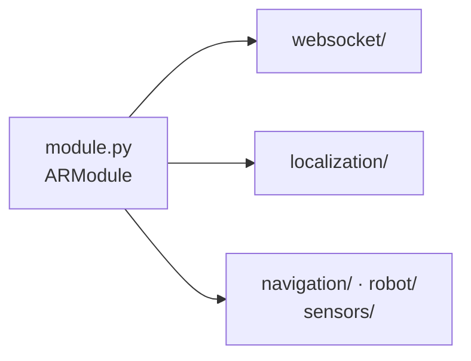
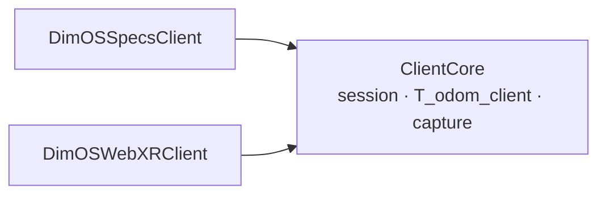
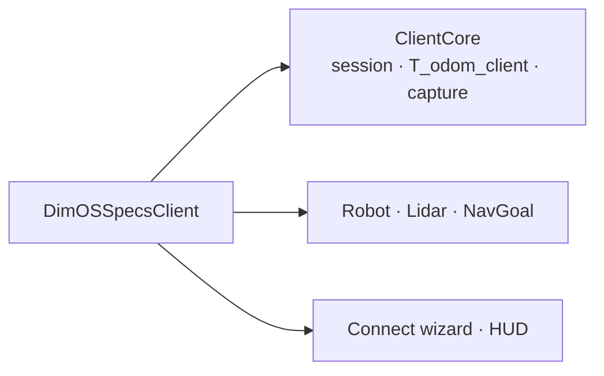
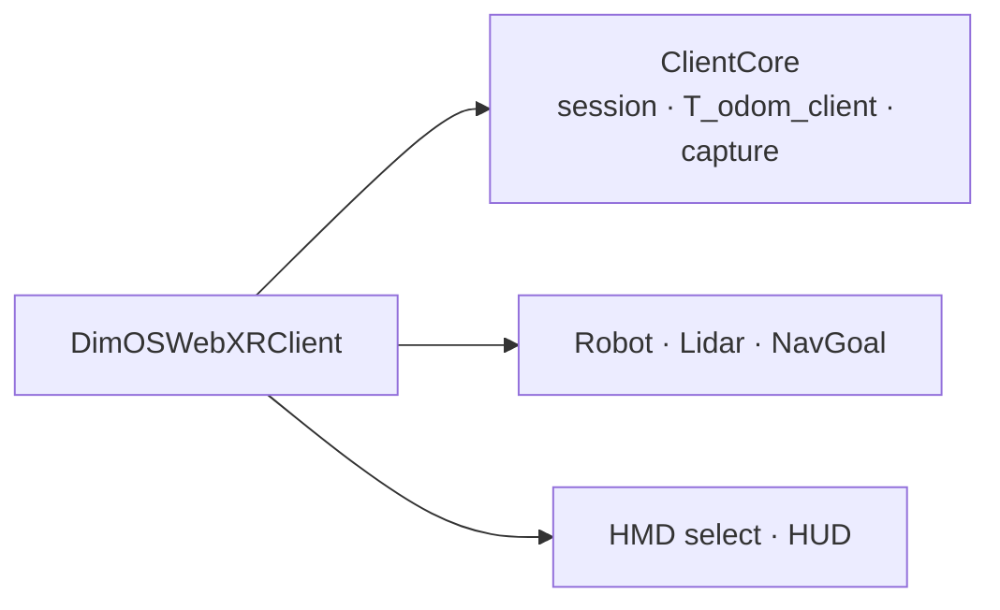

<h1 align="center">Spectacles AR for Robotics and Physical AI</h1>

<p align="center">
  <a href="https://github.com/V4C38/spectacles-dimensional-os"></a>
  <a href="LICENSE"></a>
  <a href="https://github.com/V4C38/spectacles-dimensional-os/stargazers"></a>
  <a href="https://github.com/V4C38/spectacles-dimensional-os/network/members"></a>
  <a href="https://github.com/V4C38/spectacles-dimensional-os/graphs/contributors"></a>
</p>

<p align="center">
  
  
</p>

<p>
  This project explores the use of <b>Augmented Reality as an interface for robotics and physical AI</b> in the context of navigation tasks and sensor data visualization. <br>
  AR glasses: <b>Snap Spectacles</b> 2024 developer kit. Robot: <b>Unitree Go2 quadruped</b> (ARModule). Dimensional OS also has a G1 stack; the Spectacles AR experience is Go2-only until a G1 robot profile lands. Controlled via <a href="https://github.com/dimensionalOS/dimos">Dimensional OS</a> which handles the entire physical stack, incl. navigation and LiDAR data streaming.
</p>

<p align="center">
  <a href="#setup">Setup</a> •
  <a href="#system-design">System Design</a> •
  <a href="#clients">Clients</a> •
  <a href="#pose-drift">Pose Drift</a>
</p>


<p align="center">
  
</p>


<a id="prerequisites"></a>

### Supported Hardware

<table align="center">
  <tr>
    <th>Quadruped</th>
    <th>Humanoid</th>
  </tr>
  <tr>
    <td>🟩 Unitree Go2 pro/air<br><sub>Fully supported &amp; tested</sub></td>
    <td>🟧 Unitree G1<br><sub>Not yet supported in ARModule. Launcher can still install the G1 DimOS stack.</sub></td>
  </tr>
</table>


<a id="setup"></a>

### Setup

Mac which runs DimOS, Spectacles AR glasses and the robot need to be on the <b>same WiFi</b> with a stable internet connection. 

<a id="vialauncher"></a>
<details open>
<summary><strong>Via launcher (recommended)</strong></summary>


The launcher is a small web app that runs on your Mac and manages <b>Dimensional OS</b> and <b>ARModule</b> in a clean UI. <br> It installs and configures both if needed, handles robot network discovery, generates and configures the <b>AprilTag</b> settings, and starts or stops ARModule. The <b>Log</b> also shows detailed output which is useful for debugging.


Double-click [`launcher/Start Launcher.command`](launcher/Start%20Launcher.command) in Finder, or run:

```bash
cd /path/to/spectacles-dimensional-os
./launcher/scripts/start-launcher.sh
```

Your browser opens at `http://127.0.0.1:8790`. Leave the terminal window it started from open, closing it stops the launcher.

The **Dependencies** tab allows installing and configuring dependencies based on your selected stack (Go2 / G1), choose whether to reuse a Dimensional OS install you already have or download a fresh one, then press **Install**. This can take a while. The Spectacles AR experience targets <b>Go2</b>; G1 is a DimOS stack option until an ARModule G1 robot profile lands.

**Every run:** pick **Unitree Go2** (or **Unitree G1** for DimOS-only), press **Start**, and wait for status to turn to **ARModule Ready**. The value shown as **ARModule IP** is the address you type into the Lens during the setup wizard. If no robot answers on the network, ARModule starts with a simulated robot instead.

macOS asks for your admin password the first time you start after a reboot. Dimensional OS needs a local network route and larger socket buffers for its internal messaging.

</details>

<a id="manual-install"></a>
<details>
<summary><strong>Via manual install</strong></summary>

The launcher runs two scripts, and you can run them yourself.

[`launcher/scripts/setup.sh`](launcher/scripts/setup.sh) locates a Dimensional OS install or clones one into `../dimos`, then installs this repo's `dimos-ar` package into that same Python environment and runs its tests. Add `--stack g1` if you need the G1 navigation stack, which requires Dimensional OS from source.

```bash
./launcher/scripts/setup.sh
```

[`launcher/scripts/start.sh`](launcher/scripts/start.sh) applies the macOS network settings, asks which robot stack to run, looks for the robot on the network, and starts ARModule on port **8787**. The log prints the address to enter on Spectacles. Set `OPENAI_API_KEY` beforehand if you want Agent Mode, and `ROBOT_IP` to skip discovery.

```bash
./launcher/scripts/start.sh
```

To skip the scripts entirely, install [Dimensional OS](https://github.com/dimensionalOS/dimos) yourself, add `dimos-ar` to the same environment, and start the blueprint:

```bash
cd /path/to/spectacles-dimensional-os/dimos-ar
/path/to/dimos/.venv/bin/python3 -m pip install -e ".[dev]"

sudo ../launcher/scripts/configure-system.sh --apply

export ROBOT_IP=<robot-lan-ip>   # or "fake" for a simulated robot
/path/to/dimos/.venv/bin/python3 -c "
from dimos.core.coordination.module_coordinator import ModuleCoordinator
from dimos.ar.blueprints import unitree_go2_ar
ModuleCoordinator.build(unitree_go2_ar).loop()
"
```

Equivalent once the blueprint is registered in DimOS: `dimos run unitree-go2-ar`.

</details>

<details>
<summary><strong>AprilTag setup</strong></summary>

Fiducial localization uses a robot-mounted <b>AprilTag 36h11</b> at a pose known to ARModule. Print assets and the generator live in [`assets/markers/`](assets/markers/), not inside `dimos-ar/`.

**Print:** use [`apriltag_robot_0_a4.pdf`](assets/markers/apriltag_robot_0_a4.pdf) or [`apriltag_robot_0_letter.pdf`](assets/markers/apriltag_robot_0_letter.pdf). Print at <b>100% scale</b> (no “fit to page”) and check that the sticker is <b>70 mm</b> total (56 mm black square). Mount it flat on a rigid backing.

**Regenerate or add IDs:**

```bash
python3 assets/markers/generate_marker.py --ids 0
```

**Go2 mount** (from [`UNITREE_GO2_PROFILE`](dimos-ar/dimos/ar/robot/profiles/unitree_go2.py)): one tag, ID 0, on top of the body, 18 cm ahead of the robot center and 6 cm up, pitched slightly back.

<p align="center">
  
</p>

Mount geometry is part of the robot profile, not launcher config. A G1 profile is not in this package yet; ID 1 print files in `assets/markers/` are leftover sheets only.

Enable the fiducial provider in DimOS config (`armodule.localization.providers`) when you want ARModule to request marker observations.

</details>

#### Set up inside Spectacles Lens

Open [`clients/specs/spectacles-dimensional-os.esproj`](clients/specs/spectacles-dimensional-os.esproj) in Lens Studio and send the Lens to your Spectacles (Lens with experimental API enabled cannot be published so you need to upload via LS). The <b>setup wizard</b> walks you through connecting and locating the robot. Enter the <b>ARModule IP</b> from the launcher when asked.

<p align="center">
  
</p>

Leave the robot standing still and walk around it while looking at the tag. ARModule sends `localization_observations_request`; the Lens captures frames and replies with `localization_observations`; a successful `localization_result` sets the tracking origin. Keep viewing distance about <b>0.5 - 1.5 meters</b>.

<a id="system-design"></a>

## System Design

<b>Dimensional OS</b> runs the robot. It owns the connection to the Go2 (and, in DimOS, G1), builds a map out of the LiDAR, plans routes through that map and handles the navigation. In <b>Agent Mode</b> it also runs the language model behind your voice commands. ARModule blueprints in this repo are Go2-only (`unitree_go2_ar`). 

<b>ARModule</b> (`dimos.ar`) is the main addition of this repo. It streams the robot's position, route and LiDAR over a <b>WebSocket</b> and takes navigation goals and localization observations back. Fiducial or VPS localization relates the client's tracking frame to robot `odom`.

ARModule is <b>device agnostic</b>. Clients implement [`PROTOCOL.md`](dimos-ar/PROTOCOL.md) as the communication protocol for all messages.

The <b>Spectacles Lens</b> is the reference client. It renders the robot and its route, reads hand gestures, sends camera images ARModule requires for AprilTag localization and handles speech.



<details>
<summary><strong>Architecture overview</strong></summary>

**ARModule**

Python package under `dimos-ar/dimos/ar/`, loaded by Dimensional OS. Blueprint is `unitree_go2_ar`. One owner per concern:

- `ARModule` (`module.py`) is the DimOS `In`/`Out` surface.
- `websocket/` talks to AR clients (port **8787**).
- `localization/` owns fiducial and VPS episodes; marker geometry lives in `robot/profiles/`.
- `navigation/`, `robot/`, and `sensors/` own goals, safety, odometry correction, and LiDAR.

Printable AprilTags and `generate_marker.py` live in [`assets/markers/`](assets/markers/).



</details>

<a id="clients"></a>

## Clients

### ClientCore

Portable [`ClientCore`](clients/specs/Assets/Scripts/DimOSARClient/) speaks [`PROTOCOL.md`](dimos-ar/PROTOCOL.md). Each headset host constructs that core and owns axis conversion. `clients/core/` is empty until ClientCore ships as an `.lspkg`.



<details>
<summary><strong>SPECS</strong></summary>

The composition root is **`DimOSSpecsClient`**: it constructs that core, drives time, and routes typed facts to room presenters and derived UX via [`UIPresenter`](clients/specs/Assets/Scripts/DimOSSpecsClient/presentation/UIPresenter.ts). Axis conversion stays in the Specs client (`SpecsCoordinates`).



<a id="augmented-reality-interface"></a>

### Augmented Reality Interface

The shipping Specs Lens is **`DimOSSpecsClient`** with portable **`DimOSARClient`**. The wire contract is [`PROTOCOL.md`](dimos-ar/PROTOCOL.md).

<p align="center">
  
</p>

Hold your left palm up to open the <b>wrist menu</b>. Switch between <b>Manual</b> and <b>Agent Mode</b>, restart setup (runs the wizard again), show the <b>debug console</b>, and request <b>emergency stop</b> (will immediately cancel all navigation).

<p align="center">
  
</p>

The <b>LiDAR</b> button in the wrist menu cycles three states: <b>off</b>, <b>obstacles only</b> (filters the point cloud by proximity to the robot on ARModule — performance friendly), and the <b>full point cloud</b> around the robot (performance heavy, can cause glasses to overheat over a long period).

<a id="manual-mode"></a>

#### Manual Mode

The <b>NavigationMarker</b> is initially attached to the robot and allows the user to drag it at any time. The direction you drag sets the heading it should face when it arrives, as indicated by the arrow. The robot will continuously move towards the marker.
The yellow path line shown is the real navigation path the planner sends back, rendered in world space. 


<a id="agent-mode"></a>

#### Agent Mode

Wake word <b>"Agent"</b> starts a voice session. Activity on the robot marker is <b>Following Path &gt; Thinking &gt; Responding &gt; Listening &gt; Idle</b> (Listening is Agent mode ASR running, including wake-wait). Speech to text runs on the Spectacles; the transcript goes to the DimOS agent on the Mac. The session closes after <b>30 seconds</b> of silence. Say <b>"stop"</b> and the robot stops immediately (same Emergency Stop path as in the wrist UI). With <b>Debug</b> on, the Agent button stays available even when disconnected or the blueprint has no agent, so you can test on-device STT; transcripts are not sent until the agent capability is live.

Anything the agent starts looks and behaves exactly like a manually placed navigation goal. You can grab the marker and take over at any point which will override the goal set by the agent immediately.

Headset TTS speaks every textual agent reply on the glasses. Robot speakers still play when the LLM calls `speak`. The agent assumes reasonable defaults when commands are unspecific.

| Tool | What it does |
|------|--------------|
| `move_to` | Walk to a named or described place |
| `navigate_with_text` | Navigate from a natural-language destination |
| `tag_location` | Remember a place by name |
| `stop_navigation` | Cancel the current navigation goal |
| `observe` | Look at the surroundings and report what is seen |
| `follow_person` | Start following a person |
| `stop_following` | Stop following |
| `speak` | Say something on the robot speakers |
| `wait` | Pause for a duration |
| `execute_sport_command` | Run a Unitree sport / pose command |
| `look_out_for` | Watch for a described thing |
| `stop_looking_out` | Stop watching |
| `ar_place_marker` | Leave a named marker in the room (`id` required, optional title) |
| `ar_remove_marker` | Remove a marker by `id` |
| `ar_get_client_pose` | Read the headset pose and look direction in odom |

This is a subset of the agentic blueprint's skills, not a complete inventory.

> [!NOTE]
> Agent Mode needs `OPENAI_API_KEY` set in the launcher and an internet connection on the Mac.

</details>

<details>
<summary><strong>WebXR</strong></summary>

The composition root is **`DimOSWebXRClient`**: it constructs that core, drives time, and routes typed facts to room presenters and derived UX via `WebXRUIPresenter`. Axis conversion stays in the WebXR client (`WebXRCoordinates`).



The landing page has a **Select HMD** control. Current options: Quest 3 (`quest3`) and Quest 3S (`quest3s`).

Vite on the Mac serves the HTTPS page and proxies same-origin `wss://<page-host>/ar` to ARModule at `ws://127.0.0.1:8787`. The Quest browser never types an ARModule IP. Non-HTTPS pages and unaccepted calibration profiles fail before XR entry.

```bash
cd clients/webxr
npm ci
npm test
npm run dev
```

`npm run dev` serves the Vite app over HTTPS. Open the printed LAN URL in the headset browser. Run ARModule on the same machine first.

</details>

<a id="pose-drift"></a>

## Pose Drift

<p align="center">
  
</p>

During fast movements (as shown in the GIF above) the <b>RobotMarker</b> can lag behind the real robot position, but will quickly recover when the velocity reduces (i.e. coming to a hold). Drift is also directly proportional to travelled distance and as a function of network quality. The amount of drift varies but is approx. <b>25 cm</b> at a total travel distance of <b>5 m</b>.

The cause is <b>inconsistent odometry data</b> from the robot itself. In simple terms, the robot estimates its current world pose by adding up how far it has moved, and on Unitree hardware those numbers are not consistent, so small errors accumulate over time and distance.

ARModule corrects for this with discrete capture episodes. After hello, and again after about <b>1 m</b> of successful navigation, it may request observations; a new `localization_result` updates the tracking origin. The overlay can step when that result lands. Between episodes the error grows again.

> [!NOTE]
> Expect drift to accumulate over long distance walks — start a capture episode (or restart setup from the wrist menu) when the overlay has drifted.
<details>
<summary><h3>Development &amp; Troubleshooting</h3></summary>

Run the full CI suite before opening a PR. It covers both sides and mirrors what GitHub Actions runs.

```bash
./launcher/scripts/run-ci.sh
```

Python tests on their own, using the Dimensional OS environment:

```bash
cd dimos-ar
/path/to/dimos/.venv/bin/python3 -m pytest
```

ClientCore, Lens, and WebXR tests on their own. These are plain TypeScript and do not need Lens Studio:

```bash
cd clients/specs/Tests
npm test

cd clients/webxr
npm test
```

### Troubleshooting

| Symptom | Things to try |
|---------|----------------|
| Lens cannot connect | Check that Spectacles and the Mac are on the same WiFi and that you typed the ARModule IP from the launcher, not `127.0.0.1`. |
| AprilTag not detected | Get closer, improve the lighting, keep walking around the robot, and check that the tag printed at full size. |
| Drift after setup | Expected, see [Pose Drift](#pose-drift). Start a capture episode or restart setup from the wrist menu. |
| Navigation unavailable | The ARModule log reports which capabilities the robot advertised. G1 is not an ARModule blueprint; G1 navigation is a DimOS stack concern. |
| Agent does not respond | Check that `OPENAI_API_KEY` is set in the launcher and that the Mac has internet. |
| Wake word ignored | Turn on the debug console and watch line 7 to see what was transcribed, and check that you are in Agent Mode. |
| Robot does not move | Setup has to be finished and the robot connected. The agent reply on line 8 turns red or yellow when something failed. |

</details>

## Contributing

Contributions, ideas and bug reports are welcome. If you are changing something that crosses between ARModule and the Lens, read [`CONTRIBUTING.md`](CONTRIBUTING.md) first, especially the rules on keeping the protocol in sync.

## License

MIT License, see [LICENSE](LICENSE).
