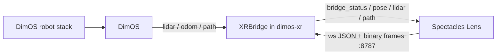
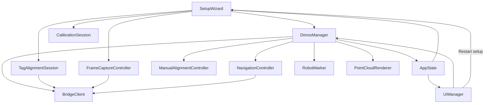
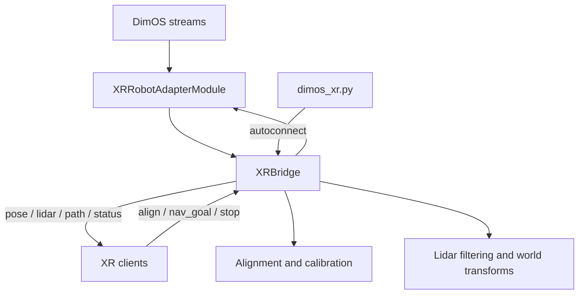

# Spectacles AR + Dimensional OS

> **Lens Studio:** open [`lens-studio/spectacles-dimensional-os.esproj`](lens-studio/spectacles-dimensional-os.esproj), not the repo root.

Visualize and control **DimOS robot stacks** from **Snap Spectacles**.
[`dimos-xr/`](dimos-xr/) is a WebSocket based bridge between [Dimensional OS](https://github.com/dimensionalOS/dimos) for low-level robot control and orchestration and a Spectacles Lens for spatial UI/UX.

<p align="center">
  
</p>

This is **not a fork of DimOS**. It is a separate package that depends on DimOS and composes into blueprints via `autoconnect`. The Spectacles client lives in [`lens-studio/`](lens-studio/), while the Python side stays platform-agnostic so future XR clients can implement the same protocol without changing `dimos_xr/`.


At a glance:
- [`lens-studio/`](lens-studio/) contains the Spectacles Lens Studio project, setup flow, HUD, navigation interaction, and world-anchored visuals.
- [`dimos-xr/`](dimos-xr/) contains the DimOS XR bridge package, `XRBridge`, the adapter module, and tests.
- [`dimos-xr/PROTOCOL.md`](dimos-xr/PROTOCOL.md) is the cross-platform contract between the bridge and every XR client.



## Core concepts / Overview

- `dimos-xr` is a **DimOS extension**, not a platform-specific fork.
- The shared API is the JSON WebSocket protocol in [`dimos-xr/PROTOCOL.md`](dimos-xr/PROTOCOL.md).
- The robot lives in an **odom** frame, while AR clients live in a **world** frame, so setup must solve a shared transform before runtime visuals are trustworthy.
- The bridge is single-active-robot per process and uses adapter-declared capabilities.

<details>
<summary>Quick start</summary>

1. Install and test the Python side:

   ```bash
   cd /path/to/spectacles-dimensional-os/dimos-xr
   ./setup.sh
   ```

2. Start the XR bridge:

   ```bash
   cd /path/to/spectacles-dimensional-os/dimos-xr
   ./start.sh
   ```

3. Open [`lens-studio/spectacles-dimensional-os.esproj`](lens-studio/spectacles-dimensional-os.esproj) in Lens Studio and push to device.

4. In the Lens, go through **Connect -> Calibrate -> Complete**.

</details>

<details>
<summary>Frame alignment</summary>

The bridge solves `T_world_odom` so AR content stays registered to the robot. During calibration, Spectacles streams high-resolution stills plus camera pose over the WebSocket; the bridge runs AprilTag detection and PnP on those frames against **robot-mounted** tags. When enough stable observations accumulate, the bridge averages a cluster of candidates and commits a gravity-leveled transform so the AR floor stays flat. After commit, the same tag stream provides continuous runtime correction when the tag is in view.

Calibration requires a **printed robot-mounted tag**: a plain **70 mm × 70 mm** AprilTag 36h11 sticker (56 mm black square). Generate assets with:

```bash
cd /path/to/spectacles-dimensional-os/dimos-xr
python scripts/generate_marker.py
```

Print `apriltag_robot_a4.pdf` or `apriltag_robot_letter.pdf` from `dimos-xr/assets/` at **actual size** (no "fit to page") and verify the outer edge measures 70 mm with a ruler before mounting on the robot.

</details>

<details>
<summary>Protocol and platform boundary</summary>

The Mac is always the WebSocket **server** and AR devices are **clients**. The bridge sends `hello` and `bridge_status` on connect, then streams messages such as `pose`, `lidar`, `path`, `nav_status`, and `align_status`. Clients send messages such as `align_*`, `nav_goal`, `cancel_goal`, and `emergency_stop`.

If the protocol changes, update these together in the same change:
- [`dimos-xr/dimos_xr/protocol.py`](dimos-xr/dimos_xr/protocol.py)
- [`dimos-xr/PROTOCOL.md`](dimos-xr/PROTOCOL.md)
- [`lens-studio/Assets/Scripts/Network/ProtocolTypes.ts`](lens-studio/Assets/Scripts/Network/ProtocolTypes.ts)
- [`lens-studio/Assets/Scripts/Network/Protocol.ts`](lens-studio/Assets/Scripts/Network/Protocol.ts)
- [`lens-studio/Assets/Scripts/Network/ProtocolParser.ts`](lens-studio/Assets/Scripts/Network/ProtocolParser.ts)

</details>

## Lens Studio Project

The Lens side is organized around three scene-entry scripts:

- [`SetupWizard.ts`](lens-studio/Assets/Scripts/Setup/SetupWizard.ts) owns the connect-and-calibrate flow and hands off to runtime. Check Lens Studio Logger output and `./start.sh` bridge logs when calibrate fails.
- [`DimosManager.ts`](lens-studio/Assets/Scripts/DimosManager.ts) is the orchestration hub for bridge I/O, shared app state, robot marker state, LiDAR/path rendering, navigation placement, and manual-alignment fallback.
- [`UIManager.ts`](lens-studio/Assets/Scripts/UI/UIManager.ts) mirrors app state and bridge status into the authored HUD; it does not own the runtime lifecycle.

`BridgeClient` is the transport layer, `CalibrationSession` owns wizard-local calibration orchestration, `TagAlignmentSession` and `FrameCaptureController` handle tag-based alignment capture, `ManualAlignmentController` handles local placement fallback, `NavigationController` manages goal placement and navigation state, and the visuals live under [`Assets/Scripts/Visuals/`](lens-studio/Assets/Scripts/Visuals/).



<details>
<summary>Lens setup and runtime responsibilities</summary>

`SetupWizard` creates the wizard view and its helper controllers, starts autoconnect, owns the high-level step flow, and finishes by calling `DimosManager.enterRuntime()`. It does not talk to `BridgeClient` directly; connection checks flow through `WizardConnectionController` and `DimosManager`, while calibrate-step orchestration is delegated to `CalibrationSession`.

`DimosManager` starts in setup mode, disconnects the bridge when re-entering setup, and switches to runtime by enabling visuals, preserving manual alignment state when needed, and syncing navigation and robot interaction state. It also owns the shared `AppState`, including bridge-link status used by setup and runtime UI. During runtime it fans bridge events into:
- `PointCloudRenderer` for lidar visualization
- `RobotMarker` for robot pose and local controls
- `NavigationController` and `PathRenderer` for goal placement and path display
- `UIManager` and `RobotMenuController` for status presentation

`UIManager` subscribes to app state and updates the authored HUD. Restarting setup goes back through `SetupWizard`, while bridge status, operating mode changes, and the coarse `disconnected` / `connectedNoRobot` / `connected` link state still come from `DimosManager`.

</details>

<details>
<summary>Scene setup pointers</summary>

- Open the project from [`lens-studio/spectacles-dimensional-os.esproj`](lens-studio/spectacles-dimensional-os.esproj).
- Scene wiring, authored object names, and `@input` references are documented inline in the script files via comments at lookup sites.
- The main feature folders are:

  ```text
  lens-studio/Assets/Scripts/
  ├── DimosManager.ts
  ├── Setup/
  ├── UI/
  ├── Alignment/
  ├── Navigation/
  ├── Network/
  └── Visuals/
  ```

- `ShowLiDAR` controls the height/debug layer, while the red obstacle layer still comes from live bridge lidar when connected.

</details>

## Dimensional OS Blueprint (`dimos-xr`)

[`dimos-xr/`](dimos-xr/) contains the Python side: `XRBridge`, `XRRobotAdapterModule`, the protocol definition, and the tests. The monorepo entrypoint is [`dimos-xr/blueprints/dimos_xr.py`](dimos-xr/blueprints/dimos_xr.py), which wraps native DimOS stack composition for the currently selected robot runtime.

`XRBridge` subclasses `dimos.core.module.Module`, handles WebSocket sessions, calibration, transforms, LiDAR/pose/path streaming, and dispatches outbound control through `XRRobotAdapterModule`. The adapter module absorbs robot-specific streams and control surfaces for Go2 and G1 while keeping the bridge core platform-agnostic.



<details>
<summary>Runtime support and capabilities</summary>

Supported runtimes:
- `unitree-go2` is the primary fully-supported navigation runtime.
- `unitree-go2-basic` is best-effort and stays in the same capability-driven contract.
- `unitree-g1-nav-onboard` is the primary navigation-capable G1 runtime, but it requires the Unitree DDS Python package set in the DimOS `.venv`.
- `unitree-g1` is a reduced-capability runtime under the same G1 family presentation.

On the Lens side, runtime behavior is negotiated from the bridge handshake:
- `AppState` projects robot/runtime metadata from the bridge and carries the coarse bridge-link state used by the setup and runtime UI.
- offline development stays permissive until a bridge connects and completes the handshake.
- unavailable controls stay visible and switch into disabled explanatory UI states with labels explaining why.

</details>

<details>
<summary>Start the blueprint</summary>

The monorepo provides `start.sh` as a convenience wrapper around native DimOS composition:

```bash
cd /path/to/spectacles-dimensional-os/dimos-xr
./start.sh
```

`./start.sh` always prompts for the target robot stack, then runs the bridge against the selected composition. The equivalent native commands are:

```bash
dimos run unitree-go2 dimos-xr
dimos run unitree-go2-basic dimos-xr
dimos run unitree-g1-nav-onboard dimos-xr
dimos run unitree-g1 dimos-xr
```

If DimOS lives somewhere unusual, set `DIMOS_PYTHON` explicitly:

```bash
DIMOS_PYTHON=/path/to/dimos/.venv/bin/python3 ./start.sh
```

</details>

<details>
<summary>Manual setup and tests</summary>

Install from the DimOS Python environment:

```bash
cd /path/to/spectacles-dimensional-os/dimos-xr
/path/to/dimos/.venv/bin/python3 -m pip install -e ".[dev]"
/path/to/dimos/.venv/bin/python3 -m pytest
/path/to/dimos/.venv/bin/python3 -m ruff check .
/path/to/dimos/.venv/bin/python3 -m mypy dimos_xr
```

If you want to run `unitree-g1-nav-onboard`, make sure the same DimOS `.venv`
also has the DDS SDK package installed:

```bash
/path/to/dimos/.venv/bin/pip3 install "unitree-sdk2py-dimos>=1.0.2"
```

Optional live protocol check while the blueprint is already running:

```bash
cd /path/to/spectacles-dimensional-os/dimos-xr
/path/to/dimos/.venv/bin/python3 -m pytest tests/test_ws_integration.py -m integration
```

See [`dimos-xr/tests/README.md`](dimos-xr/tests/README.md) for the unit vs integration test split.

</details>

<details>
<summary>Transport, ports, and discovery</summary>

- XR bridge WebSocket listens on **8787**; avoid binding port **8765** on the same machine while Foxglove is running.
- `start.sh` chooses the stack interactively at launch.
- `unitree-g1-nav-onboard` is the recommended G1 XR path.
- `unitree-g1` is a reduced-capability runtime; nav/control may be disabled there.

</details>

<details>
<summary>Extension points</summary>

- Tune lidar and rate limits in [`dimos-xr/dimos_xr/bridge/config.py`](dimos-xr/dimos_xr/bridge/config.py) via `XRBridgeConfig`.
- Add or change messages by updating the Python protocol, the protocol spec, and the Lens protocol modules together.
- Keep `dimos-xr/dimos_xr/` platform-agnostic. Spectacles-specific code stays in [`lens-studio/`](lens-studio/); other XR clients should live in their own client folder or repo.

</details>

Contributions, ideas, and bug reports are welcome. If you are changing behavior that crosses the bridge boundary, also check [`CONTRIBUTING.md`](CONTRIBUTING.md) before opening a PR.

## License

MIT License — see [LICENSE](LICENSE).
