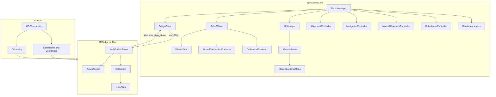
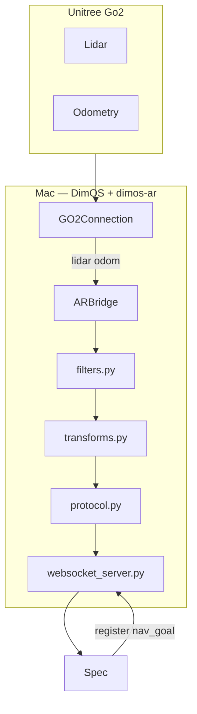

# Spectacles AR + Unitree Go2

> **Lens Studio:** open [`lens-studio/spectacles-unitree.esproj`](lens-studio/spectacles-unitree.esproj) — not the repo root.

Visualize and control a **Unitree Go2** via **Spectacles AR**. The Mac runs [DimOS](https://github.com/dimensionalOS/dimos), while [`dimos-ar/`](dimos-ar/) provides the AR bridge that streams world-anchored robot data to the Lens over WebSocket.

The first client is **Snap Spectacles** (Lens Studio), but the Python side stays platform-agnostic: it exposes a documented protocol that future AR clients can implement without changing `dimos_ar/`.

At a glance:
- A **Lens Studio project** for Spectacles (`lens-studio/`) with the setup wizard, UI, rendering, and navigation interaction
- A **Python DimOS extension** (`dimos-ar/`) that serves lidar, pose, paths, and calibration over WebSocket
- Shared protocol and architecture docs for extending or porting the system

This is **not a fork of DimOS**. It is a separate package that depends on DimOS and composes into DimOS blueprints via `autoconnect`.

This project is an easy starting point for developers who want to work at the intersection of **spatial computing**, **mobile robotics**, and **DimOS**. The overall structure and documentation style are inspired by [spectacles-reachy-mini](https://github.com/V4C38/spectacles-reachy-mini), adapted here for quadruped navigation and AR registration.

*Demo video and GIFs: add under [`assets/`](assets/) when ready — see [`assets/README.md`](assets/README.md).*

## This repo contains

- **AR bridge (Python)** — [`dimos-ar/dimos_ar/`](dimos-ar/dimos_ar/) `ARBridge` DimOS module: filter lidar, transform frames, serve WebSocket
- **Blueprints** — [`dimos-ar/blueprints/`](dimos-ar/blueprints/) compose DimOS robot stacks with `ARBridge`
- **Protocol spec** — [`dimos-ar/docs/PROTOCOL.md`](dimos-ar/docs/PROTOCOL.md) JSON WebSocket contract (the real cross-platform API)
- **Tests** — [`dimos-ar/tests/`](dimos-ar/tests/) unit tests + optional live WebSocket integration check
- **Spectacles client** — [`lens-studio/`](lens-studio/) Lens Studio project (early stage)
- **Design docs** — [`dimos-ar/docs/`](dimos-ar/docs/) architecture, project brief, protocol, Lens development guide

## Setup

**Prerequisites**

- macOS dev machine (8GB-class MacBook Air is the reference target; CPU only, no CUDA)
- Python 3.12+
- [DimOS](https://github.com/dimensionalOS/dimos) available somewhere on the machine, or installable via `./setup.sh`

*Note: You can also use **replay mode** if you do not have a Go2 on the LAN. The AR bridge and Lens flow still work for development.*

1. **Run first-time setup**

   ```bash
   cd /path/to/spectacles-unitree/dimos-ar
   ./setup.sh
   ```

   `./setup.sh` asks whether DimOS is already installed. If it is, the script tries
   to auto-detect a suitable Python environment and otherwise prompts you for the
   path. If DimOS is not installed yet, the script can clone it, create a venv,
   install `dimos[base,unitree]`, install `dimos-ar`, and run the unit tests for you.

   <details>
   <summary>Manual setup instead</summary>

   ```bash
   cd /path/to/spectacles-unitree/dimos-ar
   /path/to/dimos/.venv/bin/python3 -m pip install -e ".[dev]"
   pytest
   ```
   </details>

2. **Start the AR blueprint**

   AR development uses the blueprint script — **not** the stock `dimos --replay run unitree-go2` CLI alone, because that runs DimOS without `ARBridge`.

   **Quick start (from this repo):**

   ```bash
   cd /path/to/spectacles-unitree/dimos-ar
   ./start.sh              # discover Go2, or replay; WebSocket on 0.0.0.0:8765 (Spectacles-ready)
   ./start.sh --replay     # replay only (no robot)
   ./start.sh --local      # WebSocket localhost-only for local testing
   ```

   The script auto-picks a nearby DimOS venv when present. If DimOS lives somewhere
   unusual, set `DIMOS_PYTHON` explicitly:

   ```bash
   DIMOS_PYTHON=/path/to/dimos/.venv/bin/python3 ./start.sh --replay
   ```

   **Equivalent manual command:**

   ```bash
   /path/to/dimos/.venv/bin/python3 /path/to/spectacles-unitree/dimos-ar/blueprints/go2_ar.py
   ```

   On startup the blueprint **searches the LAN for Go2 robots** (DimOS UDP discovery). There is **no robot IP configuration** — only an optional serial:

   ```text
   Searching for robots...
   Found 1 robot (B42D...) — connecting.
   ```

   If several robots are on the network, an interactive picker runs in the terminal (arrow keys). Pin a robot with `ROBOT_SERIAL` in the environment to skip the menu.

   **Offline / CI (no discovery, replay only):**

   ```bash
   FORCE_REPLAY=1 CI=1 /path/to/dimos/.venv/bin/python3 \
     /path/to/spectacles-unitree/dimos-ar/blueprints/go2_ar.py
   ```

   Wait for:

   ```text
   AR WebSocket server listening host=0.0.0.0 port=8765
   ```

   Replay lidar often starts **15–40 seconds** after the process boots — that delay is normal.

   **Optional headless protocol check** (with the blueprint still running in another terminal):

   ```bash
   cd /path/to/spectacles-unitree/dimos-ar
   pytest tests/test_ws_integration.py -m integration
   ```

   See [`dimos-ar/tests/README.md`](dimos-ar/tests/README.md) for unit vs integration test details.

3. **Spectacles Lens (hardware)**

   - On the phone, scan the **QR code** from `./start.sh` (marker page at true size) — see [Frame alignment](#frame-alignment-apriltag-marker).
   - Open [`lens-studio/spectacles-unitree.esproj`](lens-studio/spectacles-unitree.esproj) in Lens Studio; follow [`lens-studio/docs/SCENE_SETUP.md`](lens-studio/docs/SCENE_SETUP.md).
   - Push to device — the setup wizard opens automatically: **Connect → Calibrate → Complete**.

## Core concepts

### The bridge is a DimOS module

`ARBridge` subclasses `dimos.core.module.Module`. It declares typed `In[]` / `Out[]` streams and is wired into a blueprint with `autoconnect` — the same pattern as other DimOS modules.

DimOS connects to the Go2 over **WebRTC** (no ROS2 on this path). This package subscribes to DimOS streams and re-broadcasts them to AR clients over WebSocket.

- **Inputs:** `lidar`, `odom`, `color_image`, `camera_info`, `path`, `goal_reached`, `navigation_state` — wired automatically via `handle_*` when `super().start()` runs
- **Outputs:** `clicked_point`, `goal_request`, `stop_movement` to `ReplanningAStarPlanner`
- **Side channel:** a WebSocket server on a daemon thread (the RPC worker never blocks)

### Platform-agnostic protocol

All DimOS-side code speaks a single JSON WebSocket protocol ([`dimos-ar/docs/PROTOCOL.md`](dimos-ar/docs/PROTOCOL.md)). Spectacles is just one client of that protocol.

- Name things generically: `ARBridge`, not `SpectaclesBridge`
- Treat the protocol schema as a versioned API (`protocol_version` in `hello`)
- Inbound messages with an unknown `robot_id` are rejected

### Frame alignment (AprilTag marker)

The robot lives in an **odom** frame; AR devices live in a **world** frame.

**Hardware calibration flow (phone-first — no printing required):**

1. Run `./start.sh` and **scan the QR code** on your phone (opens the composite marker page at **60 mm × 120 mm**, with the inner AprilTag still **60 mm × 60 mm**). Max brightness, disable auto-lock.
2. Run the Spectacles setup wizard (**Connect → Calibrate → Complete**).
3. During **Calibrate**, hold the phone so both the Go2 camera and your Spectacles can see the marker simultaneously. The bridge uses the full observed marker pose to solve the shared world/odom alignment, then assumes the robot is standing on a flat plane when the calibration is committed so the final AR floor stays level and lidar is not tilted with the phone.

The Lens sends `align_start` / `align_marker` while Image Tracking sees the marker; the bridge runs OpenCV AprilTag detection on the Go2 camera and computes `T_world_odom` when both sides detect the same phone-held marker within **500 ms**. At commit time the resulting transform is gravity-leveled so the AR floor remains flat even if the phone was held with some tilt. After that, lidar and pose still stream in full **world** coordinates, so the robot may continue onto uneven terrain normally.

**Marker size configuration.** Default: AprilTag 36h11 with a **60 mm** square inner tag inside a **60 mm × 120 mm** composite tracked image. The shared contract lives in `dimos-ar/dimos_ar/marker_contract.py`. The marker web page is rendered from that contract, and `python scripts/generate_marker.py --sync-lens` updates the Lens marker asset height to match automatically (see [`dimos-ar/docs/MARKER_ASSETS.md`](dimos-ar/docs/MARKER_ASSETS.md)).

The legacy `register` message still exists for replay workflows and future lightweight clients that do not use the full `align_*` session.

### DimOS visualization vs this repo

DimOS ships its own Mac-side tools (Rerun native/web on port **7779**, optional Foxglove on **8765**). Those are for **debugging DimOS blueprints** in robot/odom frame.

This repo adds `ARBridge` on port **8765** plus the QR-linked marker page used by the Spectacles setup flow. Do **not** enable `viewer=foxglove` on the same machine as ARBridge — both bind port **8765**.

## Architecture overview

Detailed information about the individual components is provided in the sections below and in the focused docs under [`dimos-ar/docs/`](dimos-ar/docs/).



The Lens architecture follows the same overall idea as `spectacles-reachy-mini`: keep the scene-entry `@component` scripts small, then push setup, HUD, navigation, robot menu, and protocol details into narrower helper modules underneath them.

```text
Unitree Go2 Air
    |  WebRTC (DimOS GO2Connection — no jailbreak)
MacBook (DimOS + dimos-ar)
    |  WebSocket JSON  ws://host:8765
AR client (Spectacles Lens)
```



### Lens architecture (scene entry points vs helpers)

| Lens script | Role |
|-------------|------|
| [`lens-studio/Assets/Scripts/DimosManager.ts`](lens-studio/Assets/Scripts/DimosManager.ts) | Top-level Lens facade that wires transport, rendering, placement, robot menu, and manual alignment helpers |
| [`lens-studio/Assets/Scripts/Setup/SetupWizard.ts`](lens-studio/Assets/Scripts/Setup/SetupWizard.ts) | Auto-start setup flow that coordinates connect + calibrate and hands off to the main HUD |
| [`lens-studio/Assets/Scripts/UI/UIManager.ts`](lens-studio/Assets/Scripts/UI/UIManager.ts) | Scene-entry HUD facade that owns overall HUD visibility and delegates to HUD subviews |
| [`lens-studio/Assets/Scripts/Network/BridgeClient.ts`](lens-studio/Assets/Scripts/Network/BridgeClient.ts) | WebSocket client and typed event fanout for the Lens |
| [`lens-studio/Assets/Scripts/Alignment/AlignmentController.ts`](lens-studio/Assets/Scripts/Alignment/AlignmentController.ts) | AprilTag alignment session against the bridge |
| [`lens-studio/Assets/Scripts/Setup/`](lens-studio/Assets/Scripts/Setup/) | Helper classes for wizard UI, connection retry, and calibration presentation |
| [`lens-studio/Assets/Scripts/UI/HUD/`](lens-studio/Assets/Scripts/UI/HUD/) | Plain HUD view classes for the authored main HUD and runtime nav controls |
| [`lens-studio/Assets/Scripts/Navigation/`](lens-studio/Assets/Scripts/Navigation/) | Placement and navigation workflow helpers |
| [`lens-studio/Assets/Scripts/Rendering/`](lens-studio/Assets/Scripts/Rendering/) | Rendering helpers for lidar, robot marker, goals, paths, and obstacles |

The important boundary is:

- `dimos-ar/` owns protocol definition, calibration math, and robot/world transforms on the Mac.
- `lens-studio/` owns Spectacles-only UX, marker tracking, world-anchored rendering, and navigation interaction.
- The contract between them is still [`dimos-ar/docs/PROTOCOL.md`](dimos-ar/docs/PROTOCOL.md), implemented on the Lens through [`lens-studio/Assets/Scripts/Network/`](lens-studio/Assets/Scripts/Network/).

### ARBridge (Python)

Central module: [`dimos-ar/dimos_ar/bridge_module.py`](dimos-ar/dimos_ar/bridge_module.py).

| File | Responsibility |
|------|----------------|
| [`bridge_module.py`](dimos-ar/dimos_ar/bridge_module.py) | DimOS module lifecycle, stream handlers |
| [`websocket_server.py`](dimos-ar/dimos_ar/websocket_server.py) | Daemon-thread `websockets` server |
| [`protocol.py`](dimos-ar/dimos_ar/protocol.py) | JSON encode/decode (keep in sync with PROTOCOL.md) |
| [`filters.py`](dimos-ar/dimos_ar/filters.py) | Range/height filter, subsample, rate limit (~1–3k points) |
| [`transforms.py`](dimos-ar/dimos_ar/transforms.py) | `T_world_odom` calibration and inverse transforms |

**Threading (critical):** `super().start()` auto-binds `handle_lidar` / `handle_odom` on the module asyncio loop. Handlers schedule WebSocket sends via `asyncio.run_coroutine_threadsafe`. The WebSocket server runs on its own daemon thread; `start()` waits until the socket is listening.

**Configuration (`ARBridgeConfig`):**

| Field | Default | Purpose |
|-------|---------|---------|
| `port` | 8765 | WebSocket listen port |
| `robot_id` | `"go2"` | Protocol robot identifier |
| `max_message_bytes` | 1048576 | Max inbound WebSocket frame size |
| `max_range_m` | 3.0 | Lidar horizontal range filter |
| `min_height_m` / `max_height_m` | 0.1 / 1.5 | Height band filter |
| `target_points` | 2500 | Lidar subsample target |
| `lidar_max_hz` / `pose_max_hz` | 10 / 30 | Outbound rate limits |
| `marker_length_m` | 0.060 | AprilTag square edge (60 mm) |
| `align_timestamp_tolerance_s` | 0.5 | Max time gap between dual detections |

### Spectacles client (`lens-studio/`)

The Lens Studio project lives in [`lens-studio/`](lens-studio/) (`lens-studio/spectacles-unitree.esproj`), not under `dimos-ar/clients/`. It implements world-anchored lidar rendering, AprilTag registration in-scene, and floor-pin navigation using the same documented WebSocket protocol as the bridge.

The Lens-side code is now organized around a few scene-entry scripts plus feature folders:

```text
lens-studio/Assets/Scripts/
├── DimosManager.ts                  # top-level Lens facade / scene entry
├── SetupWizard.ts                   # setup flow scene entry
├── UIManager.ts                     # HUD scene entry
├── Setup/                           # wizard view + connect/calibration helpers
├── Alignment/                       # marker alignment + manual placement session
├── Navigation/                      # placement + navigation workflow
├── Network/                         # WebSocket client + protocol modules
├── Rendering/                       # lidar, robot marker, goal, path, obstacles
└── UI/                              # HUD views, robot menu, shared UI helpers
```

See [`dimos-ar/docs/LENS_DEVELOPMENT.md`](dimos-ar/docs/LENS_DEVELOPMENT.md) for Lens architecture (Agent Center patterns), dev workflow, and Lens Studio MCP setup for Cursor.

## WebSocket on port 8765

The Mac is the **server**; AR devices are **clients**. All messages are JSON text frames.

**Handshake (server → client on connect)**

```json
{"type":"hello","protocol_version":1,"robots":["go2"],"capabilities":["lidar","odom","align","align_manual","nav","path","emergency_stop"]}
{"type":"bridge_status","mode":"replay","robot_model":"unitree_go2","robot_connected":true,...}
```

`bridge_status` tells clients whether the bridge is on **live** hardware or **replay**,
which `robot_model` is active (`unitree_go2` today; `unitree_g1` when that blueprint
exists), and whether streams are flowing. Clients can send `get_status` to refresh.

**Outbound (server → client)**

| Message | Purpose |
|---------|---------|
| `lidar` | Filtered point cloud in **world** frame (~1–3k points) |
| `pose` | Robot pose in **world** frame |
| `path` | Planned path waypoints in **world** frame |
| `nav_status` | Navigation state (idle, following_path, recovery) |
| `registered` | Ack after `register` |
| `align_status` | Alignment progress and quality |

**Inbound (client → server)**

| Message | Purpose |
|---------|---------|
| `register` | ArUco marker pose in world frame → compute calibration |
| `align_start`, `align_stop`, `align_commit` | Alignment session control |
| `align_marker`, `align_manual_pose` | Marker or manual pose for alignment |
| `nav_goal` | Floor waypoint in world frame → planner |
| `cancel_goal` | Cancel active navigation |
| `emergency_stop` | Emergency stop and clear navigation |

Full schema: [`dimos-ar/docs/PROTOCOL.md`](dimos-ar/docs/PROTOCOL.md).

## Blueprint

The single blueprint [`go2_ar.py`](dimos-ar/blueprints/go2_ar.py) composes the full Unitree Go2 stack (`unitree_go2` with navigation planner) with the `ARBridge` module for AR communication.

## Customization

Here are things you can change without leaving the supported architecture:

- **Tune lidar for your network:** edit `ARBridgeConfig` in [`bridge_module.py`](dimos-ar/dimos_ar/bridge_module.py) — `max_range_m`, `target_points`, `lidar_max_hz`
- **Pin a specific Go2 on a busy LAN:** set `ROBOT_SERIAL` before starting the blueprint (must match the hardware serial from discovery)
- **Add a protocol message:** update [`dimos_ar/protocol.py`](dimos-ar/dimos_ar/protocol.py), [`dimos-ar/docs/PROTOCOL.md`](dimos-ar/docs/PROTOCOL.md), and `lens-studio/Assets/Scripts/Network/Protocol.ts` together
- **Add a new AR platform:** implement [`dimos-ar/docs/PROTOCOL.md`](dimos-ar/docs/PROTOCOL.md) in your client; keep platform code out of `dimos_ar/` (Spectacles in `lens-studio/`; other platforms in their own folder or repo)

## Ports

| Service | Port |
|---------|------|
| **ARBridge WebSocket** | **8765** |
| DimOS WebsocketVis (nav dashboard) | 7779 |

## Robot discovery

The blueprint never uses a configured robot IP. At startup it probes the LAN (DimOS `landiscovery`, ~2 seconds), then:

| Result | Behavior |
|--------|----------|
| No Go2 found | **Replay mode** — recorded lidar/odom, WebSocket on port 8765 |
| One Go2 | Connect automatically; `robot_id` in protocol = hardware serial |
| Multiple Go2s | Interactive terminal picker (or `ROBOT_SERIAL` to skip) |

If the live connection goes stale, `ARGO2Connection` re-discovers by **serial** and reconnects WebRTC to the robot’s current IP.

| Environment variable | Purpose |
|---------------------|---------|
| `ROBOT_SERIAL` | Connect to this serial (required in CI when multiple robots are on LAN) |
| `FORCE_REPLAY=1` | Skip discovery; replay only |
| `DISCOVER_TIMEOUT` | Discovery wait in seconds (default `2.0`) |
| `CI=1` | Non-interactive: no picker; single robot auto-connects |

## Additional notes

### Development tips

- Use `pip install -e ".[dev]"` from `dimos-ar/` for pytest, ruff, and mypy
- Run unit tests: `cd dimos-ar && pytest` (integration tests excluded by default)
- Run live WebSocket check: `cd dimos-ar && pytest tests/test_ws_integration.py -m integration` while the blueprint is running
- Use `CI=1` when running blueprints to skip interactive system configurators
- Use `FORCE_REPLAY=1` for offline dev without LAN discovery; use `ROBOT_SERIAL` when multiple Go2s are on the network (CI / non-interactive)
- For robot-only debugging without the AR protocol, use DimOS directly: `dimos --replay run unitree-go2` with Rerun ([visualization docs](https://github.com/dimensionalOS/dimos/blob/main/docs/usage/visualization.md))
- If you bind `listen_host` to a non-localhost address for phone/Spectacles testing, remember the WebSocket has **no authentication** — use only on trusted networks

### Known issues

- Replay lidar may take **15–40 seconds** after blueprint boot before the first points arrive
- Port **8765** conflicts with DimOS **Foxglove** viewer — do not run both on the same machine
- WebSocket has no auth (intended for local dev; see `listen_host` warning above)
- Spectacles Lens (`lens-studio/`) is early stage — see `dimos-ar/docs/LENS_DEVELOPMENT.md`
- In offline Lens debugging with no bridge connected, confirming a floor goal still transitions the placement marker into its local **executing / cancel** state for UI testing, but no `nav_goal` is sent until a bridge connection is available.

### Documentation map

| Doc | Contents |
|-----|----------|
| [`dimos-ar/docs/ARCHITECTURE.md`](dimos-ar/docs/ARCHITECTURE.md) | Package layout, threading, data flow |
| [`dimos-ar/docs/PROTOCOL.md`](dimos-ar/docs/PROTOCOL.md) | WebSocket message schema |
| [`dimos-ar/docs/LENS_DEVELOPMENT.md`](dimos-ar/docs/LENS_DEVELOPMENT.md) | Spectacles Lens Studio guide, MCP, UI patterns |
| [`dimos-ar/docs/MARKER_ASSETS.md`](dimos-ar/docs/MARKER_ASSETS.md) | AprilTag generation and Lens sync |
| [`lens-studio/docs/SCENE_SETUP.md`](lens-studio/docs/SCENE_SETUP.md) | Lens scene wiring checklist |

Contributions, ideas, and bug reports are welcome. Feel free to open an issue or pull request.

## License

MIT License — see [LICENSE](LICENSE).
