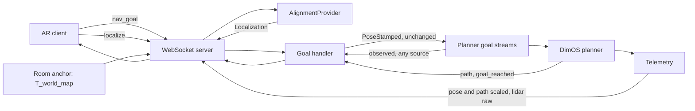

<!-- Tracked copy of the working plan. Mirrored from the Cursor plan file;
     edit there and regenerate, or edit here and copy back. -->

# Build dimos-ar-v2 as a learning-first Go2 ARModule

This is a learning project. The measure of success is that you understand every
line and why it exists, not that a demo ships quickly. The architecture below is
settled; the pace and the explanation are the point.

## How we work

`dimos-ar-v2/` is new and built subsystem by subsystem. `dimos-ar/` is frozen on
disk as reference — never edited, never installed, not in CI — and deleted once
v2 replaces it. Both publish `dimos.ar*`, so only one can be installed at a
time; v2 keeps the `dimos/ar/` module path so nothing has to be renamed later.

For each file: I explain what it does, why it needs to exist, which DimOS API it
touches with a concrete path, and what alternatives I rejected. Then I pause for
your questions. Then I write it. Then I walk through the finished code, naming
the Python language features used. Explanations live in chat.

Comments in `dimos-ar-v2/` match DimOS density — the templates are
`dimos/mapping/relocalization/module.py` (no module docstring, no class
docstring, no `In`/`Out` banners) and
`dimos/robot/unitree/go2/blueprints/smart/unitree_go2.py` (remappings and
`unitree_go2_relocalization` uncommented). DimOS also forbids section markers
(`# --- … ---`, `# === … ===`) in `dimos/codebase_checks/test_no_sections.py`:
if a file needs sections, it should be split. A comment stays only when the
code looks wrong or the constraint is invisible — surprising WHY, TODOs,
end-of-line notes on config examples. Not: essays, restating the next line,
or "first milestone" handler docstrings.

When a real design fork shows up mid-implementation, I stop and ask rather than
picking — in plain language, with enough context to decide.

## Names

Same shape as DimOS (`RelocalizationModule` / `dimos.mapping.relocalization` /
`unitree_go2_relocalization`):

- **Class:** `ARModule` in `dimos/ar/module.py` — DimOS `In`/`Out` surface.
  The WebSocket accept loop lives in `network/server.py`.
- **Import:** `dimos.ar`.
- **Blueprint:** `unitree_go2_ar` (`dimos run unitree-go2-ar`).
- **Wire peer:** `server` (WebSocket role). Clock stamps are `server_recv_ts` /
  `server_send_ts`; connection count is `state.server`.
- Lens `ARBridge/` stays until the Lens adaptation phase.

## The core idea

Every piece of complexity in today's v1 package traces back to one thing: v1 tries to *solve* the alignment between the headset and the robot, continuously, from a stream of noisy tag sightings. That is why `world_frame/` (2,352 lines), `tag_tracking/` (1,132) and `registration/` (1,154) exist, and why navigation needs a watchdog that re-dispatches goals whenever the estimate shifts.

The rebuild replaces all of that with a single seam of exactly one method:

```python
localize(observations: Sequence[Observation]) -> Localization | None
```

Answers come back labelled with the frame they are expressed in, because that genuinely differs by provider: AprilTag resolves directly into `world`, a VPS resolves into its scanned `map`. ARModule converts to `world` before anything reaches a client, so **the wire frame is always `world`** and `map` never escapes ARModule.

The contract to the client is: *here is where you are in the robot's frame, and I may send you a better answer later*. A provider may push an updated result unsolicited; the client applies the newest one it has received.

### Frame names

DimOS is not self-consistent here, so this needs stating once rather than being inferred from whichever file you happen to read.

- `GO2Connection` publishes robot odometry with `frame_id="world"` — `dimos/robot/unitree/type/odometry.py:101`. The Go2 LiDAR is also `world`, at `dimos/robot/unitree/type/lidar.py:81`.
- `PointLio` publishes odometry with `frame_id="odom"` and child `"body"` — `dimos/hardware/sensors/lidar/pointlio/module.py:88-89`, from `dimos/navigation/cmu_nav/frames.py:18`.
- `RelocalizationModule` publishes its TF as `world → map` — `dimos/mapping/relocalization/module.py:151-156`.
- The file defining `FRAME_ODOM` opens with `# NOTE: this will be deleted shortly - do not rely on` — `dimos/navigation/cmu_nav/frames.py:15`.

Every frame the stack we actually run touches is called `world`: stock Go2, the `unitree_go2` smart blueprint, and `RelocalizationModule` if it is added. `odom` would be a name appearing nowhere in the messages we handle. So:

**The drifting DimOS frame is `world`. The client's own tracking frame is `client`. The scanned room frame is `map`.** Transforms read `T_world_client` and `T_world_map`.

The trap worth one line in `PROTOCOL.md`: DimOS names the *stream* `odom` while the `frame_id` inside it is `world`. That is why v1 calls this frame `odom` — the stream name is the visible one, and the frame name is buried in the message.

Naming the client frame `client` rather than `world` removes the collision with v1 vocabulary, where `world` meant the AR frame. We rename the side we own.

`PROTOCOL.md` describes `world` in plain language rather than by its ROS lineage — "the robot frame: origin where the robot booted, X forward, Z up, drifts over time" — so a client developer never has to know the etymology.

### ARModule does not remap axes

There is no axis remap anywhere in ARModule. Coordinates stay in DimOS's convention and each client converts on receipt.

DimOS follows ROS conventions: right-handed, Z-up, X-forward. Frame names are plain strings carried on the message — `frame_id` on `PoseStamped` at `dimos/msgs/geometry_msgs/PoseStamped.py:49`.

Each client converts to its own convention on receipt. Spectacles is left-handed Y-up, Quest is right-handed Y-up, a browser viewer might be Z-up. Baking one client's convention into the wire privileges that client and forces every other one to undo it first. ARModule has no business knowing what a Lens scene graph looks like.

What this buys:

- `network/protocol.py` contains no coordinate math at all — it is field copying and JSON.
- LiDAR points are forwarded straight through, untouched.
- There is nothing to get subtly wrong in a shared axis-conversion helper, and no shared helper to test.

The cost is that the conversion is now written once per client platform instead of once on ARModule. Mitigate it by shipping a reference implementation in the Lens client and stating the exact convention precisely in `PROTOCOL.md`.

The rule that decides every case of this kind: **a property of the client platform belongs to the client; a property of the robot belongs to ARModule; anything requiring knowledge only ARModule has belongs to ARModule.**

- Axis handedness is the first, so the client owns it.
- Odometry scale is the second, so ARModule owns it. Every client talking to this Go2 needs the same 1.25 and none of them should have to know that. See the scale section below.
- Frame composition is the third, so ARModule owns it. When a VPS answers in `map`, turning that into `world` needs `T_world_map`, which is a live measured transform the client has no way to obtain.

### The provider is fully stubbed to start

There is no real implementation of `localize` in this build at all. One `StubAlignmentProvider` returns a pose read from config with `frame_id="world"` and confidence `1.0`, and no AprilTag or VPS file gets created yet. That is deliberate: you get to see the whole ARModule working — WebSocket, nav goals both directions, telemetry, safety — before any camera geometry enters the picture, and the seam gets validated by a real caller before anything is built behind it.

Both providers are then built. The designs below are recorded now so the seam does not need retrofitting when they arrive.

### The seam takes observations, not a client

Nothing in the call is client-specific. It answers one question: *given these camera observations, where is the observer?* Glasses, a phone, a tablet or the robot itself all use it identically, and the answer does not depend on who asked or on anything that happened before. It is stateless and idempotent.

```python
@dataclass(frozen=True)
class Intrinsics:
    fx: float
    fy: float
    cx: float
    cy: float
    width: int
    height: int
    distortion_model: str        # "none", "plumb_bob" or "equidistant"
    distortion: tuple[float, ...]

@dataclass(frozen=True)
class Observation:
    jpeg: bytes
    intrinsics: Intrinsics
    camera_pose: Pose            # camera_optical, in the observer's tracking frame
    capture_ts: float            # server clock, at exposure

@dataclass(frozen=True)
class Localization:
    pose: Pose                   # observer's tracking origin
    frame_id: str                # "world" or "map" — which origin pose is measured from
    confidence: float
```

Five properties of that signature carry weight:

**It takes a sequence.** A provider can fuse several viewpoints instead of solving from one frame. A caller with a single frame passes a list of one. This is where the multi-viewpoint quality the v1 aligner got from the user walking around the robot comes back, without reintroducing a session — the caller batches, the provider stays stateless.

**It is not named after the client.** `localize_client` and `T_odom_client` both implied the caller must be the AR headset. `localize` returning a `Localization` says what it actually does, and the name survives the robot becoming a caller.

**The answer is labelled with its frame.** Providers do not share a native reference: AprilTag resolves into `world` because the tag is bolted to the robot, a VPS resolves into the scanned `map`. Pretending otherwise would mean one of them lying about what it computed.

**The observer's tracking frame must be right-handed, gravity-aligned Z-up and metric — DimOS convention.** This is the one demand the seam makes of a caller, and it is not stylistic. The answer is a rotation plus a translation, and no rotation can relate a left-handed frame to a right-handed one; that needs a mirror, which is not a rigid transform and would quietly corrupt every composition downstream. Spectacles is left-handed Y-up, so the Lens client converts its camera poses on the way in and converts `Localization.pose` back on the way out — the same fixed conversion it already owes for `pose`, `path` and `lidar`, applied in both directions instead of one. Demanding Z-up specifically, rather than merely right-handed, is what makes gravity levelling possible; see the AprilTag design.

`camera_pose` is the pose of the **camera optical frame** — X right, Y down, Z along the view direction — which is what PnP natively produces and what DimOS calls `camera_optical` (`dimos/robot/unitree/go2/connection.py:115-120`). v1 instead carried the Lens camera convention on the wire and corrected for it inside the tracker with a `FLIP_YZ` constant (`tag_tracking/solve.py:62`). That constant does not come across: ARModule whose geometry names one client's camera convention has already lost the platform independence the rest of the design is built on.

**Intrinsics carry distortion, and ARModule removes it when a provider needs it gone.** The Go2's own front camera is a fisheye — `distortion_model: equidistant`, four coefficients, 1280×720 (`dimos/robot/unitree/go2/front_camera_720.yaml:1-25`) — and a VPS accepts a pinhole intrinsic only, so undistortion has to happen somewhere. ARModule must own that code for the robot's own frames regardless, so clients get it for free rather than each reimplementing it per platform. The AprilTag path needs no help: DimOS's `estimate_marker_pose` already undistorts fisheye corners into the pinhole `K` before solving (`dimos/perception/fiducial/marker_pose.py:86-90`).

### Two callers, one seam

The seam has exactly two callers, and only one of them is on the network.

**The WebSocket handler**, on behalf of a connected client. It builds `Observation`s from an inbound `localize` frame and sends the result back as `localization`, converted to `world`.

**The room-anchor loop**, in-process, when the anchor comes from a VPS. The Go2 already publishes `color_image` at roughly 14 Hz and `camera_info` as ordinary DimOS streams, with `frame_id` `camera_optical`, so the robot never speaks the wire protocol to localize itself: it is inside the same process and its frames are already there. It asks the same `localize` and pairs the `map` answer with the robot's `world` pose at capture time to produce `T_world_map`.

That is why `T_world_map` is a module-owned value rather than a protocol concept, and why no new wire message is needed for robot-side localization.

#### Capture-time pose pairing is mandatory, not an optimisation

A localization answer describes where the observer was **when the shutter opened**, not when the answer arrived. A cloud round trip is on the order of two seconds, during which the robot can have walked a metre. So every observation carries `capture_ts`, `pose_buffer.py` keeps a short ring buffer of recent robot poses, and composition interpolates the pose at capture. Without this the anchor is wrong by however far the robot moved during the query.

There is a DimOS limitation here that ARModule cannot fix and must design around:

```136:141:/Users/johannestscharn/Repositories/dimos/.venv/lib/python3.12/site-packages/dimos/robot/unitree/go2/blueprints/basic/unitree_go2_basic.py
    # we temporarily disabled sensor timestamps
    # and are derriving all timestmaps upon reception
    # this is because image webrtc stream doesn't have timestamps,
    # so it's difficult to corelate the streams otherwise
    #
    #    .configurators(ClockSyncConfigurator())
```

Robot camera frames therefore carry server *reception* timestamps with an unknown capture latency, while odometry carries the Go2's own header stamp (`dimos/robot/unitree/type/odometry.py:100`). Two clock domains, neither of them camera capture time. At 0.5 m/s, 100 ms of unaccounted latency is 5 cm of anchor error. Worth being precise about what the commented-out line does and does not do: `ClockSyncConfigurator` is a startup check that the *host's* clock sits within 200 ms of NTP (`dimos/protocol/service/system_configurator/clock_sync.py:28-38`). It never rewrote a timestamp. Disabling it means nothing verifies that server time and robot time agree.

This makes the stationary requirement below load-bearing for correctness rather than merely helpful: if the robot is not moving, capture time and arrival time yield the same pose and the latency stops mattering. In-motion robot-side fixes stay off the table until upstream timestamping is fixed — a candidate second PR alongside `PR.md`.

#### Three clocks, two mappings

Pairing an observation with a robot pose means putting a client's exposure time into the same number line as the odometry stamps in the pose buffer. Three clocks are involved and no two of them are the same: the client's, the server's, and the Go2's. So there are two mappings to establish, and keeping them separate is what makes each one testable on its own.

**Client to server, measured by the client.** Two messages, `time_sync` out and `time` back. The client stamps `client_send_ts`; ARModule replies with that value echoed plus `server_recv_ts` and `server_send_ts`; the client notes its own receive time and has the four numbers of an NTP exchange. Offset is the mean of the two crossings, round-trip delay is the difference of the two spans, and the client keeps the sample with the smallest delay out of a handful — the standard best-of-N, because the lowest-latency exchange is the least biased. The client then sends `capture_ts` already in server time.

ARModule holds **no state at all** for this. It answers with two of its own timestamps and forgets. The estimate lives entirely on the client, which is the only party that can measure its own receive time, and a client that never syncs simply cannot localize — a clear failure rather than a silently misaligned one.

This is why the plan reintroduces a message pair it had removed. Dropping `ping`/`pong` was right for the reason given — WebSocket keepalive is in RFC 6455 and the library already runs it — but that argument only covered liveness. Clock offset was the other thing `ping` was carrying, and it is genuinely needed. It comes back named for what it does, and only what it does.

**Server to robot, measured by ARModule.** The pose buffer is keyed on odometry stamps, which are the Go2's clock, not the server's. Rather than assume the two agree — nothing checks it, and the NTP check that would have is disabled — ARModule tracks the running *minimum* of `server_receive_time − odom.ts` over a rolling window and treats that as the offset. Minimum rather than mean, because every sample is inflated by that message's transport latency and the fastest message is the one closest to pure offset. It is roughly fifteen lines and it removes an assumption v1 made implicitly.

v1 did the client half of this with `ping`/`pong` and a `capture_ts_robot` field, then compared it directly against odometry `source_ts` (`registration/session/session_frames.py:217-226`) — correct only if the server and robot clocks happen to agree.

#### When the robot asks — the gate

Nothing on the wire triggers this and no client can request it. It is internal policy, owned by the room-anchor component, and it needs to be a real gate rather than a bare timer: each query costs a cloud round trip, and a query taken while walking is both blurry and mispaired.

Preconditions, all required before a query is attempted:

- **Stationary** — speed below a threshold for a couple of seconds. Correctness, per above, not just image quality.
- **Novelty** — moved beyond a distance or rotated beyond an angle since the last accepted fix. Re-querying from an unchanged viewpoint pays for information already held.
- **Rate ceiling** — a minimum interval regardless, for cost and vendor rate limits.
- **Single-flight** — never two queries outstanding.
- **Staleness override** — when no fix has been accepted for a long time, relax novelty. Drift is accumulating and a fix from a familiar viewpoint still helps.

Post-conditions on the result:

- **Confidence floor** — below it, discard.
- **Jump gate** — an implied `T_world_map` that moved further than plausible drift over the elapsed time is a mismatch, not drift. Reject it.
- **Blend, do not overwrite** — accept through a slew limit or exponential blend on translation and yaw, so one bad-but-passing fix cannot teleport every connected client's world.

**Nav-goal arrival is the primary trigger.** It is where the robot is stationary, where the most odometry error has just accumulated, and where the residual scale error over the leg that was walked is largest. Walk, arrive, stop, correct.

### Two independent axes, four configurations

"AprilTag or VPS" reads like one choice. It is two, and separating them is what makes all four combinations work:

- **Client alignment** — how a *client* learns where it is. AprilTag by looking at the robot, or VPS by looking at the room.
- **Room anchor** — how *ARModule* learns `T_world_map`. DimOS relocalization from a LiDAR premap, or a VPS robot loop, or nothing at all.

Supported: AprilTag alone; AprilTag plus relocalization; AprilTag plus VPS; VPS only.

The rule that makes one code path cover all four: **providers answer in their native frame; ARModule stores each connection's pose in the most stable frame available — `map` when a room anchor exists, `world` otherwise — and always emits `world` on the wire.**

That is what makes AprilTag plus relocalization useful rather than pointless. AprilTag answers in `world`, and anything anchored in `world` drifts. But with a room anchor present, ARModule converts that answer into `map`, keeps it there, and re-emits it in `world` every time `T_world_map` moves. AprilTag gets drift correction without knowing relocalization exists.

**What "remembers the answer per connection" means concretely.** Two things are stored: `P_map` per connection, and `T_world_map` once globally. The wire value is `T_world_map ∘ P_map`. When the anchor is refreshed, the client has not moved and has not sent anything, but the pose it holds is now stale — the same physical spot in the room maps to a different `world` coordinate than it did a minute ago. Because `P_map` was kept, ARModule recomputes and pushes. Had it stored only the composed wire value, the room-fixed fact would be gone and the user would have to re-scan. Deadband before re-sending, and the client interpolates over a few hundred milliseconds rather than teleporting, or every anchored object visibly jumps.

### The client-alignment providers

**No vendor name appears in the code.** Every cloud VPS works the same way at the level ARModule cares about: post images plus intrinsics, get a pose in a scanned map. So the provider is `VpsProvider`, the transport is a `VpsClient` protocol, and the concrete REST adapter takes its base URL, auth endpoint and query endpoint from configuration with credentials from the environment. Which vendor is in use is a deployment fact, not a source-code fact, and swapping one for another must not touch anything in `dimos/ar/`.

#### Both are configured, and they chain

AprilTag and VPS answer the same question by different means, and the sensible arrangement is not to choose between them but to order them. `ChainProvider` holds a list and returns the first non-`None`:

```python
for provider in self._providers:
    result = provider.localize(observations)
    if result is not None:
        return result
return None
```

AprilTag goes first because it is local, free and instant, and because when the robot *is* in view it is also the more precise of the two — a 56 mm square at two metres beats a cloud match against a scan. It returns `None` when no tag was found in any observation, or when every detection failed the geometric gates. Only then does the VPS get queried, which is exactly when the client is looking at the room rather than at the robot. Every avoided cloud call is a saved round trip, a saved credit and two saved seconds.

Ordering falls out of the `Localization` contract already being frame-labelled: one link answers in `world`, the next in `map`, and the caller neither knows nor cares which one produced the result. The chain is the whole implementation of "AprilTag plus VPS" as a client-alignment configuration, and with one provider in the list it is a pass-through, so the other three configurations need no special case.

#### AprilTag — stateless, local, answers in `world`

Per observation:

1. Decode the JPEG to greyscale and detect 36h11 markers, giving four pixel corners per tag. Keep only the tag IDs the robot profile declares.
2. `estimate_marker_pose` solves the 56 mm black square against the observation's intrinsics and returns `T_camopt_tag`. `IPPE_SQUARE` is the right solver here because the target is a known planar square, and the helper undistorts fisheye corners into the pinhole `K` first, so a distorted client camera costs nothing extra.
3. `T_world_tag = T_world_base(capture_ts) ∘ T_base_tag`, with the robot pose interpolated out of the pose buffer at the observation's capture time and the mount offset read from the robot profile.
4. `T_world_client = T_world_tag ∘ (T_client_camopt ∘ T_camopt_tag)⁻¹` — the tag seen from the client, walked backwards through the client's own camera pose, gives where the client's origin sits in `world`.
5. Gate: reprojection RMS, tag distance, and the skew between capture time and the nearest odometry stamp. v1's runtime values are the starting point — 3.0 px, 6 m, 0.25 s (`module.py:133`, `:141`).

Then across observations: gravity-level each candidate, take the componentwise median of translation and the circular median of yaw, and drop candidates whose residual against that median exceeds a threshold. Levelling forces the estimate's up axis to agree with `world`'s, which is sound precisely because the seam demands a gravity-aligned Z-up observer frame, and it removes a real error source — mount pitch calibration error and PnP tilt noise both show up as spurious roll and pitch. Confidence is derived from the reprojection errors and the spread of the surviving candidates.

**Reuse DimOS, do not vendor.** `dimos/perception/fiducial/marker_pose.py` supplies `create_aruco_detector`, `camera_info_to_cv_matrices`, `estimate_marker_pose` and `marker_reprojection_error` — the entire per-frame stack. v1 vendored its own copy for one reason: it called `solvePnPGeneric`, which returns both solutions of the planar-square ambiguity, and used the ratio between them as a quality gate (`tag_tracking/fiducial_helpers.py:65-71`, `:112-120`). The DimOS version returns only the best solution, so that gate is unavailable. The reprojection gate plus the cross-observation median is the replacement: a wrongly flipped solve lands far from the cluster and gets dropped as an outlier. Adding the ambiguity ratio to DimOS is a small, well-motivated upstream proposal for `PR.md` rather than grounds for a local fork.

Go2 numbers, all carried over unchanged and all verified in v1: family 36h11, tag ID 0, printed at 70 mm with a 56 mm black square, mounted at `(0.18, 0.0, 0.06)` in `base_link` with yaw −90° and pitch −15° (`robot_profile/go2.py:35-53`). PnP is fed the 56 mm black square, never the 70 mm sheet; that distinction is load-bearing and `0.070 / 0.056` being exactly 1.25 is the coincidence noted in the scale section.

AprilTag never pushes updates of its own — but its answers do get re-emitted when a room anchor moves, per the storage rule above.

#### VPS — cloud, answers in `map`, and ARModule composes

Two layers, split so the vendor lives on one side of a line. `VpsClient` is a `typing.Protocol` with one method: given a JPEG and a pinhole intrinsic, return a camera pose in the map with a confidence, or nothing. `RestVpsClient` implements it against a configured REST API. `VpsProvider` implements `AlignmentProvider` on top and knows nothing about HTTP.

Per observation, `VpsProvider`:

1. Undistorts the frame to pinhole if `distortion_model` is not `"none"`, and downscales if the longest side exceeds the API's limit, scaling `fx`, `fy`, `cx`, `cy` by the same factor.
2. Asks the client for `P_map_camopt`.
3. Computes `T_map_client = P_map_camopt ∘ T_client_camopt⁻¹` — the query answers *where the camera was*, and turning that into where the observer's origin is stays our arithmetic either way.

Across observations it takes the same median-and-reject as AprilTag, then returns a single `Localization` with `frame_id="map"`. ARModule composes with `T_world_map` before anything reaches the wire.

**One image per request, several requests, our own fusion.** The APIs in this class typically offer both a single-image query and a multi-image query that fuses four to six frames server-side. Single-image is the one to build: it works when a client sends a single frame, it keeps outlier rejection on our side of the boundary where it is testable without a network, and it is one code path shared with the fusion the AprilTag provider already needs. Multi-image would be more accurate per round trip and is worth revisiting once there is a measurement, but it refuses fewer than four frames, which would make the seam's "a caller with a single frame passes a list of one" property a lie.

**What the REST adapter has to get right**, and none of it belongs above the `VpsClient` line:

- *Token lifecycle.* These APIs typically issue a short-lived bearer token from an HTTP Basic exchange — half an hour is a common expiry. The adapter caches it and refreshes ahead of expiry, and retries once on a 401 in case the clock drifted.
- *Handedness.* Providers in this space commonly serve both a Y-up left-handed convention for game engines and a right-handed one, chosen by a request flag. **Always ask for right-handed.** A Y-up right-handed map and DimOS's Z-up right-handed `world` differ by a pure rotation, which `T_world_map` absorbs at no cost. Left-handed would make `T_world_map` a mirror, which is not a rigid transform, and every composition built on it would be wrong in a way that looks like a calibration error. This is the same argument as the seam's right-handed demand, arriving from the other side.
- *Hint conventions can differ from result conventions.* At least one API documents its spatial search hint as left-handed even on right-handed queries. Hints are a real win for the robot loop — once `T_world_map` is known ARModule knows roughly where the robot is standing, which cuts both latency and false matches in repetitive spaces — so the adapter sends them, converts them to whatever the hint field wants, and a unit test pins the conversion.
- *Accuracy versus latency modes.* Where the API exposes a slower, higher-recall engine, the room-anchor loop should use it and interactive client alignment should not. The robot queries while stationary at a nav goal, where two extra seconds cost nothing and recall is the whole point.

Config: base URL, auth path, query path, map identifier, request timeout, confidence floor. Credentials from the environment. Which vendor is in use is a deployment fact, and swapping one for another must not touch anything in `dimos/ar/`.

Two properties of the Go2 make it a workable VPS observer, both already true without new hardware. Its front camera is 1280×720, which sits exactly at the image ceiling these APIs impose, so no downscale is needed for the robot's own frames. And DimOS already ships the extrinsic chain `base_link → camera_link → camera_optical` for it (`dimos/robot/unitree/go2/connection.py:110-120`), so turning a camera pose in `map` into a base pose in `map` needs no new calibration.

What VPS buys over AprilTag: aligning **without the robot in view**, and no LiDAR premap recording step — you scan with a phone. What it costs: a cloud dependency, credentials, and a round trip. Credentials stay on ARModule either way.

Because each request is independent and idempotent, there is no session, no commit, and no module-side refinement loop. That is what removes `RegistrationSession` (1,044 lines), `RobotAprilTagTracker` (582), the windowed similarity solve (367), `SimilarityAligner` (1,066) and `WorldFrameRefiner` (471): all of it exists today only because ARModule was solving for a persistent transform including scale and then defending it against drift.

### Multiple clients

The design supports several clients at once, with one honest limit.

**Viewing is genuinely multi-client.** Telemetry is a broadcast — identical bytes to every connection, because ARModule holds no per-client transform and does no per-client math. N clients cost N sends and nothing else. Each client holds its own localization result privately and applies it to its own scene graph. This is a direct consequence of the two decisions above, and it is something the current single-AR-world design cannot do at all.

**Control is last-command-wins, and ARModule does not arbitrate.** DimOS has exactly one active goal: `GlobalPlanner.handle_goal_request` overwrites `_current_goal` under a lock. Two clients sending goals will fight, and the newest wins. A stop from any client stops the robot, and stop-on-disconnect fires on the *last* disconnect, not the first.

What ARModule does add is **identity, not arbitration**. It assigns each connection a `client_id` and returns it in that client's `hello`; `state.nav.goal.source` then carries the `client_id` of whoever set the active goal, or `"dimos"` for goals observed on the planner's input streams. Every client can therefore see who is driving and render it, which is enough for a small co-located group to coordinate socially without ARModule holding a control lock. A lock is addable later without changing this shape — it would be two new messages and a held `client_id`, and nothing above would have to move.

## Drift, and what DimOS already does about it

Drift is a DimOS problem and DimOS already ships most of the fix. `RelocalizationModule` loads a premap point cloud tagged `map`, registers the live accumulated cloud against it every couple of seconds behind a fitness gate, and publishes the result as a TF:

```147:156:/Users/johannestscharn/Repositories/dimos/.venv/lib/python3.12/site-packages/dimos/mapping/relocalization/module.py
        # relocalize(scan, map) returns T such that scan_in_map_frame = T(scan_raw).
        # We are publishing a TF for map_in_scan_frame, notice that the base frame is `world`
        # so inverse the transform T here to get map_in_scan_frame
        T_inv = np.linalg.inv(T)
        new_tf = Transform(
            translation=Vector3(*T_inv[:3, 3]),
            rotation=Quaternion.from_rotation_matrix(T_inv[:3, :3]),
            frame_id=FRAME_WORLD,
            child_frame_id=FRAME_MAP,
        )
```

That transform is exactly `T_world_map` — the same quantity a VPS robot loop would estimate. So one room-anchor implementation is a **TF subscription**: no cloud client, no worker thread, no credentials, no query gate. It is by far the cheapest of the two anchor sources and should be built first.

Three qualifications, the first of which is easy to get backwards:

**It does not stop `world` drifting.** The robot's pose keeps drifting; the map's apparent position in `world` moves to compensate. Content anchored to `map` stays fixed to the room only because ARModule does the composition. Same architecture as the VPS route — drift becomes *observable and continuously corrected*, not absent.

**It is rigid-only, no scale.** `relocalize()` passes `TransformationEstimationPointToPoint(False)` at `dimos/mapping/relocalization/relocalize.py:107` and refines with point-to-plane ICP. Pose is corrected; scale is not.

**It is not free.** Multi-scale FPFH RANSAC at a 500k iteration budget across 17 runs, taking three to eight seconds per attempt in DimOS's own sample logs, and it needs 50,000 live points before it will try. Plus a per-space workflow: record a run, `dimos export-premap`, launch with the relocalization blueprint.

It also cannot replace a client-alignment provider: it registers LiDAR point clouds, and Spectacles have no LiDAR that can register against a Go2 scan. It fixes the robot's place in the room and says nothing about the headset's.

One cost remains that no anchor removes: `world` resets when the robot restarts, so content anchored in `world` alone does not survive a session. With any room anchor that is recoverable, since the map outlives the robot and `T_world_map` is simply re-measured.

## Odometry scale — settled

**The factor is robot-side and ARModule owns it.** Confirmed with DimOS engineering: the Go2 under-reports travelled distance because of leg movement, and `1.25` is a good multiplier that significantly improves the result. It is a fixed per-robot constant, not a learned value.

That is consistent with what the code says about the source. The stream ARModule consumes is `GO2Connection.odom`, DDS topic `rt/utlidar/robot_odom` (`dimos/robot/unitree/go2/dds/store.py:41`), which DimOS itself calls leg odometry (`go2/dds/cli/render.py:233`, and the LiDAR view logs under `world/leg_odom/lidar` at line 206). Foot slip during stance makes kinematic odometry under-report, and under-reporting is one-directional — matching v1's prior of `ODOM_SCALE_INITIAL = 1.25` (`dimos-ar/dimos/ar/world_frame/state.py:26`) sitting on a hard floor of exactly 1.0.

### What is scaled and what is not

v1 has this working — the robot arrives where it was sent with minimal drift — so v1's rules are the reference, and all of its scaling happens at a single seam in `world_frame/state.py`, applied in odom coordinates *before* `T_world_odom`.

**Horizontal position — scaled. Height — not.** v1 scales X and Y and passes Z through verbatim:

```290:293:/Users/johannestscharn/Repositories/spectacles-dimensional-os/dimos-ar/dimos/ar/world_frame/state.py
        scaled_x, scaled_y = self.scale_odom_point(position[0], position[1])
        scaled_position = (scaled_x, scaled_y, position[2])
        T_odom = pose_to_matrix(scaled_position, orientation)
        T_world = self._get_T() @ T_odom
```

The batch path does the same, touching only indices 0 and 1 despite being named `scale_odom_xyz_batch` (`state.py:175-179`). This is correct: leg slip costs horizontal travel, not altitude. Because the factor is applied pre-transform, "X and Y" means the ground plane of DimOS's Z-up frame.

**Orientation — untouched.** Heading is also inaccurate, but the error is not a linear factor, so there is nothing to scale and no estimate worth making. v1 agrees: `transform_pose` builds the matrix from the raw quaternion and scales position only. Heading is left to the room anchor.

**Free vectors — untouched.** v1 excludes velocity and heading directions explicitly and writes down why at `state.py:309-313`: scaling a direction is meaningless. Linear speed is a distance rate and so arguably wants the factor, but v1 leaves it unscaled, it is display-only, and v2 follows — stated in `PROTOCOL.md` so nobody has to guess.

**Path and `nav_goal` — scaled out, inverse-scaled in.** Path scales per waypoint through the same seam (`network/data_plane.py:138`) and goals return through `inverse_transform_point` (`state.py:320-328`), reached from `navigation/world_transform.py:22-27`. This forward-and-inverse pair is precisely what the observed arrival accuracy validates. It is also what the planner requires, since it works in the same numeric space as the odometry pose: it takes the robot's start pose from `odom: In[PoseStamped]`, still marked `# TODO: Use TF.`, and subscribes it straight into `handle_odom` (`dimos/navigation/replanning_a_star/module.py:45` and `:80`), then emits `path` in those coordinates.

**LiDAR — untouched, and this is a deliberate departure from v1.** v1 routes the cloud through the same seam, so pose, path and cloud all share one scaled space:

```59:60:/Users/johannestscharn/Repositories/spectacles-dimensional-os/dimos-ar/dimos/ar/network/data_plane.py
        if len(filtered) != 0:
            world_pts = world_frame.transform_points(filtered)
```

v2 does not, because the points are metric range measurements rather than dead-reckoned positions. DimOS stamps the Go2 cloud `frame_id="world"` at `dimos/robot/unitree/type/lidar.py:81`, and the smart blueprint says registering it at the odom pose makes no sense:

```69:74:/Users/johannestscharn/Repositories/dimos/.venv/lib/python3.12/site-packages/dimos/robot/unitree/go2/blueprints/smart/unitree_go2.py
    @pose_setter_for("lidar")
    async def _lidar_pose(self, msg: PointCloud2) -> Pose | None:
        # Yes, it doesn't make sense to register lidar at the odom pose because the
        # go2 lidar is in the world frame, but map.py (for now) needs this.
        # TODO: fix map.py to use a transform frame
        return getattr(self, "_last_odom_pose", None)
```

Scaling a cloud about the odometry origin inflates within-scan separations too, so a 4 m wall would read as 5 m. Room geometry is already metric and the factor would break it.

**Two spaces, and one trap that follows.** Because the cloud stays metric while pose and path are scaled, ARModule now has two horizontal spaces where v1 had one. The visible cost is that the robot and its path drift off the cloud with distance from the odometry origin, which the room anchor corrects at each nav-goal arrival.

The trap is that any code comparing cloud points against the robot position must use the **unscaled** robot position, not the one on the wire. v1's obstacle band and near-robot subsample both do exactly that comparison and both take the scaled position, which was correct there and would be a silent 25% error here:

```61:72:/Users/johannestscharn/Repositories/spectacles-dimensional-os/dimos-ar/dimos/ar/network/data_plane.py
            if mode == "obstacles" and obstacle_distance_config is not None:
                world_pts = filter_obstacle_points(
                    world_pts,
                    obstacle_distance_config,
                    robot_position=robot_world_pos,
                    vertical_axis=1,
                    min_height_m=lidar_filter.config.min_height_m,
                    max_height_m=lidar_filter.config.max_height_m,
                )
            world_pts = subsample_points_near_robot(
                world_pts, robot_world_pos, target_points=target_points
            )
```

So `telemetry/lidar_filter.py` takes the raw odometry position and never the published one, and a test asserts that a cloud filtered at 10 m from the origin keeps the same points whether or not the scale constant is 1.0.

### Mechanics

One constant on `robot_profile/go2.py`. One function in `telemetry/scale.py`, taking the factor as a plain float so `telemetry/publisher.py` and `navigation/goals.py` do not import the profile and group ordering stays free. It returns a corrected copy rather than mutating, so the raw value stays available for the LiDAR path. Applied at encode for `pose` and `path` positions, inverted at decode for `nav_goal`, and applied to nothing else.

Applied about the odometry origin, with no anchor point — v1 needs `odom_anchor_xy` (`world_frame/state.py:155-166`) only so that *changing* a live estimate does not teleport already-placed content, and that need disappears once the factor is fixed. Because the factor is constant, scaling accumulated position is identical to scaling each increment, so telemetry stays byte-identical for every client and the broadcast property survives.

Nothing about scale appears on the wire: no factor, no confidence, no lock. The client receives corrected coordinates and never learns that a correction happened.

### What is deliberately not built

**No online estimator.** The true factor moves with gait, so it has no converged value and fitting a constant to it as a *live estimate* is misspecified — which is exactly what generated v1's jump-fraction damping, regime-agreement counter, lock confidence, plausible band and hard rails. A fixed calibration constant is the honest form of the same knowledge and needs none of that machinery. This is why `SimilarityAligner`'s scale path and the `scale_confidence` / `scale_locked` / `scale_observable` wire fields do not come across.

**No speed-dependent factor.** `sportmodestate.velocity` is available (read by DimOS at `go2/dds/cli/render.py:81`), but making the factor a function of it assumes speed is the explanatory variable. Revisit only with a measurement showing the correlation.

**Tag size was not the cause.** `0.070 / 0.056 = 1.25` exactly is a real coincidence in the codebase, and it is worth recording that inspection cleared it so nobody re-opens it: PnP is fed `mount.size_m = 0.056`, the black detection square (`tag_tracking/tracker.py:274`), with object points built from that same value (`tag_tracking/fiducial_helpers.py:28-51`). The 0.070 total is only sent to the Lens for printing and used in the max-detection-distance estimate.

### The residual, and who clears it

A fixed 1.25 against a true 1.10–1.35 leaves a residual that grows with distance walked. That is bounded by re-correction rather than by mathematics: **whichever of AprilTag, VPS or relocalization is configured re-corrects after a nav goal is reached**, so the residual only ever accumulates over one leg of travel.

That makes nav-goal arrival the primary trigger for the room-anchor gate rather than merely a good one. For the two automatic sources ARModule simply attempts a fix. AprilTag is different, because correction needs the user to look at the robot — so `state` carries a staleness flag for the client to prompt on, which costs one boolean and no new message.

### The source-level fix needs hardware

Point-LIO is LiDAR-inertial and therefore metric by construction, but in DimOS it is a wrapper around a C++ binary that drives a **Livox Mid-360** directly over UDP: `lidar_ip` is required and raises without it (`dimos/hardware/sensors/lidar/pointlio/module.py:211-217`), it opens the Livox SDK's own ports (lines 44-55), `lidar_type` defaults to the Livox branch (line 109), the sensor frame is `mid360_link` (line 90), and it needs a Nix-built binary (line 77). The Go2's built-in head LiDAR arrives over DDS as `rt/utlidar/cloud` (`go2/dds/store.py:39`) and cannot feed it. That is why v1 does not use PointLIO, and why every blueprint that does is named for the hardware — `unitree_go2_mid360_record`, `assembly/mid360_realsense_30`. If a Mid-360 is ever mounted, the constant can go away.



## `dimos-ar-v2/PR.md` — the upstream change, documented not opened

No PR gets opened in this phase. `PR.md` records exactly what the upstream change needs to be, so it can be filed later without re-deriving it.

The problem it solves: `GlobalPlanner.handle_goal_request` is the single funnel for the `goal_request` stream, `target`, `clicked_point`, and the `set_goal` RPC — but nothing observable is emitted when a goal is accepted, so there is no way to see goals that arrive by RPC.

```133:139:/Users/johannestscharn/Repositories/dimos/.venv/lib/python3.12/site-packages/dimos/navigation/replanning_a_star/global_planner.py
    def handle_goal_request(self, goal: PoseStamped) -> None:
        logger.info("Got new goal", goal=str(goal))
        with self._lock:
            self._current_goal = goal
            self._goal_reached = False
        self._replan_limiter.reset()
        self._plan_path()
```

The proposed change: add `goal_accepted: Subject[PoseStamped]` to `GlobalPlanner`, emit it in `handle_goal_request`, and expose `goal_active: Out[PoseStamped]` on `ReplanningAStarPlanner`, wired in `start()` exactly like the existing `path` and `goal_reached` subjects. Roughly six lines, matching the established pattern.

`PR.md` also notes that `navigation_state: Out[String]` is declared on the planner but never published anywhere in DimOS. v1 subscribed to it in `navigation/nav_state.py`, which means that code has never run.

A second upstream change is now a candidate: re-enabling sensor timestamps, or at least exposing capture time for the WebRTC video stream, so robot-side localization is not restricted to a stationary robot. See the capture-time section above.

### What ARModule does until then

Subscribe to the goal input streams the `unitree_go2_ar` blueprint actually wires, which is the same set the planner itself subscribes to in `start()`:

```91:96:/Users/johannestscharn/Repositories/dimos/.venv/lib/python3.12/site-packages/dimos/navigation/replanning_a_star/module.py
        self.register_disposable(
            Disposable(self.goal_request.subscribe(self._planner.handle_goal_request))
        )
        self.register_disposable(
            Disposable(self.target.subscribe(self._planner.handle_goal_request))
        )
```

This is observing the planner's public inputs, not reaching into it. It covers goals from our own clients, from `target`, and from the web UI's click path — which in the mobile blueprint runs `clicked_point` into `MovementManager`, whose `goal: Out[PointStamped]` feeds the planner.

The precise blind spot is a caller invoking the `set_goal` RPC directly. In DimOS that means `agents/skills/navigation.py`, `navigation/patrolling/module.py`, `navigation/bbox_navigation.py`, `navigation/frontier_exploration/`, and `robot/unitree/unitree_skill_container.py` — none of which `unitree_go2_ar` composes. So the gap is real but currently unreachable in our blueprint. `navigation/goals.py` states this in a docstring and `PR.md` is the fix.

Nav status is derived from goal arrivals plus `goal_reached`, and from `path`, which the planner publishes empty on cancel or arrival:

```165:169:/Users/johannestscharn/Repositories/dimos/.venv/lib/python3.12/site-packages/dimos/navigation/replanning_a_star/global_planner.py
        self.path.on_next(Path())
        self._local_planner.stop_planning()

        if not but_will_try_again:
            self.goal_reached.on_next(Bool(arrived))
```

## What the protocol carries

Today `dimos-ar/PROTOCOL.md` is at v19: 27 message types over 1,172 lines. The rebuild carries **13**, after the audit below.

Server to client:

- `hello` — protocol version, this connection's `client_id`, robot geometry, capabilities.
- `state` — one merged message replacing `runtime_snapshot`, `bridge_status` and `nav_status`. Four blocks: connection count, the live LiDAR filter settings, the nav block (state, outcome, active goal, and the `client_id` or `"dimos"` that set it), and the alignment staleness flag.
- `localization` — the observer's pose in `world`, plus confidence. May arrive unsolicited.
- `time` — the client's echoed send stamp plus ARModule's receive and send stamps.
- `pose`, `path` — DimOS `world` coordinates with the odometry scale constant applied to horizontal position only. Axes unconverted.
- binary `lidar` — raw DimOS coordinates, forwarded unmodified, no scale.

Client to server:

- `localize` — binary: one or more observations, each a JPEG, a pinhole intrinsic with its distortion model and coefficients, the camera optical pose in the caller's tracking frame, and a capture timestamp in server time.
- `time_sync` — the client's send stamp. Stateless on ARModule.
- `nav_goal` — goal in `world`, inverse-scaled and then published to `goal_request`.
- `stop`, `set_lidar`, `get_state`.

Three things drive the reduction from 27. The whole registration vocabulary (`registration_command`, `registration_pose`, `registration_status`, `capture_policy`, `camera_frame_ack`) disappears because there is no session to drive. `world_frame_correction` disappears because ARModule no longer runs a continuous solver whose internals the client had to track. And merging the three overlapping status messages kills a recurring bug class: five changelog entries (v6, v7, v9, v16, v18) exist purely to keep `runtime_snapshot`, `bridge_status` and `nav_status` agreeing with each other.

The observed DimOS goal rides inside `state.nav` rather than as its own message, so a reconnecting client and a live client see identical data by construction.

No message mentions the room anchor, the active provider, or the scale constant. All three are internal to ARModule: the client is told where it is and gets corrections when they are available, and nothing about how.

The one exception is a staleness flag in `state`. When correction requires the user — which is the AprilTag-only configuration, since the robot has to be in view — the client needs to know it should prompt. That is one boolean rather than a new message, and it is `false` forever under the automatic anchor sources. `alignment.requires_robot_in_view` in `hello` works the same way and is derived from the same fact: it is true only when the chain has AprilTag and nothing behind it.

### Why the protocol has this shape

Each of these is a v19 habit that the rewrite deliberately does not keep.

**`ping` / `pong` becomes `time_sync` / `time`.** WebSocket has protocol-level ping/pong in RFC 6455 and the `websockets` library runs keepalive automatically, so an application-level copy adds nothing for liveness — and liveness was only ever half of what v19's pair carried. The other half was clock offset, which the capture-time pairing genuinely needs and which nothing else can supply. So the pair survives, stripped of the liveness pretence and named for the one job it has. ARModule keeps no state for it; see the three-clocks section.

**Renamed `localize_request` → `localize` and `localize_result` → `localization`.** Matches the seam and reads as verb-in, noun-out.

**Cut `alignment.provider` and `alignment.supports_unsolicited_updates` from `hello`.** The client does not need to know which solver is running, and it should apply the newest localization it receives whether or not it asked for it — a flag saying pushes are possible changes no client behaviour. What *does* change client behaviour is whether the user must point at the robot, which AprilTag requires and VPS does not. So the whole block collapses to `alignment.requires_robot_in_view: bool`.

**Trimmed the `hello.robot` block.** `visual_origin_frame` and `default_render_offset_m` are v19 leftovers, informational and all-zero respectively. `tag_profile` describes a provider that does not exist yet and returns with the AprilTag work. Keeps `display_name`, `body_bounds_m`, `footprint_m`, `base_height_m`.

**`emergency_stop {active: bool}` → `stop`, no payload.** A latch only the client can clear is a footgun: a client that stops and disconnects leaves the robot immobilised with no way back except a restart. Stopping is an event, not a mode. The resume path is issuing a new `nav_goal`.

**`set_lidar_mode` three modes → `set_lidar {enabled, min_height_m, max_height_m, max_range_m}` (all required).** `"obstacles"` was not a mode, it was a preset of the filter parameters that the other two modes also accept. One boolean plus the parameters expresses all three states without an enum whose values overlap.

**Dropped `localization.unsolicited`.** The client applies the newest result regardless of why it arrived, so the flag is decoration.

**Kept `state` merged.** `pose` is already its own high-rate message; `state` is low-rate and small, and splitting the nav block back out recreates exactly the disagreement bug class the merge exists to kill.

**Kept `capabilities`.** Genuinely gates client UI — do not render a stop button when nothing can halt motion. `reason` stays as an optional human-readable string for the case where a capability is missing.

**Coordinates keep DimOS axes — in both directions.** Every position and orientation on the wire is right-handed Z-up. Everything ARModule sends is in `world`; the one exception is the camera poses inside a `localize` request, which are in the caller's own tracking frame, necessarily, since the request exists to discover how that frame relates to `world`. That frame must itself be right-handed Z-up and metric, so a left-handed client converts on the way out as well as on the way in. The seam section explains why this is a correctness requirement rather than a convention. `PROTOCOL.md` states the convention once, describes `world` in plain language, notes that DimOS names the stream `odom` while the frame is `world`, and leaves axis conversion to the client. It also states that `pose`, `path` and `nav_goal` carry the odometry scale correction on horizontal position while `lidar`, height, orientation and speed do not, so a client implementer is never left wondering why one stream would need a factor the others do not.

## Build order

Under `dimos-ar-v2/dimos/ar/`, grouped by subsystem rather than by file, so each group is a coherent piece of the system you can hold in your head and run. Within a group I still write one file at a time and explain each, but the group is the unit we discuss, review and finish. Roughly 1,900 production lines total for this phase, since no provider is written and no transform code exists.

**1. Project skeleton** — *done*. `pyproject.toml`, the package tree, `PROTOCOL.md`, `PR.md`, and `run-ci.sh` plus `.github/workflows/ci.yml` pointed at v2.

**2. The DimOS module and blueprint** — `module.py` and `blueprints.py`, plus `launcher/scripts/start.sh` and `dimos_lib.sh`. The whole DimOS integration surface in two files: `In`/`Out` stream ports, `@rpc build/start/stop`, the `handle_<stream>` auto-binding in `dimos/core/module.py`, and how `autoconnect` matches ports by name. First runnable milestone: `unitree_go2_ar` starts against the real Go2 and logs odometry.

**3. The network layer** — `network/server.py`, `network/protocol.py`, `network/send_queue.py`. Everything about talking to a client: the `websockets` accept loop, the asyncio-versus-module-thread boundary, typed encode/decode with no coordinate math, and latest-wins coalescing so a slow headset cannot stall the robot. `time_sync` lands here too, since answering it is three timestamps and no state. Runnable with `wscat`, no Lens needed.

**4. Telemetry out** — `telemetry/publisher.py`, `telemetry/scale.py` and `telemetry/lidar_filter.py`. Reactive subscription patterns, rate limiting, and the binary LiDAR frame: height band, subsample, pack. `scale.py` is the single owner of applying the odometry scale constant — one function taking the factor as a float, correcting horizontal position on `pose` and `path` and nothing else. `lidar_filter.py` is the one consumer that must take the *unscaled* robot position, since its cloud is unscaled.

**5. Navigation both directions** — `navigation/goals.py`. Client `nav_goal` inverse-scaled through the same `telemetry/scale.py` helper and published to `goal_request`, goals observed on the planner's input streams relayed back out, and nav status derived from `goal_reached` and empty-`path`. The one file where ARModule writes into DimOS rather than reading from it.

**6. The localization seam** — `alignment/provider.py` and `alignment/stub.py`. The one-method interface taking a sequence of observations and returning a frame-labelled result, and a stub returning a config pose in `world` at confidence `1.0`. Teaches `typing.Protocol`, structural typing and frozen dataclasses.

**7. Safety and robot profile** — `safety.py`, `robot_profile/base.py`, `robot_profile/go2.py`, and removing the G1 stack choice from the launcher. Stop, stop-on-last-disconnect, and the extension point for future robots.

**8. Tests and CI** — tests grow with each group; this closes it out and gets `./launcher/scripts/run-ci.sh` green from a normal terminal.

### The provider phase, behind the unchanged seam

Three shared files arrive with the first real provider, none of them provider-specific:

- `pose_buffer.py` — recent robot poses with interpolation by capture time, plus the running minimum-latency estimate of the server-to-robot clock offset. Named `pose_buffer` rather than `odom_buffer` because what it buffers is robot poses in `world`.
- `alignment/transforms.py` — the only place matrix composition will ever live: pose to matrix and back, inversion, gravity levelling, and the median-with-outlier-rejection fuse both providers use.
- `alignment/undistort.py` — fisheye and radtan to pinhole, returning the image and its adjusted intrinsic together so the two cannot drift apart. Needed by any provider that must hand a pinhole frame to something else, and by the robot's own camera regardless.

Then the providers:

- `alignment/apriltag_provider.py` — detect, solve, compose, gate, fuse. Built on `dimos/perception/fiducial/marker_pose.py`, so the file is mostly composition and gating rather than geometry. The tag mount moves into `robot_profile/go2.py` alongside the scale constant, and `scripts/generate_marker.py` plus the printed assets come across from v1 unchanged.
- `alignment/chain.py` — ordered fallback, first non-`None` wins. Twenty lines including its tests.
- `alignment/vps_client.py` — the `VpsClient` protocol and `RestVpsClient`, the only file in the tree that knows a cloud API exists. Token cache, retry, handedness flag, hint conversion.
- `alignment/vps_provider.py` — undistort, query, compose to `T_map_client`, fuse, answer in `map`.

Order matters inside this phase. AprilTag first: it needs no account, no scan and no network, so it proves the seam, the pose buffer, the clock sync and the transforms end to end on hardware with the fewest moving parts. The RelocalizationModule anchor second, because it is a subscription rather than a subsystem and it makes AprilTag drift-corrected. VPS last, with the low-camera spike settled first.

`alignment/room_anchor.py` then holds `T_world_map` behind one interface with two implementations: the RelocalizationModule TF subscription, and the gated VPS worker loop that reuses the same `VpsClient`.

## Not carried over

Joystick teleop and `MotionRouter` (239 lines — without joystick there is no arbitration to do), the entire `agent/` LLM and MCP layer (660), the G1 profile (208), the 6-state registration UX machine, the similarity aligner and runtime refiner including all online scale estimation, the nav watchdog and re-dispatch machinery, the inbound dispatch lanes (224), and the dead costmap subscription. `scripts/generate_marker.py` and the printed tag assets get copied across when the AprilTag provider is built, since the tag stays robot-mounted.

## Repo-level changes outside the package

- `.cursorrules` — new collaboration section, layout note, dangling `.cursor/rules/` references removed. *Done*.
- `launcher/scripts/run-ci.sh` and `.github/workflows/ci.yml` pointed at `dimos-ar-v2`. *Done*.
- `launcher/scripts/start.sh` and `dimos_lib.sh` launch the old blueprint; point them at v2. Group 2.
- The G1 stack choice disappears from `launcher/app/app.py`, `bridge.py`, `tag_config.py` and the static UI. Group 7.

## What this actually buys

- Production Python: 11,141 → ~1,900 now, ~2,600 once both providers are filled in. Roughly 77%.
- Tests: 7,134 → ~1,200. The single biggest test file today is `navigation/test_navigate.py` at 1,061 lines, almost all of it covering watchdog, stall, coalescing and re-registration paths that stop existing.
- Files: 91 → ~34.
- Alignment specifically: 4,638 lines across three subpackages → ~650 in one, because ARModule stops estimating a transform and starts consuming one from a provider.
- Coordinate math in ARModule: one multiply, in one file, applied to two outbound streams and inverted on one inbound message. Today's four-subpackage estimator that produced the same number becomes a constant in a robot profile.

The honest caveat: this is not free simplification. Roughly 1,900 lines of it is deleted functionality (agent layer, joystick, G1) rather than the same behaviour expressed better. The genuine architectural win is the alignment and navigation collapse, around 4,900 lines down to about 580.

## Risks worth knowing

- **Clock sync is load-bearing.** A client that never runs `time_sync` cannot localize: `capture_ts` is in server time and the pose buffer will not find a match. ARModule holds no offset state for the client side; getting it wrong is a silent misalignment, not a protocol error.
- **Go2 fisheye must be undistorted before VPS.** The robot's front camera is equidistant fisheye at 1280×720; a VPS query expects pinhole intrinsics. Skipping undistortion on robot-side anchor queries will fail or drift.
- **VPS handedness must stay right-handed.** A left-handed map answer makes `T_world_map` a mirror, not a rigid transform, and every composed client pose is wrong in a way that looks like calibration error.
- **Chain latency when the robot is out of view.** AprilTag fails fast; VPS adds ~2.5 s per attempt. A client looking at an empty room waits for the full chain before getting `None` back.
- With no room anchor, drift degrades alignment until the client localizes again. Same as today. The room anchor is what fixes this, and the RelocalizationModule TF subscription is the cheap way to get one.
- **The one unproven assumption in the VPS anchor:** a Go2 camera 30 cm off the floor has to localize against a map scanned at human height. Spike it with real frames before building the loop. If it fails, VPS still works for client alignment but cannot serve as the anchor, and relocalization becomes the only anchor source.
- Robot-side localization is restricted to a stationary robot until DimOS exposes camera capture timestamps, because reception timestamps and robot-clock odometry stamps cannot be paired accurately while moving.
- A fixed 1.25 leaves a residual, since the true factor moves around 1.10 to 1.35 with gait. It accumulates over one leg of travel and is cleared at nav-goal arrival by whichever correction source is configured. Long legs in a large space are where it will be visible.
- Rotation error is not corrected at all between nav goals, because it is not a linear factor and there is nothing sound to scale. Heading drift shows up as anchored content rotating slowly about the robot until the next fix.
- Scale-corrected `pose` and `path` alongside an unscaled `lidar` cloud is a deliberate departure from v1, which scales all three together. The robot and its path will not line up exactly with the cloud far from the odometry origin. Accepted because scaling a cloud about the origin also inflates within-scan geometry, which would misreport room dimensions — but it is the one place where v2 diverges from a configuration known to work, so it is the first thing to revisit if the overlay looks wrong on hardware.
- The two-space split makes the unscaled robot position a required input to LiDAR filtering. Passing the published position instead is a silent 25% error at 10 m, not a crash.
- Goals are resolved once at submit time. A later localization correction does not retarget an in-flight goal; the client can cancel and re-send if it cares.
- Axis conversion moves to the clients, so each new client platform reimplements it. A wrong conversion is a client bug that looks like an ARModule bug. Mitigate with a reference implementation and a precise `PROTOCOL.md`.
- The Lens client breaks, and it gains two responsibilities: converting DimOS Z-up coordinates to Lens axes, and applying its localization result to its own scene graph.
- Both trees publish `dimos.ar*`, so switching between them means a reinstall. Only v2 is installed from group 1 onward.

## What comes after this phase

The provider phase above is the remainder of this build. Once AprilTag, the RelocalizationModule anchor and VPS are all green on hardware, the Lens client is adapted — including the bidirectional DimOS-axis conversion for `localize` camera poses and answers, and the `time_sync` exchange — and `dimos-ar/` is deleted.
