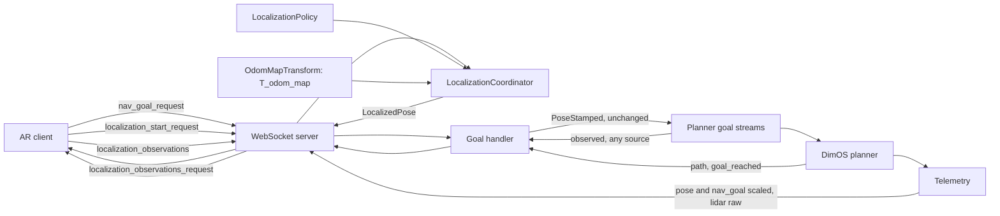

<!-- Tracked copy of the working plan. Mirrored from the Cursor plan file;
     edit there and regenerate, or edit here and copy back. -->

# Build dimos-ar-v2 as a learning-first Go2 ARModule

This is a learning project. The measure of success is that you understand every
line and why it exists, not that a demo ships quickly. The architecture below is
settled; the pace and the explanation are the point.

## How we work

`dimos-ar-v2/` is new and built subsystem by subsystem. `dimos-ar/` is frozen on
disk as reference — never edited, never installed, not in CI — and deleted once
v2 replaces it. Both publish `dimos.ar*`, so only one can be installed at a
time; v2 keeps the `dimos/ar/` module path so nothing has to be renamed later.

v2 **package layout and file names** describe what each subsystem actually is
(DimOS-shaped where upstream has precedent, e.g. `websocket/` like
`dimos/web/websocket_vis/`). Frozen `dimos-ar/` is reference for behaviour and
edge cases, not a directory map to mirror.

For each file: I explain what it does, why it needs to exist, which DimOS API it
touches with a concrete path, and what alternatives I rejected. Then I pause for
your questions. Then I write it. Then I walk through the finished code, naming
the Python language features used. Explanations live in chat.

Comments in `dimos-ar-v2/` match DimOS density — the templates are
`dimos/mapping/relocalization/module.py` (no module docstring, no class
docstring, no `In`/`Out` banners) and
`dimos/robot/unitree/go2/blueprints/smart/unitree_go2.py` (remappings and
`unitree_go2_relocalization` uncommented). DimOS also forbids section markers
(`# --- … ---`, `# === … ===`) in `dimos/codebase_checks/test_no_sections.py`:
if a file needs sections, it should be split. A comment stays only when the
code looks wrong or the constraint is invisible — surprising WHY, TODOs,
end-of-line notes on config examples. Not: essays, restating the next line,
or "first milestone" handler docstrings.

When a real design fork shows up mid-implementation, I stop and ask rather than
picking — in plain language, with enough context to decide.

## Names

Same shape as DimOS (`RelocalizationModule` / `dimos.mapping.relocalization` /
`unitree_go2_relocalization`):

- **Class:** `ARModule` in `dimos/ar/module.py` — DimOS `In`/`Out` surface.
  The WebSocket accept loop lives in `websocket/server.py`.
- **Import:** `dimos.ar`.
- **Blueprint:** `unitree_go2_ar` (`dimos run unitree-go2-ar`).
- **Wire peer:** `server` (WebSocket role). Clock stamps are `time_sync.ts_client` /
  `time_sync.ts_server`; connection count is `state.server`.
- Lens `ARBridge/` stays until the Lens adaptation phase.

## The core idea

Every piece of complexity in today's v1 package traces back to one thing: v1 tries to *solve* the alignment between the headset and the robot, continuously, from a stream of noisy tag sightings. That is why `world_frame/` (2,352 lines), `tag_tracking/` (1,132) and `registration/` (1,154) exist, and why navigation needs a watchdog that re-dispatches goals whenever the estimate shifts.

The rebuild replaces all of that with a single seam of exactly one method:

```python
localize(observations: Sequence[Observation]) -> LocalizedPose | None
```

Answers come back labelled with the frame they are expressed in, because that genuinely differs by provider: fiducial marker resolves directly into `odom`, a VPS resolves into its scanned `map`. ARModule converts to `odom` before anything reaches a client, so **the wire frame is always `odom`** and `map` never escapes ARModule.

The contract to the client is: *here is where you are in the robot's frame*.
ARModule owns when a fix happens. It sends `localization_observations_request`
on hello and after enough robot travel at a successful nav-goal arrival. A
`localization_result` is sent only after that capture episode succeeds. The
client applies the newest result it has received. ARModule does not send
unsolicited results when `T_odom_map` refreshes.

### Frame names

DimOS upstream is inconsistent; ARModule uses one vocabulary everywhere we control:

| Frame | Meaning |
|-------|---------|
| **`odom`** | Robot reference pose (drifting on mobile stacks; may be stable on a fixed base) |
| **`map`** | Scanned / premapped room frame (VPS, relocalization premap) |
| **`client`** | Observer tracking frame (headset, phone, …) |

Transforms read `T_odom_client` and `T_odom_map`. Wire messages and internal
`LocalizedPose.frame_id` use `odom` or `map`; `map` never escapes to clients on
the wire — ARModule composes map answers into `odom` first.

**DimOS boundary.** Go2 odometry and LiDAR are stamped `world`
(`dimos/robot/unitree/type/odometry.py:101`, `lidar.py:81`). Relocalization
publishes `world → map` (`dimos/mapping/relocalization/module.py:151-156`).
ARModule renames that drifting frame to `odom` on ingest
(`pose_buffer`, relocalization transform poll); do not carry both names
inside dimos-ar.

`PROTOCOL.md` describes `odom` as the selected stack's robot reference pose.
A mobile stack may drift; a fixed-base stack may publish a stable pose. Every
compatible stack still publishes `odom`. Fiducial marker and robot-side VPS
need that pose at shutter time; robot-side VPS also needs
`T_base_camera_optical`. Unused LiDAR and navigation ports stay declared and
are capability-gated.

### ARModule does not remap axes

There is no axis remap anywhere in ARModule. Coordinates stay in DimOS's convention and each client converts on receipt.

DimOS follows ROS conventions: right-handed, Z-up, X-forward. Frame names are plain strings carried on the message — `frame_id` on `PoseStamped` at `dimos/msgs/geometry_msgs/PoseStamped.py:49`.

Each client converts to its own convention on receipt. Spectacles is left-handed Y-up, Quest is right-handed Y-up, a browser viewer might be Z-up. Baking one client's convention into the wire privileges that client and forces every other one to undo it first. ARModule has no business knowing what a Lens scene graph looks like.

What this buys:

- `websocket/protocol.py` contains no coordinate math at all — it is field copying and JSON.
- LiDAR points are forwarded straight through, untouched.
- There is nothing to get subtly wrong in a shared axis-conversion helper, and no shared helper to test.

The cost is that the conversion is now written once per client platform instead of once on ARModule. Mitigate it by shipping a reference implementation in the Lens client and stating the exact convention precisely in `PROTOCOL.md`.

The rule that decides every case of this kind: **a property of the client platform belongs to the client; a property of the robot belongs to ARModule; anything requiring knowledge only ARModule has belongs to ARModule.**

- Axis handedness is the first, so the client owns it.
- Odometry scale is the second, so ARModule owns it. Every client talking to this Go2 needs the same 1.25 and none of them should have to know that. See the scale section below.
- Frame composition is the third, so ARModule owns it. When a VPS answers in `map`, turning that into `odom` needs `T_odom_map`, which is a live measured transform the client has no way to obtain.

### Localization lands in its final form

There is no stub provider. Group 6 implements the complete localization subsystem:
the shared provider contract, fiducial marker, VPS, the Multiset adapter, capture-time pose
pairing, transforms, `OdomMapTransform`, policy, coordinator, ARModule integration and tests. The
group is complete only when ARModule can request observations, run the configured
providers, and emit `localization_result`.

### The seam takes observations, not a client

Nothing in the call is client-specific. It answers one question: *given these camera observations, where is the observer?* Glasses, a phone, a tablet or the robot itself all use it identically, and the answer does not depend on who asked or on anything that happened before. It is stateless and idempotent.

```python
@dataclass(frozen=True)
class Intrinsics:
    fx: float
    fy: float
    cx: float
    cy: float
    width: int
    height: int
    distortion_model: str        # "none", "plumb_bob" or "equidistant"
    distortion: tuple[float, ...]

@dataclass(frozen=True)
class Observation:
    jpeg: bytes
    intrinsics: Intrinsics
    camera_pose: Pose            # camera_optical, in the observer's tracking frame
    ts_server: float             # converted from wire ts_capture at WebSocket boundary

@dataclass(frozen=True)
class LocalizedPose:
    pose: Pose                   # observer's tracking origin
    frame_id: str                # "odom" or "map" — which origin pose is measured from
    confidence: float
```

Five properties of that signature carry weight:

**It takes a sequence.** A provider can fuse several viewpoints instead of solving from one frame. A caller with a single frame passes a list of one. This is where the multi-viewpoint quality the v1 aligner got from the user walking around the robot comes back, without reintroducing a session — the caller batches, the provider stays stateless.

**It is not named after the client.** `localize_client` and `T_odom_client` both implied the caller must be the AR headset. `localize` returning a `LocalizedPose` says what it actually does, and the name survives the robot becoming a caller.

**The answer is labelled with its frame.** Providers do not share a native reference: fiducial marker resolves into `odom` because the marker is bolted to the robot, a VPS resolves into the scanned `map`. Pretending otherwise would mean one of them lying about what it computed.

**The observer's tracking frame must be right-handed, gravity-aligned Z-up and metric — DimOS convention.** This is the one demand the seam makes of a caller, and it is not stylistic. The answer is a rotation plus a translation, and no rotation can relate a left-handed frame to a right-handed one; that needs a mirror, which is not a rigid transform and would quietly corrupt every composition downstream. Spectacles is left-handed Y-up, so the Lens client converts its camera poses on the way in and converts `LocalizedPose.pose` back on the way out — the same fixed conversion it already owes for `pose`, `nav_goal` and `lidar`, applied in both directions instead of one. This requirement applies to the tracking coordinate system, not the physical camera pose inside it: the camera may have arbitrary roll and pitch.

`camera_pose` is the pose of the **camera optical frame** — X right, Y down, Z along the view direction — which is what PnP natively produces and what DimOS calls `camera_optical` (`dimos/robot/unitree/go2/connection.py:115-120`). v1 instead carried the Lens camera convention on the wire and corrected for it inside the tracker with a `FLIP_YZ` constant (`tag_tracking/solve.py:62`). That constant does not come across: ARModule whose geometry names one client's camera convention has already lost the platform independence the rest of the design is built on.

**Intrinsics carry distortion, and ARModule removes it when a provider needs it gone.** The Go2's own front camera is a fisheye — `distortion_model: equidistant`, four coefficients, 1280×720 (`dimos/robot/unitree/go2/front_camera_720.yaml:1-25`) — and a VPS accepts a pinhole intrinsic only, so undistortion has to happen somewhere. ARModule must own that code for the robot's own frames regardless, so clients get it for free rather than each reimplementing it per platform. The fiducial marker path needs no help: DimOS's `estimate_marker_pose` already undistorts fisheye corners into the pinhole `K` before solving (`dimos/perception/fiducial/marker_pose.py:86-90`).

### Two callers, one seam

The seam has exactly two callers, and only one of them is on the network.

**The WebSocket path**, on behalf of a connected client. ARModule sends
`localization_observations_request`. The client replies with a binary
`localization_observations` batch. The coordinator builds `Observation`s and
sends `localization_result` in `odom` on success.

**The robot VPS anchor**, in-process, when `T_odom_map` comes from a Go2 camera
query. The Go2 already publishes `color_image` at roughly 14 Hz and `camera_info`
as ordinary DimOS streams, with `frame_id` `camera_optical`, so the robot never
speaks the wire protocol to localize itself. `RobotObservationBuffer` keeps
recent stationary frames. The coordinator asks the same `localize` and pairs the
`map` answer with the robot's `odom` pose at capture time to produce `T_odom_map`.

That is why `T_odom_map` is a module-owned value rather than a protocol concept,
and why no new wire message is needed for robot-side localization.

#### Capture-time pose pairing is mandatory, not an optimisation

A localization answer describes where the observer was **when the shutter opened**, not when the answer arrived. A cloud round trip is on the order of two seconds, during which the robot can have walked a metre. The wire carries `ts_capture` in `ts_client`; `websocket/protocol.py` converts to `ts_server` before building domain `Observation`s. `localization/pose_buffer.py` keeps a short ring buffer of recent robot poses keyed on `ts_server`, and composition interpolates the pose at that time. Without this the anchor is wrong by however far the robot moved during the query.

There is a DimOS limitation here that ARModule cannot fix and must design around:

```136:141:/Users/johannestscharn/Repositories/dimos/.venv/lib/python3.12/site-packages/dimos/robot/unitree/go2/blueprints/basic/unitree_go2_basic.py
    # we temporarily disabled sensor timestamps
    # and are derriving all timestmaps upon reception
    # this is because image webrtc stream doesn't have timestamps,
    # so it's difficult to corelate the streams otherwise
    #
    #    .configurators(ClockSyncConfigurator())
```

Robot camera frames therefore carry server *reception* timestamps with an unknown capture latency, while odometry carries the Go2's own header stamp (`dimos/robot/unitree/type/odometry.py:100`). Two clock domains, neither of them camera capture time. At 0.5 m/s, 100 ms of unaccounted latency is 5 cm of anchor error. Worth being precise about what the commented-out line does and does not do: `ClockSyncConfigurator` is a startup check that the *host's* clock sits within 200 ms of NTP (`dimos/protocol/service/system_configurator/clock_sync.py:28-38`). It never rewrote a timestamp. Disabling it means nothing verifies that server time and robot time agree.

This makes the stationary requirement below load-bearing for correctness rather than merely helpful: if the robot is not moving, capture time and arrival time yield the same pose and the latency stops mattering. In-motion robot-side fixes stay off the table until upstream timestamping is fixed — a candidate second PR alongside `PR.md`.

#### Three clocks, one mapping

Pairing an observation with a robot pose means putting a client's exposure time
into the same number line as the pose buffer. Three clocks are involved:

| Clock | Meaning | Where stored in ARModule v2 |
|-------|---------|----------------------------|
| **`ts_client`** | Client local time (hello send, camera shutter) | Hello pair stored per connection as `TimeSync.ts_client` (offset anchor). Later `ts_capture` values are converted and not stored. |
| **`ts_server`** | ARModule host `time.time()` | Pose buffer lookup key; `TimeSync.ts_server` from hello; converted capture time for pose lookup; wire `ts` on `localization_result`. |
| **`ts_odom`** | DimOS `PoseStamped.ts` from Go2 DDS | Metadata on each buffer sample (`PoseSample.ts_odom`); wire `ts` on outbound `pose` / `nav_goal`. LiDAR wire `ts` is DimOS `PointCloud2.ts`. |

**Client → server, measured once at hello.** Client sends `hello_request` with
`ts_client`; ARModule records `ts_server` on receipt and stores a `TimeSync`
per connection. Inbound `ts_capture` stays in `ts_client`; ARModule converts
before pose lookup: `time_sync.to_server_ts(ts_capture)`.

**Pose lookup on server.** Pose buffer keyed on `ts_server` (odom receive time).
`buffer.at_server_ts(observation.ts_server)` — `ts_odom` retained as metadata only.
There is no separate provider time gate: if no odom sample lies within
`PoseBuffer.max_gap_s` (0.25 s) of `ts_server`, the observation is dropped.

WebSocket RFC ping/pong is liveness only. DimOS `ClockSyncConfigurator` checks
host vs NTP at startup; it does not sync client or odom clocks.

#### Localization policy — settled

`localization/policy.py` owns which configured source runs and when.
Config list order cannot change provider order. The order is private to ARModule:

- marker only → fiducial marker
- VPS only → VPS
- both → marker, then VPS if marker fails

Triggers:

- Completed `hello`: send `localization_observations_request` when any provider is configured.
- Successful `goal_reached`: request again when that client's last success is at least `1.0 m` of corrected horizontal travel ago.
- `localization_start_request`: protocol completeness only; the shipped client does not use it. Same capture path as a server prompt.

One pending episode per connection. Geometric gates stay on the client. ARModule
sends a `CapturePolicy` and an exact `observation_count`; it does not send
provider names.

Private mapping (not on the wire):

- marker only → `robot_los_required`, `observation_count=3`
- VPS only → `any_angle`, `observation_count=1`
- marker then VPS → `robot_los_preferred`, `observation_count=3`, `wait_timeout_s=2.0`

Marker receives the full submitted batch. Mixed-mode marker failure falls through
to VPS on the newest observation. The client still sends `observation_count`
frames even after a `robot_los_preferred` timeout.

**Client VPS cooldown is global** (one latch for the process): `30 s` from the
start of a client VPS attempt, including failures. VPS-only waits before sending
`localization_observations_request`. Mixed tries marker immediately; if marker
fails during cooldown, keep the batch on the pending episode and run VPS when
the latch expires.

**Robot VPS cooldown is separate**, also `30 s` from the start of a Go2 VPS
query. Reuse cached `T_odom_map` while corrected travel since that robot
observation is `<= 1.0 m`. Query the robot VPS path only when the anchor is
missing or stale **and** the robot cooldown is clear. Otherwise fail the VPS
step explicitly. Hello-time VPS with no valid robot observation fails that
episode; the next qualifying trigger retries.

Do not send unsolicited `localization_result` when `T_odom_map` refreshes. There
is no `state.alignment` block. `localization_observations_request` is the only
prompt to capture.

### Client localization and `T_odom_map` are independent

Two concerns must remain separate:

- **Client localization** — how a *client* learns where it is. Fiducial marker by looking at the robot, or VPS by looking at the room.
- **OdomMapTransform** — how *ARModule* learns `T_odom_map`. A VPS robot query, or optional DimOS relocalization from a LiDAR premap, or nothing at all.

Fiducial marker, VPS, or both are valid client-localization configurations. DimOS
relocalization is an optional `OdomMapTransform` input and is never a requirement for
either provider. `OdomMapTransform` stores a VPS sample and a relocalization sample
independently. Client VPS composition reads only the VPS sample: the LiDAR premap
and the VPS `map` are not interchangeable. Relocalization is storage-only in this
phase.

ARModule polls `self.tf.get("world", "map")` from `handle_odom`, rebuilds that
`Transform` with parent `odom`, and stores it via
`OdomMapTransform.update_from_relocalization`. `unitree_go2_ar` does not
include `RelocalizationModule`, so the lookup is a no-op until that module is
autoconnected and started with `relocalizationmodule.map_file`.

Providers answer in their native frame: fiducial marker in `odom`, VPS in its scanned
`map`. ARModule always emits `odom` on the wire. Odometry scale correction is
applied at encode of `localization_result`, same as `pose` / `nav_goal`.

### The client-alignment providers

The localizer layer is vendor-neutral, not vendor-anonymous. `VpsLocalizer` and
its `VpsClient` protocol live together in `localization/vps/localizer.py`.
`MultisetVpsClient` is the concrete adapter that owns Multiset M2M
authentication, HTTP request and response shapes, handedness and hint
conversion. The localizer depends only on the protocol, so another VPS adapter
does not change localizer or ARModule code.

When fiducial marker and VPS are both configured, policy tries marker first. One
provider returning `None` dispatches the other only on that mixed path.

#### Fiducial marker — stateless, local, answers in `odom`

Per observation:

1. Decode the JPEG to greyscale and detect configured fiducial markers (Go2 ships AprilTag 36h11), giving four pixel corners per marker. Keep only the marker IDs the robot profile declares.
2. `estimate_marker_pose` solves the 56 mm black square against the observation's intrinsics and returns `T_camopt_marker`. `IPPE_SQUARE` is the right solver here because the target is a known planar square, and the helper undistorts fisheye corners into the pinhole `K` first, so a distorted client camera costs nothing extra.
3. `T_odom_marker = T_odom_base(ts_server) ∘ T_base_marker`, with the robot pose interpolated out of the pose buffer at `observation.ts_server` and the mount offset read from the robot profile.
4. `T_odom_client = T_odom_marker ∘ (T_client_camopt ∘ T_camopt_marker)⁻¹` — the marker seen from the client, walked backwards through the client's own camera pose, gives where the client's origin sits in `odom`.
5. Gate: reprojection RMS only (3.0 px, from v1 `module.py:133`). Time pairing uses `PoseBuffer.max_gap_s` (0.25 s): if no odom sample lies near `observation.ts_server`, the observation is rejected — there is no separate provider time knob. Distance is not gated server-side; marker size is declared in the robot profile and PnP/reprojection quality is the check.

Every request, including a request with one observation, passes its final client-alignment candidates through `fuse_pose_estimates`. Each candidate is already `T_odom_client`, not a physical camera pose. `normalize_client_alignment` rejects tilt above 5°, removes small residual roll and pitch, and preserves translation and yaw. The survivors are filtered against the componentwise median translation and circular median yaw, then fused. This projects PnP noise onto the contract between two gravity-aligned Z-up tracking frames without hiding a badly tilted solve. Confidence is one minus the worst normalized accepted-candidate signal: mean reprojection error, maximum position residual, or maximum yaw residual. Rejected outliers never contribute.

**Reuse DimOS, do not vendor.** `dimos/perception/fiducial/marker_pose.py` supplies `create_aruco_detector`, `camera_info_to_cv_matrices`, `estimate_marker_pose` and `marker_reprojection_error` — the entire per-frame stack. v1 vendored its own copy for one reason: it called `solvePnPGeneric`, which returns both solutions of the planar-square ambiguity, and used the ratio between them as a quality gate (`tag_tracking/fiducial_helpers.py:65-71`, `:112-120`). The DimOS version returns only the best solution, so that gate is unavailable. The reprojection gate plus the cross-observation median is the replacement: a wrongly flipped solve lands far from the cluster and gets dropped as an outlier. Adding the ambiguity ratio to DimOS is a small, well-motivated upstream proposal for `PR.md` rather than grounds for a local fork.

Go2 numbers, all carried over unchanged and all verified in v1: family 36h11, marker ID 0, printed at 70 mm with a 56 mm black square, mounted at `(0.18, 0.0, 0.06)` in `base_link` with yaw −90° and pitch −15° (`robot_profile/go2.py:35-53`). `FiducialMarkerMount` is robot-domain geometry in `robot/profiles/profile.py`; `robot/profiles/unitree_go2.py` supplies the Go2 values and dictionary to the generic provider. PnP is fed the 56 mm black square, never the 70 mm sheet; that distinction is load-bearing and `0.070 / 0.056` being exactly 1.25 is the coincidence noted in the scale section.

Fiducial marker never pushes updates by itself. A later `T_odom_map` refresh does
not send an unsolicited `localization_result`; the next capture episode recaptures.

#### VPS — cloud, answers in `map`, and ARModule composes

`VpsClient` is a `typing.Protocol` in `vps/localizer.py` with one method: given
a JPEG and a pinhole intrinsic, return a camera pose in the map with a
confidence, or nothing. `VpsLocalizer` implements `Localizer` on top and
knows nothing about HTTP. `MultisetVpsClient` implements the protocol against
Multiset's REST API. The protocol's `map` frame is canonical right-handed Z-up.
Each concrete VPS adapter converts its vendor's native axes to that convention
before returning a pose to `VpsLocalizer`.

Per observation, `VpsLocalizer`:

1. Undistorts the frame to pinhole if `distortion_model` is not `"none"`, and downscales if the longest side exceeds the API's limit, scaling `fx`, `fy`, `cx`, `cy` by the same factor.
2. Asks the client for `P_map_camopt`.
3. Computes `T_map_client = P_map_camopt ∘ T_client_camopt⁻¹` — the query answers *where the camera was*, and turning that into where the observer's origin is stays our arithmetic either way.

Across observations it takes the same median-and-reject as fiducial marker, then returns a single `LocalizedPose` with `frame_id="map"`. ARModule composes with `T_odom_map` before anything reaches the wire.

**One image per request, several requests, our own fusion.** The APIs in this class typically offer both a single-image query and a multi-image query that fuses four to six frames server-side. Single-image is the one to build: it works when a client sends a single frame, it keeps outlier rejection on our side of the boundary where it is testable without a network, and it is one code path shared with the fusion the fiducial marker provider already needs. Multi-image would be more accurate per round trip and is worth revisiting once there is a measurement, but it refuses fewer than four frames, which would make the seam's "a caller with a single frame passes a list of one" property a lie.

**What the Multiset adapter has to get right**, and none of it belongs above the `VpsClient` line:

- *Token lifecycle.* These APIs typically issue a short-lived bearer token from an HTTP Basic exchange — half an hour is a common expiry. The adapter caches it and refreshes ahead of expiry, and retries once on a 401 in case the clock drifted.
- *Axes and handedness.* Providers in this space commonly expose several coordinate conventions. `MultisetVpsClient` requests a right-handed result and converts its native up axis to dimos-ar's canonical Z-up `map` before returning it. A left-handed result would require a mirror, not a rigid transform, and would corrupt every composition downstream. The conversion belongs in this concrete adapter so `VpsLocalizer`, fusion, and `OdomMapTransform` see one map convention.
- *Hint conventions can differ from result conventions.* At least one API documents its spatial search hint as left-handed even on right-handed queries. Hints are a real win for the robot loop — once `T_odom_map` is known ARModule knows roughly where the robot is standing, which cuts both latency and false matches in repetitive spaces — so the adapter sends them, converts them to whatever the hint field wants, and a unit test pins the conversion.
- *Accuracy versus latency modes.* Multiset exposes standard and deep-search
  engines with different latency and recall. Which mode each request uses
  belongs to `policy.py`; the adapter only sends the selected mode.

Config: base URL, auth path, query path, map code, request timeout and confidence
floor. Credentials come from the environment. Swapping adapters does not change
`VpsLocalizer` or ARModule.

Two properties of the Go2 make it a workable VPS observer, both already true without new hardware. Its front camera is 1280×720, which sits exactly at the image ceiling these APIs impose, so no downscale is needed for the robot's own frames. And DimOS already ships the extrinsic chain `base_link → camera_link → camera_optical` for it (`dimos/robot/unitree/go2/connection.py:110-120`), so turning a camera pose in `map` into a base pose in `map` needs no new calibration.

What VPS buys over fiducial marker: aligning **without the robot in view**, and no LiDAR premap recording step — you scan with a phone. What it costs: a cloud dependency, credentials, and a round trip. Credentials stay on ARModule either way.

Because each request is independent and idempotent, there is no session, no commit, and no module-side refinement loop. That is what removes `RegistrationSession` (1,044 lines), `RobotAprilTagTracker` (582), the windowed similarity solve (367), `SimilarityAligner` (1,066) and `WorldFrameRefiner` (471): all of it exists today only because ARModule was solving for a persistent transform including scale and then defending it against drift.

### Multiple clients

The design supports several clients at once, with one honest limit.

**Viewing is genuinely multi-client.** Telemetry is a broadcast — identical
bytes to every connection. Localization is connection-specific: ARModule
prompts each client, each client submits its own observations, and
`localization_result` goes to that connection only.

**Control is last-command-wins, and ARModule does not arbitrate.** DimOS has exactly one active goal: `GlobalPlanner.handle_goal_request` overwrites `_current_goal` under a lock. Two clients sending goals will fight, and the newest wins. An `estop_request` from any client stops the robot, and estop-on-disconnect fires on the *last* disconnect, not the first.

`hello` assigns each connection a `client_id` for logging and targeted send.
ARModule does not record who is driving: `state.nav` tracks planner navigation regardless of source, and overlay uses `nav_goal` plus `pose`.

## Drift, and what DimOS already does about it

DimOS ships an optional way to measure odometry drift. `RelocalizationModule`
loads a premap point cloud tagged `map`, registers the live accumulated cloud
against it every couple of seconds behind a fitness gate, and publishes the
result as a TF:

```147:156:/Users/johannestscharn/Repositories/dimos/.venv/lib/python3.12/site-packages/dimos/mapping/relocalization/module.py
        # relocalize(scan, map) returns T such that scan_in_map_frame = T(scan_raw).
        # We are publishing a TF for map_in_scan_frame, notice that the base frame is `world`
        # so inverse the transform T here to get map_in_scan_frame
        T_inv = np.linalg.inv(T)
        new_tf = Transform(
            translation=Vector3(*T_inv[:3, 3]),
            rotation=Quaternion.from_rotation_matrix(T_inv[:3, :3]),
            frame_id=FRAME_WORLD,
            child_frame_id=FRAME_MAP,
        )
```

That transform has the same role as the `T_odom_map` estimated by a VPS robot
loop, but it belongs to the DimOS LiDAR premap rather than the VPS `map`;
the two map coordinates are not interchangeable. DimOS relocalization is
an optional `OdomMapTransform` input, not a dependency of ARModule or either client
provider. Multiset stays in `MultisetVpsClient`.

Three qualifications, the first of which is easy to get backwards:

**It does not stop `odom` drifting or republish corrected odometry.** The
robot's `pose` remains in drifting `odom`; the map's apparent position in
`odom` moves to expose the measured error. ARModule receives no benefit
automatically. It must explicitly consume the TF and use it when updating
client localization if the robot marker is to stay aligned longer between
client observations.

**It is rigid-only, no scale.** `relocalize()` passes
`TransformationEstimationPointToPoint(False)` at
`dimos/mapping/relocalization/relocalize.py:107` and refines with point-to-plane
ICP. It estimates translation and rotation; it cannot estimate or replace the
fixed odometry scale correction.

**It is not free.** Multi-scale FPFH RANSAC at a 500k iteration budget across 17 runs, taking three to eight seconds per attempt in DimOS's own sample logs, and it needs 50,000 live points before it will try. Plus a per-space workflow: record a run, `dimos export-premap`, launch with the relocalization blueprint.

It also cannot replace a client-localization provider: it registers LiDAR point
clouds and says nothing about the headset's tracking frame. Fiducial marker or VPS is
still required to relate the client to the robot.

## Odometry scale — settled

**The factor is robot-side and ARModule owns it.** Confirmed with DimOS engineering: the Go2 under-reports travelled distance because of leg movement, and `1.25` is a good multiplier that significantly improves the result. It is a fixed per-robot constant, not a learned value.

That is consistent with what the code says about the source. The stream ARModule consumes is `GO2Connection.odom`, DDS topic `rt/utlidar/robot_odom` (`dimos/robot/unitree/go2/dds/store.py:41`), which DimOS itself calls leg odometry (`go2/dds/cli/render.py:233`, and the LiDAR view logs under `world/leg_odom/lidar` at line 206). Foot slip during stance makes kinematic odometry under-report, and under-reporting is one-directional — matching v1's prior of `ODOM_SCALE_INITIAL = 1.25` (`dimos-ar/dimos/ar/world_frame/state.py:26`) sitting on a hard floor of exactly 1.0.

### What is scaled and what is not

v1 has this working — the robot arrives where it was sent with minimal drift — so v1's rules are the reference, and all of its scaling happens at a single seam in `world_frame/state.py`, applied in odom coordinates *before* `T_world_odom`.

**Horizontal position — scaled. Height — not.** v1 scales X and Y and passes Z through verbatim:

```290:293:/Users/johannestscharn/Repositories/spectacles-dimensional-os/dimos-ar/dimos/ar/world_frame/state.py
        scaled_x, scaled_y = self.scale_odom_point(position[0], position[1])
        scaled_position = (scaled_x, scaled_y, position[2])
        T_odom = pose_to_matrix(scaled_position, orientation)
        T_world = self._get_T() @ T_odom
```

The batch path does the same, touching only indices 0 and 1 despite being named `scale_odom_xyz_batch` (`state.py:175-179`). This is correct: leg slip costs horizontal travel, not altitude. Because the factor is applied pre-transform, "X and Y" means the ground plane of DimOS's Z-up frame.

**Orientation — untouched.** Heading is also inaccurate, but the error is not a linear factor, so there is nothing to scale and no estimate worth making. v1 agrees: `transform_pose` builds the matrix from the raw quaternion and scales position only. Heading is left to `T_odom_map` updates.

**Free vectors — untouched.** v1 excludes velocity and heading directions explicitly and writes down why at `state.py:309-313`: scaling a direction is meaningless. Linear speed is a distance rate and so arguably wants the factor, but v1 leaves it unscaled, it is display-only, and v2 follows — stated in `PROTOCOL.md` so nobody has to guess.

**Path and `nav_goal` — scaled out, inverse-scaled in.** Path scales per waypoint through the same seam (`network/data_plane.py:138`) and goals return through `inverse_transform_point` (`state.py:320-328`), reached from `navigation/world_transform.py:22-27`. This forward-and-inverse pair is precisely what the observed arrival accuracy validates. It is also what the planner requires, since it works in the same numeric space as the odometry pose: it takes the robot's start pose from `odom: In[PoseStamped]`, still marked `# TODO: Use TF.`, and subscribes it straight into `handle_odom` (`dimos/navigation/replanning_a_star/module.py:45` and `:80`), then emits `path` in those coordinates.

**LiDAR — untouched, and this is a deliberate departure from v1.** v1 routes the cloud through the same seam, so pose, path and cloud all share one scaled space:

```59:60:/Users/johannestscharn/Repositories/spectacles-dimensional-os/dimos-ar/dimos/ar/network/data_plane.py
        if len(filtered) != 0:
            world_pts = world_frame.transform_points(filtered)
```

v2 does not, because the points are metric range measurements rather than dead-reckoned positions. DimOS stamps the Go2 cloud `frame_id="odom"` at `dimos/robot/unitree/type/lidar.py:81`, and the smart blueprint says registering it at the odom pose makes no sense:

```69:74:/Users/johannestscharn/Repositories/dimos/.venv/lib/python3.12/site-packages/dimos/robot/unitree/go2/blueprints/smart/unitree_go2.py
    @pose_setter_for("lidar")
    async def _lidar_pose(self, msg: PointCloud2) -> Pose | None:
        # Yes, it doesn't make sense to register lidar at the odom pose because the
        # go2 lidar is in the world frame, but map.py (for now) needs this.
        # TODO: fix map.py to use a transform frame
        return getattr(self, "_last_odom_pose", None)
```

Scaling a cloud about the odometry origin inflates within-scan separations too, so a 4 m wall would read as 5 m. Room geometry is already metric and the factor would break it.

**Two spaces, and one trap that follows — pending the measurement below.** If
the cloud is metric while pose and path are scaled, ARModule has two horizontal
spaces where v1 had one. The visible cost is that the robot and its path drift
off the cloud with distance from the odometry origin. Whether and when a room
anchor reduces that visible error is part of the deferred localization-policy
and `odom → map` design.

The trap, in that case, is that any code comparing cloud points against the robot position must use the **unscaled** robot position, not the one on the wire. v1's obstacle band and near-robot subsample both do exactly that comparison and both take the scaled position, which was correct there and would be a silent 25% error here:

```61:72:/Users/johannestscharn/Repositories/spectacles-dimensional-os/dimos-ar/dimos/ar/network/data_plane.py
            if mode == "obstacles" and obstacle_distance_config is not None:
                world_pts = filter_obstacle_points(
                    world_pts,
                    obstacle_distance_config,
                    robot_position=robot_world_pos,
                    vertical_axis=1,
                    min_height_m=lidar_filter.config.min_height_m,
                    max_height_m=lidar_filter.config.max_height_m,
                )
            world_pts = subsample_points_near_robot(
                world_pts, robot_world_pos, target_points=target_points
            )
```

So `sensors/lidar_filter.py` takes the raw odometry position and never the published one. Range is a horizontal radius around that robot pose, not around the odometry origin; a test keeps a point next to the robot at 10 m from origin and drops a point at the origin.

**Footnote — verify one space or two on hardware.** The LiDAR rule above assumes the Go2 cloud is metric range in an `odom` that is *not* the under-reporting odom. The code does not settle that. DimOS stamps the cloud `frame_id="world"` (`robot/unitree/type/lidar.py:81`), `Map` accumulates it with no pose applied (`robot/unitree/type/map.py:88`), and the same `utlidar` namespace also publishes `rt/utlidar/robot_odom` — the stream DimOS itself loads as the "leg-odom trajectory" under `world/leg_odom/lidar` (`go2/dds/cli/render.py:206`, `:233-234`). If the on-board cloud is registered with that same estimate, the accumulated cloud is compressed by the same factor, is not metric, and v1 was right to route it through the same seam.

Measure it: walk a tape-measured 10 m, then compare the odom delta against the separation of two identifiable features in the accumulated cloud.

- **Cloud ~10 m, odom ~8 m — two spaces, keep the current LiDAR rule.** Pose and path stay scaled; the cloud stays unscaled. Filtering keeps using the raw robot position. Relocalization's `T_odom_map` is then also in the unscaled space (it registers that cloud against the premap, `mapping/relocalization/module.py:150-156`), so the composition `T_odom_map ∘ P_map` needs an explicit rule that the LiDAR paragraph currently omits: leave the TF raw and anchored content disagrees with the robot marker by up to 25% of the distance from the odom origin; scale the TF translation and the same silent 25% error the filter trap warns about appears in every composed client pose. Pick one and pin it with a test.
- **Cloud ~8 m as well — one space, revert the LiDAR departure.** Scale the cloud about the odometry origin the way v1 does (`network/data_plane.py:59-60`). Filtering goes back to the published (scaled) robot position. `T_odom_map` is in that same compressed space, so scale its translation through the same function as pose. The two-space trap, the unscaled-position filter contract, and the "robot drifts off the cloud" overlay cost all go away.

The 1.25 on pose and `nav_goal` does not wait on this measurement. An odom_map transform is a rigid transform and cannot cancel a scale error; the planner still walks in odom metres.

### Mechanics

One constant on `robot/profiles/unitree_go2.py`. `robot/odometry_correction.py` takes the factor as a plain float so `robot/state_publisher.py` and `navigation/coordinator.py` do not import the profile and group ordering stays free. It returns a corrected copy rather than mutating, so the raw value stays available for the LiDAR path. Applied at encode for `pose` and `nav_goal` positions, inverted at decode for `nav_goal_request`, and applied to nothing else.

Applied about the odometry origin, with no anchor point — v1 needs `odom_anchor_xy` (`world_frame/state.py:155-166`) only so that *changing* a live estimate does not teleport already-placed content, and that need disappears once the factor is fixed. Because the factor is constant, scaling accumulated position is identical to scaling each increment, so robot-state outbound stays byte-identical for every client and the broadcast property survives.

Nothing about scale appears on the wire: no factor, no confidence, no lock. The client receives corrected coordinates and never learns that a correction happened.

### What is deliberately not built

**No online estimator.** The true factor moves with gait, so it has no converged value and fitting a constant to it as a *live estimate* is misspecified — which is exactly what generated v1's jump-fraction damping, regime-agreement counter, lock confidence, plausible band and hard rails. A fixed calibration constant is the honest form of the same knowledge and needs none of that machinery. This is why `SimilarityAligner`'s scale path and the `scale_confidence` / `scale_locked` / `scale_observable` wire fields do not come across.

**No speed-dependent factor.** `sportmodestate.velocity` is available (read by DimOS at `go2/dds/cli/render.py:81`), but making the factor a function of it assumes speed is the explanatory variable. Revisit only with a measurement showing the correlation.

**Tag size was not the cause.** `0.070 / 0.056 = 1.25` exactly is a real coincidence in the codebase, and it is worth recording that inspection cleared it so nobody re-opens it: PnP is fed `mount.size_m = 0.056`, the black detection square (`tag_tracking/tracker.py:274`), with object points built from that same value (`tag_tracking/fiducial_helpers.py:28-51`). The 0.070 total is only sent to the Lens for printing and used in the max-detection-distance estimate.

### The residual, and who clears it

A fixed 1.25 against a true 1.10–1.35 leaves a residual that grows with distance
walked. Periodic accepted localization or `T_odom_map` updates can bound its
visible effect, but a rigid update cannot remove the underlying scale error.

### The source-level fix needs hardware

Point-LIO is LiDAR-inertial and therefore metric by construction, but in DimOS it is a wrapper around a C++ binary that drives a **Livox Mid-360** directly over UDP: `lidar_ip` is required and raises without it (`dimos/hardware/sensors/lidar/pointlio/module.py:211-217`), it opens the Livox SDK's own ports (lines 44-55), `lidar_type` defaults to the Livox branch (line 109), the sensor frame is `mid360_link` (line 90), and it needs a Nix-built binary (line 77). The Go2's built-in head LiDAR arrives over DDS as `rt/utlidar/cloud` (`go2/dds/store.py:39`) and cannot feed it. That is why v1 does not use PointLIO, and why every blueprint that does is named for the hardware — `unitree_go2_mid360_record`, `assembly/mid360_realsense_30`. If a Mid-360 is ever mounted, the constant can go away.



## `dimos-ar-v2/PR.md` — the upstream change, documented not opened

No PR gets opened in this phase. `PR.md` records exactly what the upstream change needs to be, so it can be filed later without re-deriving it.

The problem it solves: `GlobalPlanner.handle_goal_request` is the single funnel for the `goal_request` stream, `target`, `clicked_point`, and the `set_goal` RPC — but nothing observable is emitted when a goal is accepted, so there is no way to see goals that arrive by RPC.

```133:139:/Users/johannestscharn/Repositories/dimos/.venv/lib/python3.12/site-packages/dimos/navigation/replanning_a_star/global_planner.py
    def handle_goal_request(self, goal: PoseStamped) -> None:
        logger.info("Got new goal", goal=str(goal))
        with self._lock:
            self._current_goal = goal
            self._goal_reached = False
        self._replan_limiter.reset()
        self._plan_path()
```

The proposed change: add `goal_accepted: Subject[PoseStamped]` to `GlobalPlanner`, emit it in `handle_goal_request`, and expose `goal_active: Out[PoseStamped]` on `ReplanningAStarPlanner`, wired in `start()` exactly like the existing `path` and `goal_reached` subjects. Roughly six lines, matching the established pattern.

`PR.md` also notes that `navigation_state: Out[String]` is declared on the planner but never published anywhere in DimOS. v1 subscribed to it; ARModule does not — `recovery` is not on the wire until DimOS actually emits it.

A second upstream change is now a candidate: re-enabling sensor timestamps, or at least exposing capture time for the WebRTC video stream, so robot-side localization is not restricted to a stationary robot. See the capture-time section above.

### What ARModule does until then

Overlay and `state.nav` come from DimOS `path` and `goal_reached`. ARModule does
not subscribe to planner input streams or record goal source. Terminal pose and
yaw are the last pose on the published path.

The precise blind spot is a caller invoking the `set_goal` RPC directly. In DimOS that means `agents/skills/navigation.py`, `navigation/patrolling/module.py`, `navigation/bbox_navigation.py`, `navigation/frontier_exploration/`, and `robot/unitree/unitree_skill_container.py` — none of which `unitree_go2_ar` composes. So the gap is real but currently unreachable in our blueprint. The RPC path still plans and publishes `path`; only observers that need the accepted goal pose on a stream would miss it. `PR.md` is the fix.

Nav status is derived from goal arrivals plus `goal_reached`, and from `path`, which the planner publishes empty on cancel or arrival:

```165:169:/Users/johannestscharn/Repositories/dimos/.venv/lib/python3.12/site-packages/dimos/navigation/replanning_a_star/global_planner.py
        self.path.on_next(Path())
        self._local_planner.stop_planning()

        if not but_will_try_again:
            self.goal_reached.on_next(Bool(arrived))
```

## What the protocol carries

Today `dimos-ar/PROTOCOL.md` is at v19: 27 message types over 1,172 lines. The rebuild carries **14**, after the audit below.

Server to client:

- `hello` — this connection's `client_id`, clock sync stamps, robot geometry, capabilities including `localization`. No protocol version field.
- `state` — one merged message replacing `runtime_snapshot`, `bridge_status` and `nav_status`. Three blocks: connection count, the live LiDAR filter settings, and `nav` (`state` + `outcome`). No alignment block.
- `pose`, `nav_goal` — DimOS `odom` coordinates with the odometry scale constant applied to horizontal position only. Axes unconverted. Wire `ts` is DimOS message time (`PoseStamped.ts` / `Path.ts`, i.e. `ts_odom`). `nav_goal` carries terminal `pose` plus `path_poses`.
- `localization_observations_request` — ARModule → one client: `capture_policy`, `observation_count`, and `wait_timeout_s` when the policy is `robot_los_preferred`. Server-to-client `*_request` is allowed when ARModule needs client action.
- `localization_result` — observer pose in `odom`, plus confidence. Wire `ts` is `ts_server` when the fix was produced. Sent only after a successful capture episode.
- binary `lidar` — raw DimOS coordinates, forwarded unmodified, no scale. Wire `ts` is DimOS `PointCloud2.ts`.

Client to server:

- `hello_request` — first frame; `ts_client` for clock sync. Server replies with `hello`.
- `localization_start_request` — JSON, no camera payload. Completeness only.
- `localization_observations` — binary camera batch; `ts_capture` in `ts_client` (server converts).
- `nav_goal_request` — goal in `odom`, inverse-scaled and then published to `goal_request`.
- `estop_request`, `lidar_settings_request`, `state_request`.

Client commands use `*_request`; server replies and telemetry use the bare noun. `hello` is the handshake reply. The exception is `localization_observations_request`: ARModule asks the client to capture.

Three things drive the reduction from 27. The whole registration vocabulary (`registration_command`, `registration_pose`, `registration_status`, `capture_policy`, `camera_frame_ack`) disappears because there is no session to drive. `world_frame_correction` disappears because ARModule no longer runs a continuous solver whose internals the client had to track. And merging the three overlapping status messages kills a recurring bug class: five changelog entries (v6, v7, v9, v16, v18) exist purely to keep `runtime_snapshot`, `bridge_status` and `nav_status` agreeing with each other.

The observed DimOS route rides in `nav_goal` rather than inside `state.nav`, so overlay and status stay separate. A reconnecting client asks `state_request` and then sees the next `nav_goal` when the planner republishes.

No message mentions `T_odom_map`, the active provider, or the scale constant. All three are internal to ARModule: the client is told when to capture and where it is after a successful episode.

`CapturePolicy` values (`robot_los_required`, `robot_los_preferred`, `any_angle`) tell the client which geometric gate to use. They are not provider names.

### Why the protocol has this shape

Each of these is a v19 habit that the rewrite deliberately does not keep.

**`ping` / `pong` clock sync folds into `hello_request` / `hello`.** WebSocket has protocol-level ping/pong in RFC 6455 and the `websockets` library runs keepalive automatically. Clock offset rides in the hello handshake instead of a separate message pair. ARModule stores one `TimeSync` per connection and converts inbound `ts_capture`; see the three-clocks section.

**Renamed inbound camera batch to `localization_observations` and the result to `localization_result`.** ARModule prompts with `localization_observations_request`. `localization_start_request` exists for completeness only.

**Cut provider and capture-guidance fields from `hello`.** The client does not need to know which solver is running. `hello.capabilities.localization` only gates whether capture is available. Capture geometry is a `CapturePolicy` on each `localization_observations_request`.

**Dropped unsolicited `localization_result`.** Results follow a completed capture episode. A `T_odom_map` refresh does not push a new client pose.
**Trimmed the `hello.robot` block.** `visual_origin_frame` and
`default_render_offset_m` are v19 leftovers, informational and all-zero
respectively. Tag geometry stays server-side in the robot profile. Keeps
`display_name`, `body_bounds_m`, `footprint_m`, `base_height_m`.

**`emergency_stop {active: bool}` → `estop_request`, no payload.** A latch only the client can clear is a footgun: a client that stops and disconnects leaves the robot immobilised with no way back except a restart. Stopping is an event, not a mode. The resume path is issuing a new `nav_goal_request`.

**`set_lidar_mode` three modes → `lidar_settings_request {enabled, min_height_m, max_height_m, max_range_m}` (all required).** `"obstacles"` was not a mode, it was a preset of the filter parameters that the other two modes also accept. One boolean plus the parameters expresses all three states without an enum whose values overlap.

**Dropped `localization.unsolicited`.** Results follow a completed capture episode; there is no flag because there is no unsolicited path.

**Kept `state` merged.** `pose` is already its own high-rate message; `state` is low-rate and small, and splitting the nav block back out recreates exactly the disagreement bug class the merge exists to kill.

**Kept `capabilities`.** Genuinely gates client UI for lidar, navigation,
localization, and estop. On Go2 estop is always available; the key stays so a
future robot can report it missing. `reason` stays as an optional human-readable
string for the case where a capability is missing.

**Coordinates keep DimOS axes — in both directions.** Every position and orientation on the wire is right-handed Z-up. Everything ARModule sends is in `odom`; the one exception is the camera poses inside `localization_observations`, which are in the caller's own tracking frame, necessarily, since the request exists to discover how that frame relates to `odom`. That frame must itself be right-handed Z-up and metric, so a left-handed client converts on the way out as well as on the way in. The seam section explains why this is a correctness requirement rather than a convention. `PROTOCOL.md` states the convention once, describes `odom` in plain language, notes that DimOS names the stream `odom` while DimOS stamps `world` on ingest, and leaves axis conversion to the client. It also states that `pose` and `nav_goal` carry the odometry scale correction on horizontal position while `lidar`, height, orientation and speed do not, so a client implementer is never left wondering why one stream would need a factor the others do not.

## Build order

Under `dimos-ar-v2/dimos/ar/`, grouped by subsystem rather than by file, so
each group is a coherent piece of the system you can hold in your head and run.
Within a group I still write one file at a time and explain each, but the group
is the unit we discuss, review and finish.

**1. Project skeleton** — *done*. `pyproject.toml`, the package tree, `PROTOCOL.md`, `PR.md`, and `run-ci.sh` plus `.github/workflows/ci.yml` pointed at v2.

**2. The DimOS module and blueprint** — `module.py` and `blueprints.py`, plus `launcher/scripts/start.sh` and `dimos_lib.sh`. The whole DimOS integration surface in two files: `In`/`Out` stream ports, `@rpc build/start/stop`, the `handle_<stream>` auto-binding in `dimos/core/module.py`, and how `autoconnect` matches ports by name. First runnable milestone: `unitree_go2_ar` starts against the real Go2 and logs odometry.

**3. The WebSocket layer** — `websocket/server.py`, `websocket/protocol.py`, `websocket/send_queue.py`. Everything about talking to a client: the `websockets` accept loop, the asyncio-versus-module-thread boundary, typed encode/decode with no coordinate math, and latest-wins coalescing so a slow headset cannot stall the robot. Clock sync is part of the `hello_request` / `hello` handshake. Runnable with `wscat`, no Lens needed.

**4. Robot state out** — `robot/state_publisher.py`, `robot/odometry_correction.py`, `sensors/lidar_filter.py`, `sensors/lidar_settings.py`, `robot/profiles/profile.py`, and `robot/profiles/unitree_go2.py`. Reactive subscription patterns, rate limiting, and the binary LiDAR frame: height band, subsample, pack. `odometry_correction.py` is the single owner of applying the odometry scale constant — functions taking the factor as a plain float, correcting horizontal position on `pose` and `nav_goal` and nothing else. `sensors/lidar_filter.py` is the one consumer that must take the *unscaled* robot position, since its cloud is unscaled.

**5. Navigation both directions** — `navigation/coordinator.py`. Client `nav_goal_request` inverse-scaled through the same `robot/odometry_correction.py` helper and published to `goal_request`; outbound `nav_goal` derived from DimOS `path`; nav status derived from `goal_reached` and `path`. The one file where ARModule writes into DimOS rather than reading from it.

**6. Complete localization** — the final provider contract and real fiducial marker
and VPS implementations, the Multiset adapter, pose buffering, transforms,
undistortion, `OdomMapTransform`, robot observation buffer, localization policy,
coordinator, robot marker geometry, ARModule integration and tests. There is no
stub and no later provider phase. The group supports fiducial marker, VPS, or
both, with fixed marker-then-VPS fallback when both are configured.

**7. Safety and robot profile** — `robot/safety.py`, and completing the handshake and
estop portions of `robot/profiles/profile.py` and `robot/profiles/unitree_go2.py`. Estop,
estop-on-last-disconnect, and the extension point for future robots.

**8. Tests and CI** — tests grow with each group; this closes it out and gets `./launcher/scripts/run-ci.sh` green from a normal terminal.

### Group 6 file order

Shared foundations:

- `localization/pose_buffer.py` — recent robot poses in `odom`, interpolated at `ts_server`. Named `pose_buffer` rather than `odom_buffer` because what it buffers is robot poses, not raw odom messages.
- `localization/types.py` — `Intrinsics`, `Observation`, `LocalizedPose`, `CapturePolicy`, provider type names, and the one-method `Localizer` protocol.
- `localization/transforms.py` — localization-specific pose-estimate processing:
  heading extraction, final client-alignment normalization, and the
  median-with-outlier-rejection fuse both providers use. Providers use DimOS `pose_to_matrix` /
  `matrix_to_pose`, matrix `@`, and `np.linalg.inv` directly.
- `localization/undistort.py` — fisheye and radtan to pinhole, returning the image and its adjusted intrinsic together so the two cannot drift apart. Needed by any provider that must hand a pinhole frame to something else, and by the robot's own camera regardless.

Concrete implementations and orchestration:

- `localization/fiducial_marker/localizer.py` — detect, solve, compose, gate, fuse. Built on `dimos/perception/fiducial/marker_pose.py`, so the file is mostly composition and gating rather than geometry. Marker mounts live in `robot/profiles/unitree_go2.py` alongside the scale constant, and `scripts/generate_marker.py` plus the printed assets come across from v1 unchanged.
- `localization/vps/localizer.py` — the `VpsClient` protocol plus localizer logic: undistort, query, compose to `T_map_client`, fuse, answer in `map`.
- `localization/vps/multiset_client.py` — the concrete `MultisetVpsClient`: M2M token cache and refresh, `/vps/map/query-form`, vendor axes converted to canonical right-handed Z-up `map`, left-handed spatial hints, timeout and response validation.
- `localization/vps/robot_observation_buffer.py` — ring buffer of Go2 frames captured while stationary; retain until corrected travel since capture exceeds `1.0 m`.
- `localization/odom_map_transform.py` — owns independent VPS and relocalization `T_odom_map` samples; composes a VPS `map` pose into wire `odom`. Reuses a VPS sample while travel since capture is `<= 1.0 m`. Relocalization is storage-only and is not used for client VPS composition. Stays at `localization/` because DimOS relocalization is also an input; it is not a VPS adapter.
- `localization/policy.py` — configured provider order, `CapturePolicy`, cumulative travel, per-connection episodes, global client-VPS cooldown, separate robot-VPS cooldown.
- `localization/coordinator.py` — episode owner: marker then VPS, `OdomMapTransform` reuse/refresh, `correct_odom_xy`, `encode_localization_result`. `module.py` stays the DimOS `In`/`Out` surface.

Group 6 also wires these files through `module.py`, `robot/profiles/profile.py`,
`robot/profiles/unitree_go2.py`, `websocket/protocol.py` where needed, and adds unit and
integration tests. Fiducial marker is implemented before VPS because it has no account
or network dependency; that is implementation order, not runtime priority.

### Future client (Lens) — not implemented in this phase

No Lens files. Recorded here so the later client matches the wire:

- No provider names on the client.
- `robot_los_required`: wait for distance + look-at LOS gates, then capture `observation_count`.
- `robot_los_preferred`: wait for those gates until `wait_timeout_s`, then capture `observation_count` anyway (including after timeout).
- `any_angle`: capture `observation_count` with no robot LOS gates.
- Batch into one `localization_observations` frame. v1 Lens cadence (`1.5 s` spacing, budget 3) is the practical reference.
- `localization_start_request` is completeness-only.
- Clear the latch after one batch or disconnect.
- Do not implement unsolicited `localization_result`. Apply the newest received result.

## Not carried over

Joystick teleop and `MotionRouter` (239 lines — without joystick there is no arbitration to do), the entire `agent/` LLM and MCP layer (660), the G1 profile (208), the 6-state registration UX machine, the similarity aligner and runtime refiner including all online scale estimation, the nav watchdog and re-dispatch machinery, the inbound dispatch lanes (224), and the dead costmap subscription. `scripts/generate_marker.py` and the printed tag assets get copied across when the fiducial marker provider is built, since the marker stays robot-mounted.

## Repo-level changes outside the package

- `.cursorrules` — new collaboration section, layout note, dangling `.cursor/rules/` references removed. *Done*.
- `launcher/scripts/run-ci.sh` and `.github/workflows/ci.yml` pointed at `dimos-ar-v2`. *Done*.
- `launcher/scripts/start.sh` and `dimos_lib.sh` launch the old blueprint; point them at v2. Group 2.
- The G1 stack choice disappears from `launcher/app/app.py`, `bridge.py`, `tag_config.py` and the static UI. Group 7.

### Launcher updates (Group 2 and Group 6)

When `ARModuleConfig.localization` lands, the launcher must match DimOS CLI behaviour:

- **`load_config_args()` before `ModuleCoordinator.build()`** — `launcher/scripts/start.sh` currently skips this; without it, `~/.config/dimos` JSON and `armodule__…` env overrides are ignored compared to `dimos run unitree-go2-ar -o …`.
- **Localizer wiring** — construct `FiducialMarkerLocalizer` / `VpsLocalizer` from config, pass marker mounts from `robot/profiles/unitree_go2.py` when fiducial is enabled.
- **Printed marker assets** — `scripts/generate_marker.py` and tag PDFs stay a launcher/setup concern, not wire protocol.

## ARModule configuration (DimOS blueprint config)

There is no separate `dimos-ar` config file. Localization settings live in the **DimOS blueprint config** for `unitree_go2_ar`, keyed under the module name `armodule` (lowercase class name), same as other DimOS modules.

| Mechanism | Location / form |
|-----------|-----------------|
| JSON file | `~/.config/dimos/config.json` (default; overridable via DimOS env) |
| Env overrides | `armodule__localization__…` (double underscore nesting) |
| CLI one-offs | `dimos run unitree-go2-ar -o armodule.localization=…` |

**Authoring:** edit the JSON file, set env vars, or pass `-o` flags — same as any DimOS blueprint. The launcher should eventually expose localization toggles in its web UI, but the source of truth remains DimOS config loading.

**Defaults:** no localization providers enabled. Example target shape:

```json
{
  "armodule": {
    "localization": {
      "providers": [
        {"type": "fiducial_marker"}
      ]
    }
  }
}
```

VPS credentials stay in environment variables (Multiset M2M), not in the config file. Provider-specific tuning (reprojection threshold, tilt limit) stays hardcoded in provider config dataclasses unless we later expose knobs — v2 starts with the v1 runtime values (3 px, 5° tilt, 0.25 s pose-buffer gap).

Document this in `README.md` when `ARModuleConfig` lands; until then the plan is the reference.

## What this actually buys

- Production Python: 11,141 → roughly 2,600 once complete localization is included. Roughly 77%.
- Tests: 7,134 → ~1,200. The single biggest test file today is `navigation/test_navigate.py` at 1,061 lines, almost all of it covering watchdog, stall, coalescing and re-registration paths that stop existing.
- Files: 91 → ~34.
- Alignment specifically: 4,638 lines across three subpackages → ~650 in one, because ARModule stops estimating a transform and starts consuming one from a provider.
- Coordinate math in ARModule: one multiply, in one file, applied to two outbound streams and inverted on one inbound message. Today's four-subpackage estimator that produced the same number becomes a constant in a robot profile.

The honest caveat: this is not free simplification. Roughly 1,900 lines of it is deleted functionality (agent layer, joystick, G1) rather than the same behaviour expressed better. The genuine architectural win is the alignment and navigation collapse, around 4,900 lines down to about 580.

## Risks worth knowing

- **Clock sync is load-bearing.** Skipping `hello_request` leaves no offset; localization cannot pair observations. Wrong offset is silent misalignment, not a protocol error.
- **Go2 fisheye must be undistorted before VPS.** The robot's front camera is equidistant fisheye at 1280×720; a VPS query expects pinhole intrinsics. Skipping undistortion on robot-side anchor queries will fail or drift.
- **VPS output must be canonical right-handed Z-up.** Each concrete adapter converts vendor output before it reaches `VpsLocalizer`. A left-handed map answer makes `T_odom_map` a mirror, not a rigid transform, and every composed client pose is wrong in a way that looks like calibration error.
- **VPS latency and cost belong to policy.** A Multiset query takes seconds and
  consumes a cloud request. Client VPS and robot VPS each have a 30 s cooldown.
  Policy waits rather than dispatching VPS because another provider returned no
  result during cooldown.
- With no VPS `T_odom_map`, drift degrades localization until the next capture
  episode. Optional DimOS relocalization is stored separately and does
  not rewrite odometry or compose with a VPS client result.
- **The one unproven assumption in the VPS anchor:** a Go2 camera 30 cm off the floor has to localize against a map scanned at human height. Spike it with real frames before building the loop. If it fails, VPS still works for client alignment but cannot serve as the anchor, and relocalization becomes the only anchor source.
- Robot-side localization is restricted to a stationary robot until DimOS exposes camera capture timestamps, because reception timestamps and robot-clock odometry stamps cannot be paired accurately while moving.
- A fixed 1.25 leaves a residual, since the true factor moves around 1.10 to
  1.35 with gait. It accumulates between accepted localization or `T_odom_map`
  updates. Long movements in a large space are where it will be visible.
- Rotation error is not corrected by the scale factor because it is not linear.
  Heading drift remains visible until an accepted localization or `T_odom_map`
  update.
- Scale-corrected `pose` and `nav_goal` alongside an unscaled `lidar` cloud is a deliberate departure from v1, which scales all three together. Whether that split is physically real is unmeasured: walk 10 m on tape and compare odom against two features in the accumulated cloud (see the footnote under Odometry scale). Two spaces: keep the current rule, and write down how `T_odom_map` is composed across them. One space: scale the cloud and the TF translation with pose, like v1. Until that result exists, the overlay looking wrong on hardware is the first thing to revisit.
- If the two-space split holds, the unscaled robot position is a required input to LiDAR filtering. Passing the published position instead is a silent 25% error at 10 m, not a crash.
- Goals are resolved once at submit time. A later localization correction does not retarget an in-flight goal; the client can cancel and re-send if it cares.
- Axis conversion moves to the clients, so each new client platform reimplements it. A wrong conversion is a client bug that looks like an ARModule bug. Mitigate with a reference implementation and a precise `PROTOCOL.md`.
- The Lens client breaks, and it gains two responsibilities: converting DimOS Z-up coordinates to Lens axes, and applying its localization result to its own scene graph.
- Both trees publish `dimos.ar*`, so switching between them means a reinstall. Only v2 is installed from group 1 onward.

## What comes after this phase

Once Group 6's fiducial marker, VPS, Multiset adapter and `OdomMapTransform` paths are
green on hardware, the Lens client is adapted — including the bidirectional
DimOS-axis conversion for `localization_observations` camera poses and
`localization_result` answers, the `hello_request` / `hello` clock exchange,
and the `CapturePolicy` latch described above — and `dimos-ar/` is deleted.
